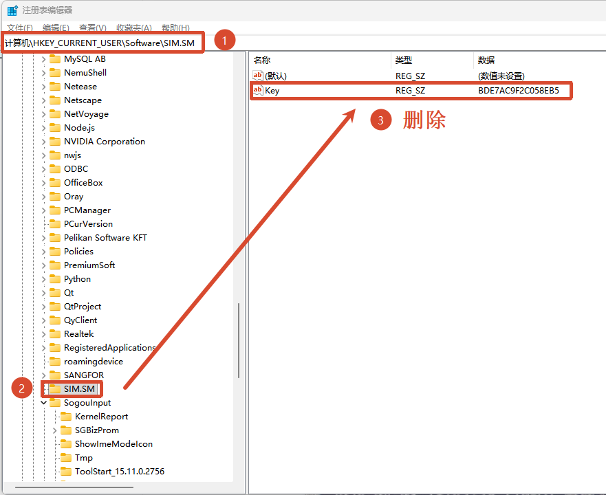
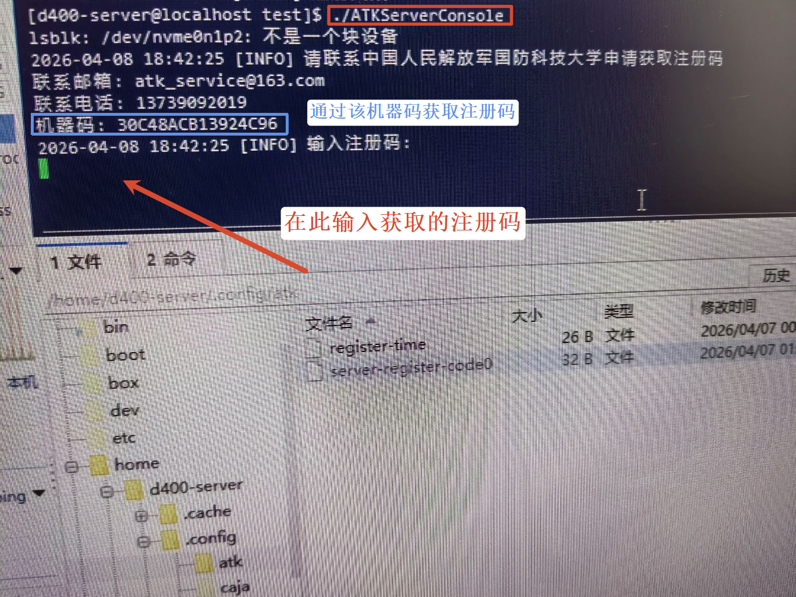
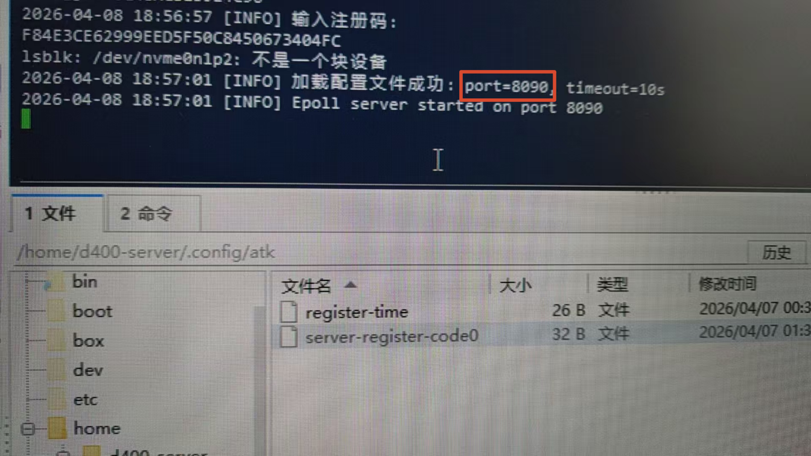

# ATK远程服务注册

## 适用场景

企业或团队部署 ATK 远程服务，使多台客户端共享服务端授权，统一管理和分配注册资源。

::: tip 说明
远程服务注册需要分别在**服务端**（服务器）和**客户端**（用户电脑）执行操作。
:::

## 前置条件

| 组件 | 系统要求 |
|------|---------|
| 服务端 | 麒麟操作系统 V10 及以上，x86_64 或 arm64 |
| 客户端 | Windows 7 SP1 及以上，或麒麟操作系统 V10 及以上 |
| 网络 | 客户端与服务端需在同一局域网内，或客户端可访问服务端 IP |

## 服务端配置

### 1. 清理本地注册残留

若此前在该服务器完成过 ATK 本地注册，需先清理注册表残留配置：

1. 打开注册表编辑器（按下 `Win + R` 输入 `regedit` 回车）；
2. 定位到路径：`计算机\HKEY_CURRENT_USER\Software\SIM.SM`；
3. 右键删除名为 `Key` 的注册表项。

::: warning 注意
若服务器从未安装过 ATK，可跳过此步骤。
:::

### 2. 启动并注册服务端

1. 登录服务端所在服务器，通过终端进入服务程序所在目录；

2. 执行服务端启动命令：

       ./ATKServerConsole

3. 程序启动后自动生成**机器码**（示例：`30C48ACB13924C96`），并提示「输入注册码」；

4. 联系官方获取服务端注册码：

   - **邮箱**：`atk_service@163.com`
   - **电话**：`13739092019`

   输入官方提供的注册码后按下 <kbd>Enter</kbd> 确认。

   

5. 注册成功后，终端输出启动日志，显示**配置文件加载成功**及**服务端口**（默认 `8090`）。

   

### 3. 日常启动（已注册后）

若服务端已完成注册，后续无需重复清理和输入注册码，直接执行启动命令：

    ./ATKServerConsole

终端输出日志中记录**服务端口号**（核心用于客户端配置），示例端口为 `8090`。

::: tip 端口自定义
服务端配置文件 `server_config.ini` 支持修改端口，默认端口为 `8090`，修改后需重启服务使配置生效。
:::

## 客户端配置

### 1. 确认使用协议

1. 启动 ATK 客户端，自动弹出【ATK-使用协议】对话框；
2. 勾选 **我已经认真阅读该协议**，点击 <kbd>同意</kbd>，进入软件主界面。

### 2. 配置远程注册

客户端需关联服务端 IP 与端口，完成远程注册：

1. 在【ATK-注册】窗口中，选择 **远程** 单选框；
2. 【服务器 IP】输入框填写服务端所在服务器 IP（示例：`192.168.1.252`）；
3. 【服务器端口】输入框填写服务端启动时的端口号（示例：`8090`）；
4. 点击 <kbd>注册</kbd> 按钮，完成远程服务注册。

::: warning 重要提醒
- 请确保客户端可访问服务端 IP 和端口（可使用 `ping` 或 `telnet` 测试连通性）
- 若注册失败，请检查服务端是否已正常启动，以及防火墙是否放行对应端口
:::

## 故障排查

| 问题 | 原因 | 解决 |
|------|------|------|
| 客户端提示"无法连接服务器" | 网络不通或端口被防火墙拦截 | 检查网络连通性，确认防火墙放行端口 |
| 客户端提示"注册码无效" | 服务端机器码变更或注册码过期 | 联系官方重新获取注册码 |
| 服务端启动提示"端口被占用" | 8090 端口已被其他程序使用 | 修改 `server_config.ini` 更换端口 |