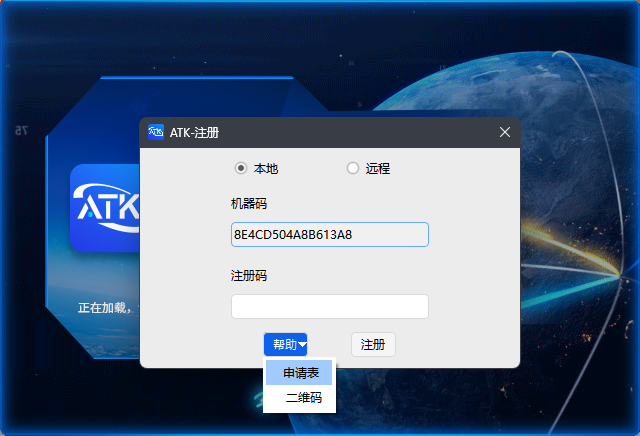

# 邮件申请

## 申请流程

### 1. 打开申请表

在软件注册界面点击 <kbd>申请表</kbd> 按钮。

等待系统加载并打开 PDF 格式的指引文件。

::: tip 提示
若 PDF 无法自动打开，请检查系统是否已安装 PDF 阅读器。
:::

### 2. 填写申请表

按照 PDF 文档说明填写信息：

::: warning 重要提醒
请仔细核对机器码，**输入错误将导致注册码无法使用**。建议直接从注册机界面复制粘贴。
:::

### 3. 发送邮件

将填写完成的申请表发送至指定邮箱：

> **收件邮箱**：`atk_service@163.com`
> **邮件主题**：`ATK注册码申请 - [您的单位名称]`

### 4. 等待审核

工作人员将在 **1-2 个工作日** 内审核并回复注册码。

::: warning 注意
若超过 2 个工作日未收到回复，请检查垃圾邮件箱，或通过 [直接联系我们](./直接联系我们.md) 查询进度
:::

<!--@include:./.include/填入注册码.md-->