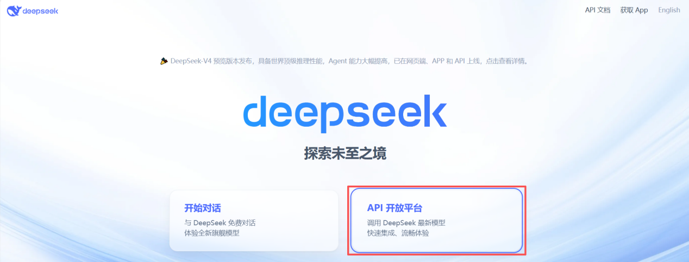
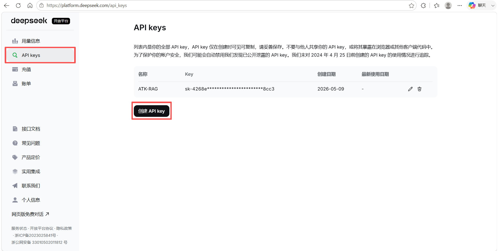
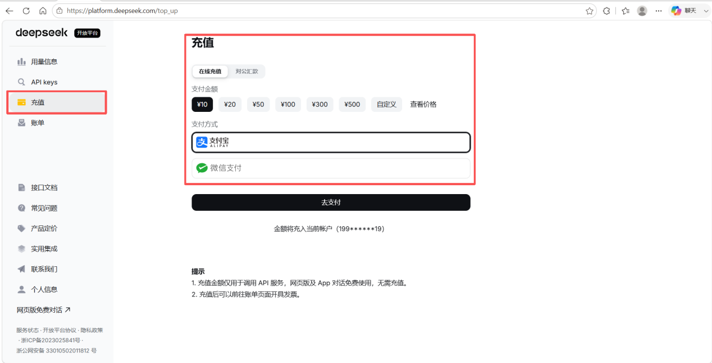

# API 模型配置

无需本地 GPU，通过云服务商提供的 API 接口调用模型。需要分别获取 **API Key**、**Base URL** 和 **Model Name**，然后填入 ATK。

## 大语言模型配置

以 **DeepSeek** 为例。

### 获取 API Key

进入 [DeepSeek 官网](https://www.deepseek.com/)，点击 **API 开发平台**。

在 **API keys** 页面创建 API key。

::: warning 使用前注意
API 服务按量计费，使用前需先充值。

:::

### 获取 Base URL 和 Model

点击 **接口文档**，可查看 `base_url` 和 `model` 参数。

### 填写模型配置

在 ATK 的模型配置界面中依次填入 **model_name**、**base_url** 和 **api_key**。

## 嵌入模型配置

以 **Qwen3-Embedding-8B** 为例。

### 获取 API Key

进入 [ModelScope 魔塔社区](https://www.modelscope.cn/my/overview)，点击 **访问控制**，新建访问令牌获取 `api_key`。

::: warning 使用前注意
需在阿里云百炼平台完成实名认证后才能使用 API 服务。
:::

### 选择模型

进入魔塔社区后，在 **模型库** 中搜索并选择对应模型。

### 获取 Base URL

进入模型详情页，在 **API-Inference** 中点击查看代码范例，即可获取 `base_url`。

### 填写模型配置

在 ATK 的模型配置界面中依次填入 **model_name**、**base_url** 和 **api_key**。

