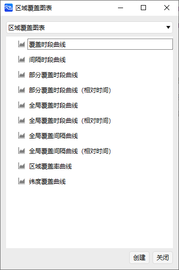
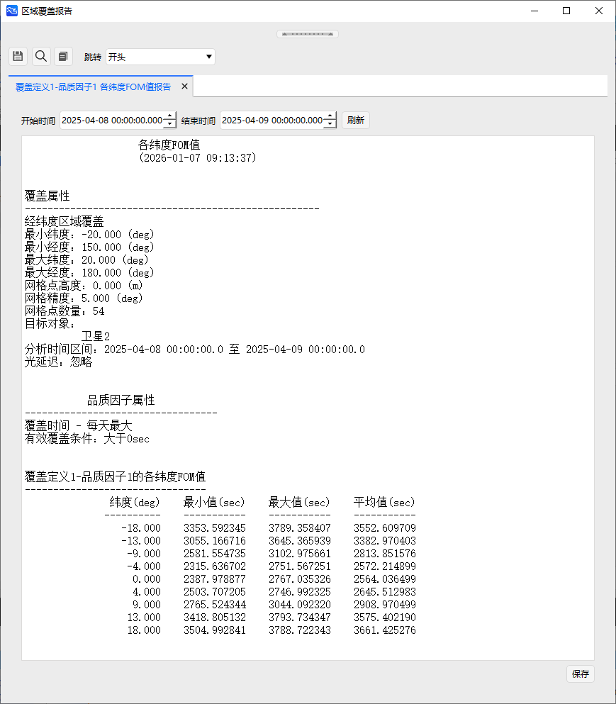
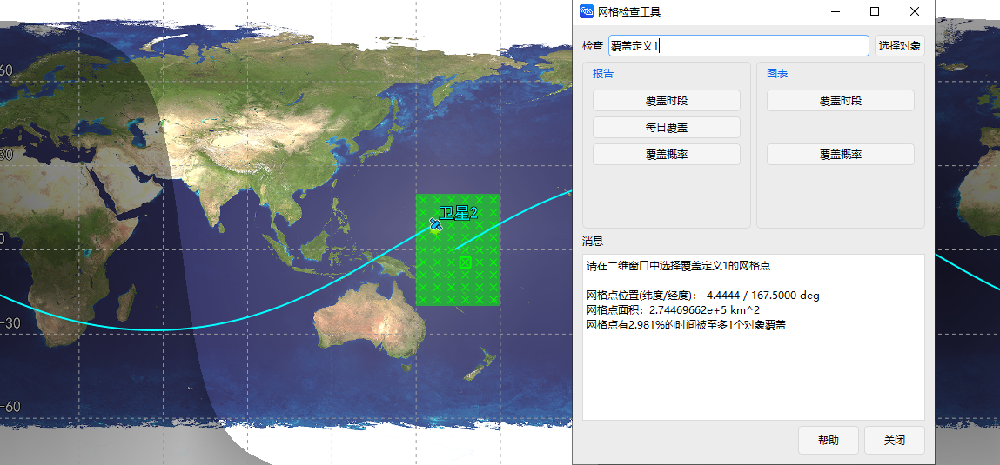
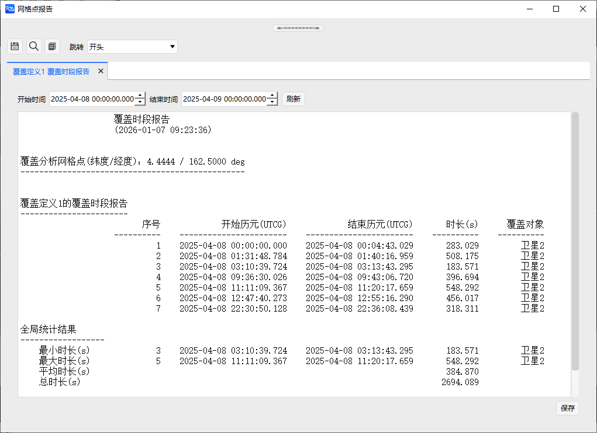

# 区域覆盖案例

<PathViewer
  :relative-paths="files"
/>

## 案例想定

本案例模拟卫星群组对某指定区域的覆盖分析。覆盖区域范围：纬度 **-20°~20°**，经度 **150°~180°**。卫星选择星链卫星进行分析。

## 创建任务场景

1. 运行 ATK.exe，点击 <kbd>新建一个想定文件</kbd> 新建一个想定 **AreaCoverage**。

2. 设置仿真时间。在【ATK：新建想定向导】对话框中设置时间段。

   | 开始历元(UTCG_MM) | 结束历元(UTCG_MM) |
   | :---------------: | :---------------: |
   | 2025-04-08 00:00:00.000 | 2025-04-09 00:00:00.000 |

3. 点击 <kbd>确定</kbd> 完成场景建立。

## 创建对象

1. **创建及编辑覆盖对象**

   - 点击工具栏 <kbd>开始</kbd> 中的 <kbd>插入</kbd> 创建覆盖定义对象。

   - 选择 **想定对象** - **覆盖定义**，**选择插入方式** - **插入默认类型**，点击 <kbd>插入…</kbd>，点击 <kbd>关闭</kbd>。

   - 鼠标右键点击【对象浏览器】中 **覆盖定义1**，选择 <kbd>属性</kbd>，出现覆盖定义的属性设置页面。

   - 选择 **基本** - **网格**。**网格区域配置参数** 设置如下：

     | 参数 | 设置值 |
     | :--: | :----: |
     | 最小纬度(deg) | -20 |
     | 最小经度(deg) | 150 |
     | 最大纬度(deg) | 20 |
     | 最大经度(deg) | 180 |

   - **网格定义** 中的 **经纬度(deg)** 设置为 5，其他默认，点击 <kbd>确定</kbd>。

   - **属性** 的 **可视化 - 显示** 中的 **点大小** 设置为 35。

   

2. **创建及编辑品质因子对象**

   - 点击工具栏 <kbd>开始</kbd> 中的 <kbd>插入</kbd>。

   - 选择 **附加对象** - **品质因子**，**选择插入方式** - **插入默认类型**，点击 <kbd>插入…</kbd>，出现窗口，**选择对象** 选择 **覆盖定义1**，点击 <kbd>确定…</kbd>。

   - 右键点击【对象浏览器】中 **品质因子1**，选择 <kbd>属性</kbd>，出现品质因子的属性设置页面。

   - 品质因子基本定义中，选择品质因子 **类型** 为 **覆盖时间**，**计算** 为 **每日最大**，有效条件勾选 **启动**。

3. **创建卫星对象**

   - 点击工具栏 <kbd>开始</kbd> 中的 <kbd>插入</kbd>。

   - 选择 **想定对象** - **卫星**，**选择插入方式** - **插入默认类型**，点击 <kbd>插入…</kbd>。

   

## 区域覆盖分析及结果查看

1. **区域覆盖分析**

   - 点击 **覆盖定义1**，点击 <kbd>工具</kbd> - <kbd>区域覆盖</kbd> 出现区域覆盖分析功能窗口。

   - 点击 <kbd>选择对象</kbd>，在【选择对象】窗口中选择 **覆盖定义1**，点击 <kbd>确定</kbd>。

   - 计算时间选择默认的场景仿真时间。

   - 选择所有 **卫星2**，点击 <kbd>计算</kbd>。

2. **区域覆盖报告结果查看**

   计算结束后，在右侧 **报告**/**图表** 区域可查看区域覆盖分析结果。选择 **间隔时段报告** 和 **间隔时间曲线**，结果如图所示。

   

   

   更多区域覆盖 **报告** 和 **图表**，如图所示。

   

   

3. **覆盖品质报告结果查看**

   点击 <kbd>报告</kbd> - <kbd>品质因子报告…</kbd> 和 <kbd>品质因子图表…</kbd>，进而生成相关的报告和曲线。

   

   

   更多覆盖品质 **报告** 和 **图表**，如图所示。

   

   

4. **网格检查工具**

   点击 <kbd>网格检查工具</kbd>，并在二维场景中选择覆盖定义1中的网格点，可以得到网格点的相关参数。为更直观展示结果，将 **覆盖定义1** - **属性** - **可视化** - **显示** - **点大小** 修改为 **5**，如图所示。

   

   点击 <kbd>网格检查工具</kbd> 中的 <kbd>报告</kbd> 和 <kbd>图表</kbd>，可展示相关报告和曲线。结果如图所示。

   

   

5. **品质因子的二维静态图像展示**

   - 在 **品质因子** - **属性** - **二维视图** - **静态** 下可设置显示品质因子的静态图像。支持自定义分级区域，由 **覆盖定义1** - **品质因子1** - **网格点FOM值报告** 可以得到，当前场景下的品质因子值（sec）在 2000-4000 之间，所以 **起始** 设置为 2000，**结束** 设置为 4000，**步长** 设置为 200。

   - 在 **分级属性** 中点击 <kbd>删除全部</kbd>，在设置好的 **添加分级** 中点击 <kbd>添加</kbd>，点击 <kbd>应用</kbd>，在二维视图中可查看。

   

