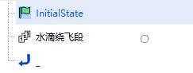

<PathViewer
  :relative-paths="files"
/>

# RPO案例

## 案例想定

为了更好地为卫星提供服务（维修、加注燃料等），接触前的环绕观测必不可少。

本案例将模拟一次为地球同步轨道卫星在轨服务前的环绕观测任务，水滴绕飞模式。

## 任务控制序列说明

为了模拟该水滴绕飞任务过程，构建以下任务序列：

- 一个初始状态段：包含工作卫星的一个初始状态段。
- 一个水滴绕飞段：用于执行对目标的水滴绕飞任务。

## 创建任务场景

1. 运行 ATK.exe，点击 <kbd>新建一个想定文件</kbd> 新建一个想定 **Teardrop**。

2. 设置仿真时间。在【ATK：新建想定向导】对话框中设置时间段。

| 开始历元                | 结束历元                |
| ----------------------- | ----------------------- |
| 2007-03-08 00:00:00.000 | 2007-03-13 00:00:00.000 |

3. 点击 <kbd>确定</kbd> 完成场景建立。

## 创建卫星并进行属性设置

1. 创建及编辑卫星对象

   - 点击工具栏 <kbd>开始</kbd> 中的 <kbd>插入!</kbd> 创建卫星对象。
   - 选择 **想定对象** —— **卫星**，**选择插入方式** —— **插入默认类型**，点击 <kbd>插入…</kbd>，点击 <kbd>关闭</kbd>。
   - 右键单击卫星 **卫星1** 和 **卫星2**，选择 <kbd>重命名</kbd>，将其命名为 **工作星** 和 **服务星**。

2. 设置 **工作星** 轨道参数
   - 预报模型设置。右键单击卫星 **工作星**，选择 <kbd>属性</kbd>，进入卫星参数设置界面，选择 **轨道预报器** —— **HPOP**。

   - 设置 **轨道历元(UTCG_MM)** —— **2007-03-08 00:00:00.000**。

   - 选择 **坐标系统** —— **J2000**，**坐标类型** —— **轨道根数**，设置轨道根数。

| 参数            | 数值  |
| --------------- | ----- |
| 半长轴(km)      | 42164 |
| 偏心率          | 0     |
| 轨道倾角(deg)   | 0     |
| 升交点赤经(deg) | 0     |
| 近拱点角距(deg) | 0     |
| 真近点角(deg)   | 0     |

3. 设置 **服务星** 初始状态

   - 定义初始状态段，案例参照轨道机动规划中的[霍曼转移](../02-案例教程/3.4轨道机动规划工具案例/3.4.1霍曼转移.md)的初始段设置的方式定义服务星的初始状态。

   - 或者采用相对于 **工作星** 的相对坐标系的方式定义初始状态段：右键单击卫星 **服务星**，选择 <kbd>属性</kbd>，进入卫星参数设置界面，选择 **轨道预报器** —— **机动规划**。在左上【参考卫星】中选中 **工作星** 添加为参考卫星。InitialState初始段的坐标系选择 **参考航天器** - **工作星** 的 **VVLH坐标系**。

4. 水滴绕飞段的轨道预报器设置

   - 选择 **新增** —— **插入 RPO 段** —— **伴飞** —— **水滴绕飞段**。
   - 点击 **轨道预报** —— <kbd>高级设置…</kbd>。
   - 选择 **中心天体** —— **Earth**；**引力** 中选择 **模型** —— **WGS84**；**三体引力** 中选择 **太阳、月球** —— **Point-Mass Model**（点质量模型）；勾选 **大气阻力摄动**，大气模型选取 **NRLMSISE00**；勾选 **太阳光压**；其余不勾选。
   - 点击 <kbd>确定</kbd>。
   - 左上方点击 <kbd>参考卫星</kbd>，添加 **工作星**；RPO参数下的参考航天器选择 **工作星**。
   - 水滴受控绕飞的参数设置。设置参数如下：

| 参数名称           | 数值       |
| ------------------ | ---------- |
| 圈数               | 5          |
| 起始点距离          | -300m      |
| 机动点距离          | -800m      |
| 等待时间            | 21600      |
| 真近点角变化量最大值 | 5          |
| 求解算法            | 序列二次规划 |

## 运行任务控制序列

由于 RPO 段是预先构建好的，具有便于操作的特性，整个水滴饶飞任务控制序列构建仅由两部分构成，设置完毕后左侧的段节点操作区呈现为如图所示。

1. 运行结果显示

   - 点击 <kbd>运行</kbd> 按钮，任务控制序列开始计算。弹窗可以查看运行状态和计算时间。

   

   - 点击 **水滴绕飞段** 右侧页面的 **结果数据**，可查看任务控制序列中每一次脉冲施加的时刻与脉冲量大小。

2. 三维视图显示

   点击 <kbd>视图</kbd> 下的 <kbd>三维视图</kbd> 按钮，选择左上角的 **局部视点**，然后依次选择 **卫星**，**工作星**，即可将视角规定在 **工作星** 上。

   添加伴飞轨迹显示：点击服务星 <kbd>属性</kbd> - <kbd>三维视图</kbd> - <kbd>轨道系统</kbd> - <kbd>添加VVLH系</kbd>，并勾选 **显示** 工作星VVLH。

   图中白色水滴形轨迹是 **服务星** 相对于 **工作星** 的水滴绕飞轨迹。

