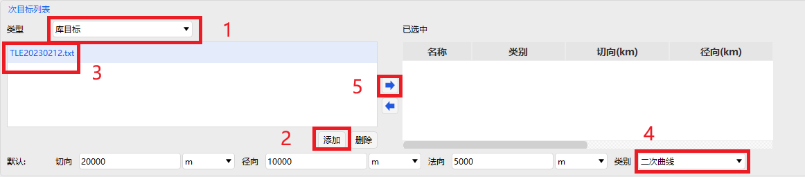
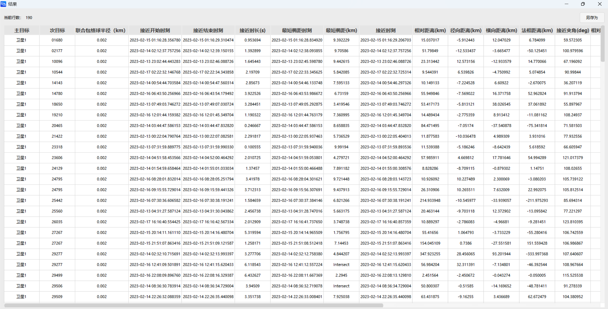

# 高级接近分析案例
<PathViewer
  :relative-paths="files"
/>

## 案例想定

本案例进行一对多的高级接近分析及结果展示介绍。

::: warning 已知问题
此案例需要从头完全新建才能正常计算。若打开已保存的文件后直接计算，结果会出错。

**正确操作流程**：

1. 打开 ATK，新建“高级接近分析”想定文件，按文档说明完成设置
2. 在“高级接近分析工具”中点击计算，可得到正确结果

**复现问题的操作**：

1. 在上述正确流程后保存想定文件，关闭 ATK
2. 重新打开 ATK，加载已保存的想定文件
3. 进入”高级接近分析工具”，点击计算
4. 计算结果将显示“未找到接近事件！”，与最初结果不一致
:::

## 创建任务场景

1. 运行 ATK 软件，选择上方 <kbd>开始</kbd> 工具栏，点击 <kbd>新建</kbd> 按钮，创建一个想定文件 **高级接近分析**。

2. 在【ATK: 新建想定向导】对话框中设置 **开始历元** 与 **结束历元**：

| 开始历元 (UTCG_MM)   | 结束历元 (UTCG_MM)      |
|:-----------------------:|-------------------------|
| 2023-02-13 00:00:00.000 | 2023-02-18 00:00:00.000 |

3. 点击 <kbd>确定</kbd> 完成场景创建。

## 插入卫星并进行属性设置

1. 点击 <kbd>开始</kbd> 工具栏下的 <kbd>插入</kbd> 按钮，打开【插入对象】页面。

2. 选择 **卫星** 对象，再选择 **插入默认类型** 方式，点击 <kbd>insert...</kbd> 按钮，将对象插入场景。

3. 双击新插入的 **卫星** 对象，进入【属性】设置界面。

4. 点击 **轨道预报器** 下拉框，选择 **HPOP**；点击 **坐标类型** 下拉框，选择 **轨道根数**；对轨道根数进行设置：

|  轨道根数  |    数值   |
|:----------:|:---------:|
|   半长轴   | 7000137 m |
|   偏心率   |    0.01   |
|  轨道倾角  |  28.5 deg |
| 升交点赤经 |   0 deg   |
| 近拱点角距 |   0 deg   |
|  真近点角  |   0 deg   |

5. 点击 <kbd>协方差…</kbd> 按钮，在弹出的页面中，勾选 <kbd>计算协方差</kbd> 复选框，然后点击 <kbd>确定</kbd> 按钮，启用协方差计算。

6. 点击【属性】设置页面右下角的 <kbd>应用</kbd> 按钮，完成属性设置。

## 插入高级接近分析对象并进行属性设置

1. 点击 <kbd>开始</kbd> 工具栏下的 <kbd>插入</kbd> 按钮，打开【插入对象】页面。

2. 选择 **高级接近分析** 对象，再选择 **插入默认类型** 方式，点击 <kbd>insert...</kbd> 按钮，将对象插入场景。

3. 双击新插入的 **高级接近分析** 对象，进入【属性】设置界面。

4. **分析时段** 设置。用户可根据实际需要设置分析时段，本案例使用默认参数。

5. **主目标列表** 设置。选中左侧栏中的 **卫星1** 对象，点击右下方 <kbd>类别</kbd> 下拉框，选择 **协方差**，点击 <kbd>右箭头</kbd> 按钮，将其放入已选中列表。

6. **次目标列表** 设置。点击左侧栏上方的 <kbd>类型</kbd> 下拉框，选择 **库目标**，点击左侧栏右下方的 <kbd>添加</kbd> 按钮，在系统文件管理器中选择 <PathCopy :entry="tleFile" />，将其导入到软件中，然后选中左侧栏中的 **TLE20230212.txt** 对象，点击右下方 <kbd>类别</kbd> 下拉框，选择 **二次曲线**，点击 <kbd>右箭头</kbd> 按钮，将其放入已选中列表。

7. 高级设置。将【属性】设置界面从 **基本 - 主配置** 切换为 **基本 - 高级**，勾选 <kbd>轨道历元过期门限</kbd> 和 <kbd>轨道路径筛选器门限</kbd> 复选框，参数设置保持默认。在 **高级椭球属性 - 误差椭球数据库** 设置中，点击 <kbd>…</kbd> 按钮依次为 **时间二次曲线数据库**、**固定轨道类型数据库**、**二次/固定类型数据库** 导入对应数据文件，文件路径为：

|       数据文件      | 路径 |
|:-------------------:|------------------------------------------------------------|
|  时间二次曲线数据库 | (ATK根目录)\AstroData\Database\Satellite\atkQuadDB.qdb     |
|  固定轨道类型数据库 | (ATK根目录)\AstroData\Database\Satellite\atkFxdOrbCls.foc  |
| 二次/固定类型数据库 | (ATK根目录)\AstroData\Database\Satellite\atkQuadOrbCls.qoc |

8. 将【属性】设置界面从 **基本 - 高级** 切换为 **基本 - 主配置**，点击 <kbd>计算</kbd> 按钮。

## 结果分析

计算完成后，点击 <kbd>报告</kbd> 展示计算结果。

如果需要获取自定义数据报告，右键 **高级接近分析** 对象，点击 <kbd>数据报告</kbd>，进入【报告管理】页面，点击右侧 <kbd>样式 - 新建</kbd> 按钮，创建新样式，选中 **新样式1**，点击 <kbd>样式 - 属性...</kbd> 按钮，进入【属性】页面，此时用户可自由选择所需的结果条目，点击 <kbd>右箭头</kbd> 添加到右侧 **报告内容** 栏，点击右下角 <kbd>确定</kbd> 按钮即可完成自定义数据报告的设置。回到【报告管理】页面，选中 **新样式1**，点击右侧 <kbd>显示 - 生成...</kbd> 按钮，即可在新窗口查看自定义报告。

[高级接近分析模块](../5.专业使用指南/05-高级接近分析.md)

