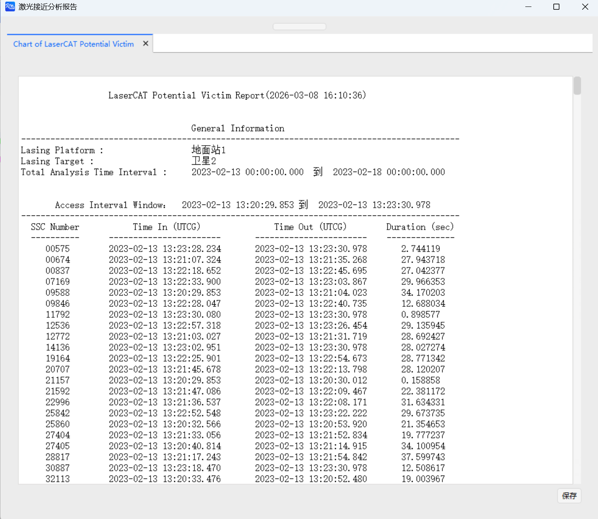

# 激光接近分析案例
<PathViewer
  :relative-paths="files"
/>

## 案例想定

本案例进行地面激光站对跟踪目标过程的激光接近分析及结果展示介绍。

## 创建任务场景

1. 运行 ATK 软件，选择上方 <kbd>开始</kbd> 工具栏，点击 <kbd>新建</kbd> 按钮，创建一个想定文件 **激光接近分析**。

2. 在【ATK: 新建想定向导】对话框中设置 **开始历元** 与 **结束历元**：

| 开始历元 (UTCG_MM)   | 结束历元 (UTCG_MM)      |
|:-----------------------:|-------------------------|
| 2023-02-13 00:00:00.000 | 2023-02-18 00:00:00.000 |

3. 点击 <kbd>确定</kbd> 完成场景创建。

## 插入一个地面站并进行属性设置

1. 点击 <kbd>开始</kbd> 工具栏下的 <kbd>插入</kbd> 按钮，打开【插入对象】页面。

2. 选择 **地面站** 对象，再选择 **插入默认类型** 方式，点击 <kbd>插入...</kbd> 按钮，将对象插入场景。

3. 双击新插入的 **地面站** 对象，进入【属性】设置界面。

4. 点击 **位置 - 类型** 下拉框，选择 **地理坐标**，然后进行如下设置：

| 地理坐标 |   数值  |
|:--------:|:-------:|
|   纬度   |  30 deg |
|   经度   | 110 deg |
|   高度   |   0 m   |

5. 点击【属性】设置页面右下角的 <kbd>应用</kbd> 按钮，完成属性设置。

## 插入一个卫星并进行属性设置

1. 点击 <kbd>开始</kbd> 工具栏下的 <kbd>插入</kbd> 按钮，打开【插入对象】页面。

2. 选择 **卫星** 对象，再选择 **插入默认类型** 方式，点击 <kbd>插入...</kbd> 按钮，将对象插入场景。

3. 双击新插入的 **卫星** 对象，进入【属性】设置界面。

4. 点击 **轨道预报器** 下拉框，选择 **二体**；点击 **坐标类型** 下拉框，选择 **轨道根数**；对轨道根数进行设置：

|  轨道根数  |    数值   |
|:----------:|:---------:|
|   半长轴   | 7000137 m |
|   偏心率   |    0.01   |
|  轨道倾角  |   20 deg  |
| 升交点赤经 |   0 deg   |
| 近拱点角距 |   0 deg   |
|  真近点角  |   0 deg   |

5. 点击【属性】设置页面右下角的 <kbd>应用</kbd> 按钮，完成属性设置。

## 激光接近分析

1. 在左侧对象视图选中 **地面站** 对象，选择上方 <kbd>地面站</kbd> 工具栏，点击 <kbd>激光接近分析</kbd>。

2. 点击 **执行激光接近分析** 右侧的 <kbd>选择对象</kbd> 按钮，在弹窗内选中 **地面站1** 对象，点击 <kbd>确定</kbd> 按钮。

3. 在 **指向方法** 栏内，点击下拉框，选择 **跟踪目标**，再选中 **卫星2** 对象，点击 <kbd>选择</kbd> 按钮。

4. 在 **数据库** 栏内，点击第一个 <kbd>…</kbd> 按钮，在系统文件管理器中选择 [TLE20230212.txt](#PathViewer) 文件，点击右下角 <kbd>打开(O)</kbd> 按钮，将其加载到 ATK 中。

5. 在 **筛选器** 栏内，勾选 <kbd>根数集的最长时效 - 使用</kbd> 复选框。

6. 其余参数用户可根据实际需要进行设置，本案例使用默认参数。

7. 点击 <kbd>计算</kbd> 按钮。

## 结果分析

计算完成后，点击 <kbd>报告 - 安全跟踪时段…</kbd> 按钮可以查看跟踪期间不会意外照射其余空间目标的时段数据报告；点击 <kbd>图表 - 安全跟踪时段…</kbd> 按钮可以查看对应的图表报告。

点击 <kbd>报告 - 潜在危险目标…</kbd> 按钮可以查看潜在危险目标的数据报告；点击 <kbd>图表 - 潜在危险目标…</kbd> 按钮可以查看对应的图表报告。

[激光接近分析工具](../5.专业使用指南/21-激光接近分析工具.md)

