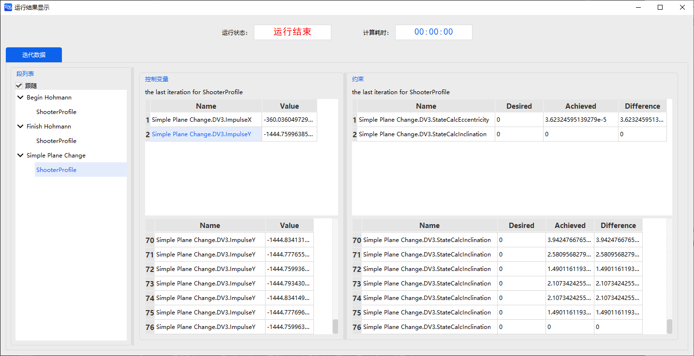

# 倾角改变与瞄准轨道

<PathViewer
  :relative-paths="files"
/>

## 案例想定

倾角改变与瞄准是轨道改变的单脉冲机动方法，可以通过机动规划模块的脉冲机动建模能力和瞄准器实现这一类问题的求解。

本案例将介绍航天器从半径 6570km、倾角为 28 度的圆轨道转移至半径为 42160km、倾角为 28 度的圆轨道的霍曼转移，并在升交点变轨至倾角为 0 度的圆轨道的设计过程。

## 任务控制序列说明

为了设计从半径为 6570km、倾角为 28 度的停泊轨道转移到半径为 42160km、倾角为 28 度的圆轨道的转移轨道，并在升交点变轨至倾角为 0 度的目标圆轨道，需要构建以下任务序列。

- 一个 **初始段**：定义半径为 6570km、倾角为 28 度的停泊轨道；
- 一个 **预报段**：对停泊轨道进行外推；
- 一个 **瞄准序列段**：包含一个脉冲机动使航天器进入椭圆转移轨道；
- 一个 **预报段**：用于将航天器轨道外推至椭圆轨道的远地点；
- 一个 **瞄准序列段**：包含一个脉冲机动使航天器进入圆轨道；
- 一个 **预报段**：用于对圆轨道上的航天器轨道外推至第二次经过升交点；
- 一个 **瞄准序列段**：包含一个脉冲机动使航天器自升交点进入目标圆轨道；
- 一个 **预报段**：用于对目标圆轨道上的航天器轨道外推。

## 创建任务场景

1. 运行 ATK.exe，点击 <kbd>新建一个想定文件</kbd> 新建一个想定“InclinationChange”。

2. 设置仿真时间。在【ATK：新建想定向导】对话框中设置：

| 开始历元 | 结束历元 |
| ----------------------- | ----------------------- |
| 2022-11-05 00:00:00.000000 | 2022-11-08 00:00:00.000000 |

3. 点击 <kbd>确定</kbd> 完成场景建立。

## 创建对象并定义初始轨道参数

1. 创建及编辑卫星对象

   - 点击工具栏【开始】中的 <kbd>插入</kbd>创建卫星对象；

   - 选择【想定对象】—【卫星】，【选择插入方式】—【插入默认类型】，点击 <kbd>插入…</kbd>，点击 <kbd>关闭</kbd>；

   - 在左侧【对象】页面上，右键单击卫星**卫星1**，选择 <kbd>重命名</kbd>，将其命名为**SatInclinationChange**；

   - 在左侧【对象】页面上，右键单击卫星**SatInclinationChange**，选择【属性】，出现卫星参数设置界面，选择【轨道预报器】—【机动规划】。

2. 定义初始段
   如果任务控制序列已经有默认的初始段，则直接进行定义，否则点击 <kbd>新增</kbd> 添加一个“初始段”，将其命名为**28 deg Inclined Orbit**。

3. 轨道历元设置

   设置【轨道历元（UTCG）】—“5 Nov 2022 00:00:00.000 ”。

4. 坐标相关设置

   选择【坐标系】—【Earth J2000】，【坐标类型】—【轨道根数】，轨道根数设置如下表：

   | 参数               |  数值       |
   | ------------------ | -------     |
   | 半长轴             | 6570 km     |
   | 偏心率             | 0           |
   | 轨道倾角           | 28°         |
   | 升交点赤经（RAAN） | 0°          |
   | 近拱点角距         | 0°          |
   | 真近点角           | 0°          |

## 设置初始轨道预报段

1. 定义预报段

   如果任务控制序列已经有默认的预报段，则直接进行定义，否则点击 <kbd>新增</kbd> 添加一个**预报段**，将其命名为**Propagate 2 hours**。

2. 轨道预报器设置

   - 点击【轨道预报】—<kbd>高级设置…</kbd>，进入轨道预报器；

   - 选择【中心天体】—【Earth】，【引力】中选择【模型】—【JGM3】，勾选【大气阻力摄动】，勾选【太阳光压】，勾选【三体引力】—【太阳】、【月球】，并在【类型】中选择【点质量】模型；

   - 点击 <kbd>确定</kbd>。

3. 停止条件设置

   - 在停止条件点击 <kbd>新增</kbd> 图标，选择**CAsStopDuration**【预报时长】作为停止条件（如已有默认的停止条件，直接设置参数）；

   - 设置【触发值】为“7200”sec。

## 机动进入椭圆转移轨道

1. 定义瞄准序列段

   - 点击 <kbd>新增</kbd> 添加一个**瞄准序列段**，命名为**Begin Hohmann**；

   - 点击 <kbd>新增</kbd> 在**瞄准序列段**—**Begin Hohmann**嵌入一个**机动段** 命名为**DV1**。

2. 选择DV1变量

   - 选择【机动类型】—【脉冲】，【推力坐标轴】—【VNC】，坐标类型选择【直角坐标】；

   - 点击**VX**文字段后方的勾选图标 将其勾选为 **设计变量**；

   - 右键点击该机动段**DV1**，选择【约束配置…】，双击选择【开普勒根数】—【远拱点半径】作为目标变量，点击 <kbd>确定</kbd>。

3. 设置瞄准器

   选中**Begin Hohmann**，单击【配置】—<kbd>新建</kbd>，选择【微分修正】，单击 <kbd>确定</kbd>；（如已有默认的微分修正，直接设置参数）

   - 双击【配置】—【配置类型】—【微分修正】，进入瞄准器设置界面。

   - 分别点击【控制变量】和【约束】中【使用】栏下的方框勾选使用的变量和约束；

   | 控制变量 | 约束                      |
   | -------- | ------------------------- |
   | ImpulseX | StateCalcRadiusOfApoapsis |

   - 在【约束】—【期望值】一栏中填写远地点地心距的期望值为 42160000m，【摄动量】、【收敛误差】、【最大步长】等参数选择为默认参数；

   - 设置完毕后点击 <kbd>确定</kbd>，然后再进入瞄准器设置界面即可看到用户设置后的结果。

## 设置椭圆转移轨道预报段

1. 定义预报段

   点击 <kbd>新增</kbd> 在**瞄准序列段**—**Begin Hohmann**后添加一个**预报段**，命名为**To Apogee**，即为过渡的椭圆轨道。

2. 轨道预报器设置

   - 点击【轨道预报】—<kbd>高级设置…</kbd>；

   - 选择【中心天体】—【Earth】，【引力】中选择【模型】—【JGM3】，勾选【大气阻力摄动】、勾选【太阳光压】，勾选【三体引力】—【太阳】、【月球】，并选择【点质量】模型；

   - 点击 <kbd>确定</kbd>。

3. 停止条件设置

   在【停止条件】，点击 <kbd>新建</kbd> 图标，勾选【远拱点】【CAsStopApoapsis】作为停止条件。

## 机动进入过渡圆轨道

1. 定义瞄准序列段

   - 点击 <kbd>新增</kbd> 在**预报段**—**To Apogee**后插入一个**瞄准序列段**，将其命名为**Finish Hohmann**；

   - 在该序列段内点击 <kbd>新增</kbd> 在**瞄准序列段**—**Finish Hohmann**嵌入一个**机动段**，命名为**DV2**。

2. 选择变量

   - 选择【机动类型】—【脉冲】，【推力坐标轴】—【VNC】，坐标类型选择【直角坐标】；

   - 点击**VX**文字段后方的勾选图标 将其勾选为 **设计变量**；

   - 右键点击该机动段**DV2**，选择【约束配置…】，双击选择【开普勒根数】—【偏心率】作为目标变量，点击 <kbd>确定</kbd>。

3. 设置瞄准器

   选中**Finish Hohmann**，单击【配置】—<kbd>新建</kbd>，选择【微分修正】，单击 <kbd>确定</kbd>；

   - 双击【配置】—【配置类型】—【微分修正】，进入瞄准器设置界面。

   - 分别点击【控制变量】和【约束】中【使用】栏下的方框勾选使用的控制变量和约束；

      | 控制变量 | 约束                   |
      | -------- | ---------------------- |
      | ImpulseX | StateCalcEccentricity |

   - 在【约束】—【期望值】一栏中填写偏心率的期望值为 0，在【约束】—【收敛误差】更改偏心率的收敛误差为 0.001，【摄动量】、【最大步长】等参数可选择为默认参数；

   - 设置完毕后点击 <kbd>确定</kbd>，然后再进入瞄准器设置界面即可看到用户设置后的结果。

## 设置过渡圆轨道预报段

1. 定义预报段

   点击 <kbd>新增</kbd> 在**瞄准序列段**—**Finish Hohmann**后插入一个**预报段**，命名为**To Ascending Node**。

2. 轨道预报器设置

   - 点击【轨道预报】—<kbd>高级设置…</kbd>；

   - 选择【中心天体】—【Earth】，【引力】中选择【模型】—【JGM3】，勾选【大气阻力摄动】、勾选【太阳光压】，勾选【三体引力】—【太阳】、【月球】，并选择【点质量】模型；

   - 点击 <kbd>确定</kbd>。

3. 停止条件设置

   在【停止条件】点击 <kbd>新建</kbd> 图标，勾选**CAsStopAscendingNode**【升交点】作为停止条件，【重复次数】设置为 2。

## 机动进入目标圆轨道

1. 定义瞄准序列段

   - 点击 <kbd>新增</kbd>在**预报段**—**To Ascending Node**后插入一个**瞄准序列段**，将其命名为**Simple Plane Change**；

   - 在该序列段内点击 <kbd>新增</kbd> 在**瞄准序列段**—**Simple Plane Change**嵌入一个**机动段**，命名为**DV3**。

2. 选择变量

   - 选择【机动类型】—【脉冲】，【推力坐标轴】—【VNC】，坐标类型选择【直角坐标】；

   - 点击**VX**和**VY**文字段后方的勾选图标 将其勾选为 **设计变量**；

   - 右键点击该机动段**DV3**，选择【约束配置…】，双击选择【开普勒根数】—【偏心率】和【开普勒根数】—【倾角】作为目标变量，点击 <kbd>确定</kbd>。

3. 设置瞄准器

   选中**Simple Plane Change**，单击【配置】—<kbd>新建</kbd>，选择【微分修正】，单击 <kbd>确定</kbd>；双击【配置】—【配置类型】—【微分修正】，进入瞄准器设置界面。

   - 分别点击【控制变量】和【约束】中【使用】栏下的方框勾选使用的控制变量和约束；

      | 控制变量  |    约束               |
      | --------  | ----------------------|
      | ImpulseX  | StateCalcEccentricity|
      | ImpulseY  | StateCalcInclination |

   - 在【约束】—【期望值】一栏中填写偏心率的期望值为 0、倾角的期望值为 0，在【约束】—【收敛误差】更改偏心率的收敛误差为 0.001、倾角的收敛误差为 0，【摄动量】、【最大步长】等参数可选择为默认参数；

   - 设置完毕后点击 <kbd>确定</kbd>，然后再进入瞄准器设置界面即可看到用户设置后的结果。

## 设置目标圆轨道预报段

1. 定义预报段

   点击 <kbd>新增</kbd> 在**瞄准序列段**—**Simple Plane Change**后插入一个**预报段**，命名为**Propagate 36 hours**。

2. 轨道预报器设置

   - 点击【轨道预报】—<kbd>高级设置…</kbd>；
  
   - 选择【中心天体】—【Earth】，【引力】中选择【模型】—【JGM3】，勾选【大气阻力摄动】、勾选【太阳光压】，勾选【三体引力】—【太阳】、【月球】，并选择【点质量】模型；

   - 点击 <kbd>确定</kbd>。

3. 停止条件设置

   在【停止条件】点击 <kbd>新建</kbd> 图标，勾选**CAsStopDuration**【预报时长】作为停止条件。触发值设置为**129600sec**。

## 运行任务控制序列

当整个任务控制序列构建完毕后，可以单击左侧段节点区的白色方框 选择**预报段**和**机动段**的颜色，设置完毕后左侧的段节点操作区呈现为如下形状：

1. 运行结果显示

   - 点击 <kbd>运行</kbd>，任务控制序列开始计算。可以点击 <kbd>显示</kbd>，查看运行结果。

   

   - 分别点击左侧【段列表】的**瞄准序列段**，可查看任务控制序列中瞄准序列段的运行结果，参考结果如下表所示：

      | Begin Hohmann |                            | 当前值        |
      | ------------- | -------------------------- | ------------- |
      | 控制变量      | ImpulseX                   | 2457.0942 m/s |
      | 约束          | StateCalcRadiusOfApoapsis | 42160 km      |

      | Finish Hohmann |                        | 当前值       |
      | -------------- | ---------------------- | ------------ |
      | 控制变量       | ImpulseX               | 1480.2414 m/s|
      | 约束           | StateCalcEccentricity | 1.3150×10-6  |

      | Simple Plane Change |                        | 当前值         |
      | ------------------- | ---------------------- | -------------- |
      | 控制变量            | ImpulseX               | -360.0360 m/s  |
      | 控制变量            | ImpulseY               | -1444.7600 m/s |
      | 约束                | StateCalcInclination  | 0              |
      | 约束                | StateCalcEccentricity | 3.6232×10-6    |

2. 三维视图显示

   点击【视图】下的 <kbd>三维视图</kbd>，操作【时间视图】中的时间轴，可查看轨道形状。

   

