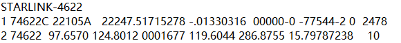
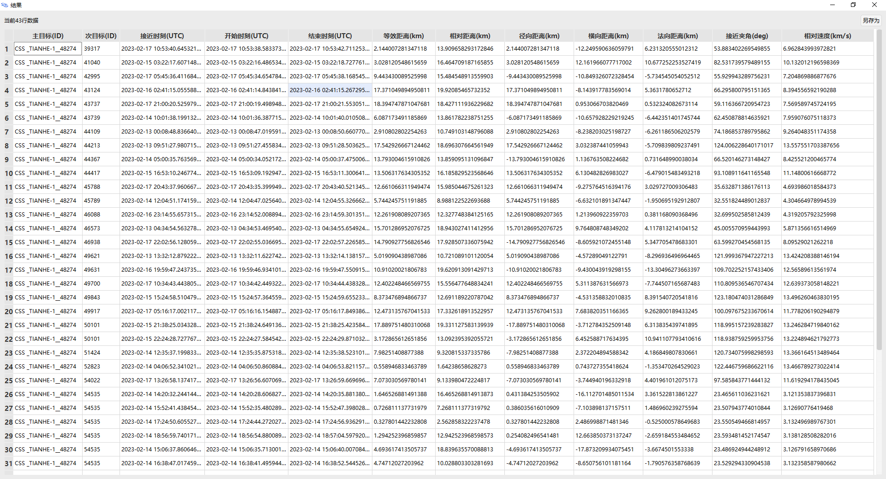
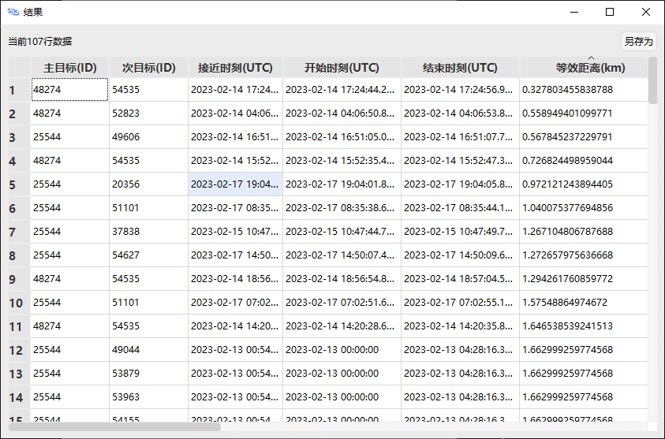

<PathViewer
  :relative-paths="files"
/>

# 接近分析案例

接近分析工具可以分析和评估太空中的目标与其他物体接近的可能性，得到目标与其他物体的最接近时刻以及最接近时刻所对应的相对位置、速度等信息。

## 案例想定

本案例中，使用已有的 **目标 TLE 数据库**，对单个或多个主目标进行接近分析。**目标 TLE 数据库** 的格式如图所示。

主目标有四种不同加入方式：

1. **从场景对象选择卫星**，主目标来源于用户插入场景中的卫星，且已对该卫星仿真完毕；
2. **从场景对象选择导弹/火箭**，主目标来源于用户插入场景中的导弹/火箭，且已对该目标仿真完毕；
3. **输入目标国际编号**，主目标来源于 **目标 TLE 数据库**；
4. **数据库目标遍历计算**，会对库目标进行两两接近分析。

本案例将基于上述第1、3种不同主目标的来源场景，根据我国的 **天和一号** 卫星（目标编号48274）与俄罗斯的 **曙光** 号卫星（目标编号25544）分别对目标进行接近分析。

## 基于场景对象选择的接近分析

### 创建场景对象

1. 运行 ATK.exe，点击 <kbd>新建一个想定文件</kbd>；

2. 在【新建想定向导】对话框中，设置场景 **名称** 为 CAT_TLE20230213；

3. 设置场景时段为：

| 开始历元(UTCG)          | 结束历元(UTCG)          |
| ----------------------- | ----------------------- |
| 13 Feb 2023 00:00:00.000 | 18 Feb 2023 00:00:00.000 |

4. 点击 <kbd>确定</kbd> 完成场景建立。

::: warning 场景时间注意事项
场景时间不同会影响后续接近分析结果。
:::

### 插入目标卫星与仿真

1. 点击 <kbd>插入</kbd> 按钮，打开【插入对象】页面；

2. 选择 **想定对象** — **卫星**，**选择插入方式** — **从TLE文件**；

3. 点击 <kbd>插入…</kbd>，进入【插入卫星对象】页面；

4. 选择 **数据源** 路径；

在 **数据源** 处点击 <kbd>选择文件</kbd> 按钮，目标卫星[TLE20230212.txt](#PathViewer)。

5. 插入 25544 卫星；

在 **搜索项** 中的 **SSC 编号** 处输入 `25544`；

点击 <kbd>搜索</kbd> 按钮，在下方栏中出现 SSC 编号25544卫星，单击选中该卫星，点击 <kbd>插入</kbd> 按钮，25544 卫星插入成功。

6. 重复步骤 5 操作，插入48274卫星。

### 打开卫星-接近分析工具

1. 在 ATK 页面中点击 <kbd>工具</kbd> 按钮，选择 <kbd>接近分析</kbd>；

2. 点击 <kbd>刷新</kbd> 按钮，进行重置。

### 选择 SSC 编号 48274 卫星为主目标

1. 在 **选择主目标** 中下拉列表选择：**从场景对象选择卫星**；

2. 单击选中目标 SSC 编号 48274 卫星。

### 选择目标 TLE 数据库

1. 点击 **目标 TLE 数据库** — <kbd>选择…</kbd> 按钮；

2. 选择 **目标 TLE 数据库** 文件 [TLE20230212.txt](#PathViewer)。

### 选择排除 TLE 中的目标卫星

1. 点击 **排除目标 SSC 编号** — <kbd>设置…</kbd> 按钮；

2. 在 **排除目标 SSC 编号** 栏中，输入目标 SSC 编号 `48274`；

3. 点击 <kbd>添加</kbd> 按钮，单击选中 48274 卫星；

4. 输入 **排除目标ssc编号** 完毕，点击 <kbd>确定</kbd> 按钮，此时在【接近分析】界面。

### 设定仿真分析时间

**仿真分析时间** 中的 **开始历元**、**结束历元** 默认为勾选 **使用场景区间**。

### 设置接近约束

设置 **接近约束** — **相对距离门限** 为 20km。当 TLE 数据库中的卫星与主目标卫星的距离小于 **相对距离门限** 时，会在接近分析的计算结果页面显示。

### 进行高级设置

点击 <kbd>高级设置…</kbd> 按钮，打开【高级设置】页面。

1. 设置 **过滤器**。**过滤器** 为默认设置，**方法** 为解析法，参数设置如下：

| 名称           | 值      | 单位 |
|----------------|---------|------|
| 轨道历元过期门限 | 2592000 | s    |
| 远/近地点门限   | 50000   | m    |
| 轨道路径       | 100000  | m    |
| 时间           | 30000   | m    |

2. 设置 **等效距离告警门限**。**等效距离告警门限** 为默认设置，参数设置如下：

| 名称           | 值   | 单位 |
|----------------|------|------|
| 黄色告警       | 200  | m    |
| 红色告警       | 50   | m    |
| 等效距离系数(k) | 10   | —    |

3. 点击 <kbd>确定</kbd> 按钮

### 计算结果

1. 点击 <kbd>计算</kbd> 按钮，得到仿真结果；

2. 结果说明。

接近分析部分结果如图所示：

仿真结果包含满足约束条件的 **接近时刻**、**等效距离**、**相对距离**、**径向距离**、**横向距离**、**法向距离**、**接近夹角** 与 **相对速度** 等。相对距离门限小于 20km 的接近分析数据共有 43 行。

### 多目标接近分析

1. 同时选择 48274 卫星与 25544 卫星，并排除 TLE 库中的 48274 卫星与 25544 卫星；

2. 其余设置不变，点击 <kbd>计算</kbd> 按钮，得到多目标的接近分析结果，共有 107 行数据。单击 **接近时刻（UTC）**，可得到离仿真时间最近的接近事件，如图所示：

此外，还可通过点击 **次目标（ID）**、**等效距离** 等，来对接近分析结果进行排序。若关闭了结算结果页面，可以在【接近分析】页面下方点击 <kbd>结果…</kbd>，重新打开计算结果。

## 基于存在国际编号目标的接近分析

### 选择 SSC 编号 48274 卫星为主目标

1. 在 **选择主目标** 中下拉列表选择：**输入目标国际编号**；

2. 在 **目标国际编号栏** 输入 `48274`，单击 <kbd>添加</kbd> 按钮后单击选中 48274 卫星。

### 计算结果

1. 保持其余设置不变，点击 <kbd>计算</kbd> 按钮，得到仿真结果；

::: warning 排除目标注意事项
本小节不需要进行 **排除目标SSC编号** 操作，若在前面步骤中排除了48274、25544卫星，需要进入【排除目标】页面，选中两卫星再点击 <kbd>删除</kbd>。
:::

2. 在 **结果** 页面中点击 **等效距离(km)**；

3. 接近分析部分结果如图所示：

仿真结果共有 43 行数据，上述仿真结果按 **等效距离** 排序。

### 多目标接近分析

令 25544、48274 卫星分别与 TLE 数据库中的其他卫星进行接近分析。

1. 在 **目标国际编号** 中输入 `25544` 卫星，点击 <kbd>添加</kbd>，并重复此步骤添加 `48274` 卫星；

2. 同时选中 25544、48274 卫星；

3. 点击 <kbd>计算</kbd> 按钮，得到输出结果；

4. 点击 **等效距离（km）**，按等效距离排序，如图所示：

[接近分析工具](../5.专业使用指南/07-接近分析.md)

