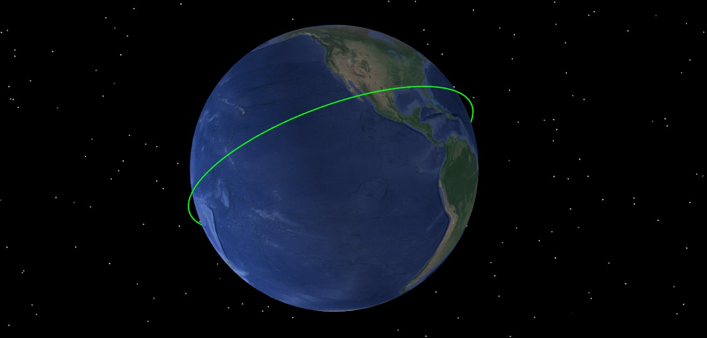

# 入门案例

通过二次开发 Connect 模式，创建入门案例场景，必须保持 ATK 为打开状态，具体命令分类包括：

1. 与 ATK 进行连接。
2. 新建场景并进行属性设置。
3. 新建卫星并进行属性设置。
4. 查看二维和三维场景
5. 查看输出报告。
6. 保存场景后与 ATK 断开连接。

## 脚本展示

### 与 ATK 进行连接

```mixcode
conID = atkOpen()
```

### 新建场景并进行属性设置

```mixcode
{C:2, 创建任务场景并进行属性设置}
atkConnect(conID, {S:New}, {S:/ Scenario SimpleExample})
atkConnect(conID, {S:SetAnalysisTimePeriod}, {S:* "2026-03-06 00:00:00.000" "2026-03-09 00:00:00.000"})
atkConnect(conID, {S:Animate}, {S:* Reset})
```

### 新建卫星并进行属性设置

```mixcode
{C:3, 插入卫星并进行属性设置}
atkConnect(conID, {S:New}, {S:/ Satellite Satellite1})
atkConnect(conID, {S:SetState}, {S:*/Satellite/Satellite1 Classical HPOP "2026-03-06 00:00:00.000" "2026-03-09 00:00:00.000" 60 ICRF "2026-03-06 00:00:00.000" 6878137.000 0 0 0 0 0})
```

### 新建二维场景和三维场景

```mixcode
{C:4, 新建二维场景和三维场景}
atkConnect(conID, {S:Window2D},{S:/ Create})
atkConnect(conID, {S:Window3D},{S:/ CreateWindow Normal})
atkConnect(conID, {S:Animate}, {S:* Reset})
```




### 查看输出报告

```mixcode
{C:5, 查看输出报告}
atkConnect(conID,{S:Report_RM}, {S:*/Satellite/Satellite1 Style "J2000 Position Velocity"  TimePeriod "2026-03-06 00:00:00.000" "2026-03-09 00:00:00.000"})
```

### 保存场景后与 ATK 断开连接

```mixcode
{C:6，保存场景后与 ATK 断开连接}
atkConnect(conID, {S:Save}, {S:/ *})
atkClose(conID)
```

## 完整脚本

```mixcode
conID = atkOpen()
{C:2, 创建任务场景并进行属性设置}
atkConnect(conID, {S:New}, {S:/ Scenario SimpleExample})
atkConnect(conID, {S:SetAnalysisTimePeriod}, {S:* "2026-03-06 00:00:00.000" "2026-03-09 00:00:00.000"})
atkConnect(conID, {S:Animate}, {S:* Reset})
{C:3, 插入卫星并进行属性设置}
atkConnect(conID, {S:New}, {S:/ Satellite Satellite1})
atkConnect(conID, {S:SetState}, {S:*/Satellite/Satellite1 Classical HPOP "2026-03-06 00:00:00.000" "2026-03-09 00:00:00.000" 60 ICRF "2026-03-06 00:00:00.000" 6878137.000 0 0 0 0 0})
{C:4, 新建二维场景和三维场景}
atkConnect(conID, {S:Window2D},{S:/ Create})
atkConnect(conID, {S:Window3D},{S:/ CreateWindow Normal})
atkConnect(conID, {S:Animate}, {S:* Reset})
{C:5, 查看输出报告}
atkConnect(conID,{S:Report_RM}, {S:*/Satellite/Satellite1 Style "J2000 Position Velocity"  TimePeriod "2026-03-06 00:00:00.000" "2026-03-09 00:00:00.000"})
{C:6，保存场景后与 ATK 断开连接}
atkConnect(conID, {S:Save}, {S:/ *})
atkClose(conID)
```
