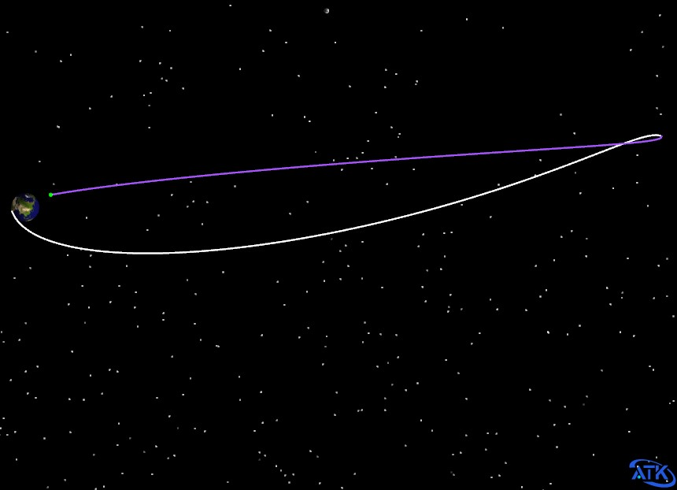

# 基于自由返回轨道的地月转移

通过二次开发 Connect 模式，创建霍曼转移场景，必须保持 ATK 为打开状态，具体命令分类包括：

1. 与 ATK 进行连接。
2. 新建场景并进行属性设置。
3. 新建卫星并进行属性设置。
4. 新建自由返回轨道任务序列并进行属性设置。
5. 运行机动规划。
6. 查看运行结果。
7. 保存场景后与 ATK 断开连接。

## 脚本展示

### 与 ATK 进行连接

```python
#1, 与 ATK 进行连接
conID = atkOpen();
```

### 新建场景并进行属性设置

```python
#2, 创建任务场景
atkConnect(conID, 'New', '/ Scenario exLunarFreeReturn');
atkConnect(conID, 'SetAnalysisTimePeriod', '* "2028-06-24 16:24:55.000" "2028-06-30 02:00:00.000"');
atkConnect(conID, 'Animate', '* Reset');
```

### 新建卫星并进行属性设置

```python
#3, 插入卫星，将轨道预报器设置为机动规划
atkConnect(conID, 'New', '/ Satellite exLunarFreeReturn');
atkConnect(conID, 'Astrogator', '*/Satellite/exLunarFreeReturn SetProp');
```

### 自由返回轨道任务序列

```python
#4, 瞄准段
# 删除初始段
atkConnect(conID,'Astrogator', '*/Satellite/exLunarFreeReturn DeleteSegment MainSequence.SegmentList.InitialState');
# 新建瞄准段
atkConnect(conID, 'Astrogator', '*/Satellite/exLunarFreeReturn InsertSegment MainSequence.SegmentList.- Target_Sequence');
```

```python
#5，初始段
# 新建初始段
atkConnect(conID, 'Astrogator', '*/Satellite/exLunarFreeReturn InsertSegment MainSequence.SegmentList.TargetSequence.SegmentList.- InitialState');
# 设置坐标系-J2000
atkConnect(conID, 'Astrogator', '*/Satellite/exLunarFreeReturn SetValue MainSequence.SegmentList.TargetSequence.SegmentList.InitialState.CoordinateSystem "CentralBody/Earth J2000"');
# 设置坐标类型-轨道根数
atkConnect(conID, 'Astrogator', '*/Satellite/exLunarFreeReturn SetValue MainSequence.SegmentList.TargetSequence.SegmentList.InitialState.CoordinateType "Keplerian"');
# 设置轨道六根数
atkConnect(conID, 'Astrogator', '*/Satellite/exLunarFreeReturn SetValue MainSequence.SegmentList.TargetSequence.SegmentList.InitialState.InitialState.Keplerian.sma 6548151 m');
atkConnect(conID, 'Astrogator', '*/Satellite/exLunarFreeReturn SetValue MainSequence.SegmentList.TargetSequence.SegmentList.InitialState.InitialState.Keplerian.ecc 0');
atkConnect(conID, 'Astrogator', '*/Satellite/exLunarFreeReturn SetValue MainSequence.SegmentList.TargetSequence.SegmentList.InitialState.InitialState.Keplerian.inc 21');
atkConnect(conID, 'Astrogator', '*/Satellite/exLunarFreeReturn SetValue MainSequence.SegmentList.TargetSequence.SegmentList.InitialState.InitialState.Keplerian.RAAN 149');
atkConnect(conID, 'Astrogator', '*/Satellite/exLunarFreeReturn SetValue MainSequence.SegmentList.TargetSequence.SegmentList.InitialState.InitialState.Keplerian.w 0');
atkConnect(conID, 'Astrogator', '*/Satellite/exLunarFreeReturn SetValue MainSequence.SegmentList.TargetSequence.SegmentList.InitialState.InitialState.Keplerian.TA 199');
# 设置轨道历元
atkConnect(conID, 'Astrogator', '*/Satellite/exLunarFreeReturn SetValue MainSequence.SegmentList.TargetSequence.SegmentList.InitialState.InitialState.Epoch "24 Jun 2028 16:25:59.184" UTCG');
```

```python
#6，机动段
# 初始段后面加机动段
atkConnect(conID, 'Astrogator', '*/Satellite/exLunarFreeReturn InsertSegment MainSequence.SegmentList.TargetSequence.SegmentList.- Maneuver');
# 设置机动类型-脉冲
atkConnect(conID, 'Astrogator', '*/Satellite/exLunarFreeReturn SetValue MainSequence.SegmentList.TargetSequence.SegmentList.Maneuver.MnvrType Impulsive');
# 设置推力坐标轴-VNC
atkConnect(conID, 'Astrogator', '*/Satellite/exLunarFreeReturn SetValue MainSequence.SegmentList.TargetSequence.SegmentList.Maneuver.ImpulsiveMnvr.ThrustAxes "Satellite/exLunarFreeReturn VNC"');
# 设置坐标类型-直角
atkConnect(conID, 'Astrogator', '*/Satellite/exLunarFreeReturn SetValue MainSequence.SegmentList.TargetSequence.SegmentList.Maneuver.ImpulsiveMnvr.CoordType Cartesian');
# 设置速度增量
atkConnect(conID, 'Astrogator', '*/Satellite/exLunarFreeReturn SetValue MainSequence.SegmentList.TargetSequence.SegmentList.Maneuver.ImpulsiveMnvr.Cartesian.X 3160');
atkConnect(conID, 'Astrogator', '*/Satellite/exLunarFreeReturn SetValue MainSequence.SegmentList.TargetSequence.SegmentList.Maneuver.ImpulsiveMnvr.Cartesian.Y 0');
atkConnect(conID, 'Astrogator', '*/Satellite/exLunarFreeReturn SetValue MainSequence.SegmentList.TargetSequence.SegmentList.Maneuver.ImpulsiveMnvr.Cartesian.Z 0');
```

```python
#7，第一个预报段
# 机动段后面加预报段
atkConnect(conID, 'Astrogator', '*/Satellite/exLunarFreeReturn InsertSegment MainSequence.SegmentList.TargetSequence.SegmentList.- Propagate');
# 设置中心天体-地球
atkConnect(conID, 'Astrogator', '*/Satellite/exLunarFreeReturn SetValue MainSequence.SegmentList.TargetSequence.SegmentList.Propagate.CentralBodyCode 2');
# 设置引力场模型-WGS84
atkConnect(conID, 'Astrogator', '*/Satellite/exLunarFreeReturn SetValue MainSequence.SegmentList.TargetSequence.SegmentList.Propagate.ForceModel.Gravity.GravModel WGS84');
# 设置引力场阶数-20
atkConnect(conID, 'Astrogator', '*/Satellite/exLunarFreeReturn SetValue MainSequence.SegmentList.TargetSequence.SegmentList.Propagate.ForceModel.Gravity.MaxDegree 20');
# 设置引力场次数-20
atkConnect(conID, 'Astrogator', '*/Satellite/exLunarFreeReturn SetValue MainSequence.SegmentList.TargetSequence.SegmentList.Propagate.ForceModel.Gravity.MaxOrder 20');
# 不勾选大气阻力摄动
atkConnect(conID, 'Astrogator', '*/Satellite/exLunarFreeReturn SetValue MainSequence.SegmentList.TargetSequence.SegmentList.Propagate.ForceModel.Drag.UseDrag false');
# 勾选太阳光压摄动
atkConnect(conID, 'Astrogator', '*/Satellite/exLunarFreeReturn SetValue MainSequence.SegmentList.TargetSequence.SegmentList.Propagate.ForceModel.SRP.UseSRP true');
# 三体摄动-日月
atkConnect(conID, 'Astrogator', '*/Satellite/exLunarFreeReturn SetValue MainSequence.SegmentList.TargetSequence.SegmentList.Propagate.ForceModel.ThirdBodies.Moon.UseGravity true');
atkConnect(conID, 'Astrogator', '*/Satellite/exLunarFreeReturn SetValue MainSequence.SegmentList.TargetSequence.SegmentList.Propagate.ForceModel.ThirdBodies.Sun.UseGravity true');
# 新建停止条件-Periapsis
atkConnect(conID, 'Astrogator', '*/Satellite/exLunarFreeReturn SetValue MainSequence.SegmentList.TargetSequence.SegmentList.Propagate.StoppingConditions Periapsis');
# 设置停止条件的中心天体-Moon
atkConnect(conID, 'Astrogator', '*/Satellite/exLunarFreeReturn SetValue MainSequence.SegmentList.TargetSequence.SegmentList.Propagate.StoppingConditions.Periapsis.CalcObjectAttributes.CentralBody Moon');
# 设置停止条件的重复次数-1
atkConnect(conID, 'Astrogator', '*/Satellite/exLunarFreeReturn SetValue MainSequence.SegmentList.TargetSequence.SegmentList.Propagate.StoppingConditions.Periapsis.RepeatCount 1');
```

```python
#8，第二个预报段
# 第一个预报段后面再加一个预报段
atkConnect(conID, 'Astrogator', '*/Satellite/exLunarFreeReturn InsertSegment MainSequence.SegmentList.TargetSequence.SegmentList.- Propagate');
# 设置中心天体-地球
atkConnect(conID, 'Astrogator', '*/Satellite/exLunarFreeReturn SetValue MainSequence.SegmentList.TargetSequence.SegmentList.Propagate1.CentralBodyCode 2');
# 设置引力场模型-JGM3
atkConnect(conID, 'Astrogator', '*/Satellite/exLunarFreeReturn SetValue MainSequence.SegmentList.TargetSequence.SegmentList.Propagate1.ForceModel.Gravity.GravModel JGM3');
# 设置引力场阶数-20
atkConnect(conID, 'Astrogator', '*/Satellite/exLunarFreeReturn SetValue MainSequence.SegmentList.TargetSequence.SegmentList.Propagate1.ForceModel.Gravity.MaxDegree 20');
# 设置引力场次数-20
atkConnect(conID, 'Astrogator', '*/Satellite/exLunarFreeReturn SetValue MainSequence.SegmentList.TargetSequence.SegmentList.Propagate1.ForceModel.Gravity.MaxOrder 20');
# 不勾选大气阻力摄动
atkConnect(conID, 'Astrogator', '*/Satellite/exLunarFreeReturn SetValue MainSequence.SegmentList.TargetSequence.SegmentList.Propagate1.ForceModel.Drag.UseDrag false');
# 勾选太阳光压摄动
atkConnect(conID, 'Astrogator', '*/Satellite/exLunarFreeReturn SetValue MainSequence.SegmentList.TargetSequence.SegmentList.Propagate1.ForceModel.SRP.UseSRP true');
# 三体摄动-日月
atkConnect(conID, 'Astrogator', '*/Satellite/exLunarFreeReturn SetValue MainSequence.SegmentList.TargetSequence.SegmentList.Propagate.ForceModel.ThirdBodies.Moon.UseGravity true');
atkConnect(conID, 'Astrogator', '*/Satellite/exLunarFreeReturn SetValue MainSequence.SegmentList.TargetSequence.SegmentList.Propagate.ForceModel.ThirdBodies.Sun.UseGravity true');
# 新建停止条件-Periapsis
atkConnect(conID, 'Astrogator', '*/Satellite/exLunarFreeReturn SetValue MainSequence.SegmentList.TargetSequence.SegmentList.Propagate1.StoppingConditions Periapsis');
# 设置停止条件的中心天体-Earth
atkConnect(conID, 'Astrogator', '*/Satellite/exLunarFreeReturn SetValue MainSequence.SegmentList.TargetSequence.SegmentList.Propagate1.StoppingConditions.Periapsis.CalcObjectAttributes.CentralBody Earth');
# 设置停止条件的重复次数-1
atkConnect(conID, 'Astrogator', '*/Satellite/exLunarFreeReturn SetValue MainSequence.SegmentList.TargetSequence.SegmentList.Propagate1.StoppingConditions.Periapsis.RepeatCount 1');
```

```python
#9，勾选各段的变量或约束
# 初始段中，将升交点赤经勾选为设计变量
atkConnect(conID, 'Astrogator', '*/Satellite/exLunarFreeReturn AddMCSSegmentControl MainSequence.SegmentList.TargetSequence.SegmentList.InitialState InitialState.Keplerian.RAAN');
# 初始段中，将轨道历元勾选为设计变量
atkConnect(conID, 'Astrogator', '*/Satellite/exLunarFreeReturn AddMCSSegmentControl MainSequence.SegmentList.TargetSequence.SegmentList.InitialState InitialState.Epoch');
# 机动段中，将Vx勾选为设计变量
atkConnect(conID, 'Astrogator', '*/Satellite/exLunarFreeReturn AddMCSSegmentControl MainSequence.SegmentList.TargetSequence.SegmentList.Maneuver ImpulsiveMnvr.Cartesian.X');
# 第一个预报段选择“近拱点高度”作为目标变量
atkConnect(conID, 'Astrogator', '*/Satellite/exLunarFreeReturn SetValue MainSequence.SegmentList.TargetSequence.SegmentList.Propagate.Results "AltitudeOfPeriapsis"');
# 第一个预报段目标变量的“中心天体”设置为“Moon”
atkConnect(conID, 'Astrogator', '*/Satellite/exLunarFreeReturn SetValue MainSequence.SegmentList.TargetSequence.SegmentList.Propagate.Results.StateCalcAltitudeOfPeriapsis.CentralBody Moon');
# 第二个预报段选择“近拱点高度”、倾角作为目标变量
atkConnect(conID, 'Astrogator', '*/Satellite/exLunarFreeReturn SetValue MainSequence.SegmentList.TargetSequence.SegmentList.Propagate1.Results "AltitudeOfPeriapsis" "Inclination"');
# 第二个预报段目标变量的“中心天体”设置为“Earth”
atkConnect(conID, 'Astrogator', '*/Satellite/exLunarFreeReturn SetValue MainSequence.SegmentList.TargetSequence.SegmentList.Propagate1.Results.StateCalcAltitudeOfPeriapsis.CentralBody Earth');
atkConnect(conID, 'Astrogator', '*/Satellite/exLunarFreeReturn SetValue MainSequence.SegmentList.TargetSequence.SegmentList.Propagate1.Results.StateCalcInclination.CentralBody Earth');
```

```python
#10，设置瞄准器下的控制变量和约束
# 新建微分修正配置
atkConnect(conID, 'Astrogator', '*/Satellite/exLunarFreeReturn SetValue MainSequence.SegmentList.TargetSequence.Profiles Differential_Corrector');
# 机动段的Vx
atkConnect(conID, 'Astrogator', '*/Satellite/exLunarFreeReturn SetMCSControlValue MainSequence.SegmentList.TargetSequence.Profiles.Differential_Corrector Maneuver ImpulsiveMnvr.Cartesian.X Active true');
# 初始段的UTC
atkConnect(conID, 'Astrogator', '*/Satellite/exLunarFreeReturn SetMCSControlValue MainSequence.SegmentList.TargetSequence.Profiles.Differential_Corrector InitialState InitialState.Epoch Active true');
# 初始段的升交点赤经
atkConnect(conID, 'Astrogator', '*/Satellite/exLunarFreeReturn SetMCSControlValue MainSequence.SegmentList.TargetSequence.Profiles.Differential_Corrector InitialState InitialState.Keplerian.RAAN Active true');
# 第一个预报段的近拱点高度
atkConnect(conID, 'Astrogator', '*/Satellite/exLunarFreeReturn SetMCSConstraintValue MainSequence.SegmentList.TargetSequence.Profiles.Differential_Corrector Propagate "StateCalcAltitudeOfPeriapsis" Active true');
# 设置第一个预报段的近拱点高度期望值100000m
atkConnect(conID, 'Astrogator', '*/Satellite/exLunarFreeReturn SetMCSConstraintValue MainSequence.SegmentList.TargetSequence.Profiles.Differential_Corrector Propagate "StateCalcAltitudeOfPeriapsis" Desired 100000 m');
# 设置第一个预报段的近拱点高度收敛误差100m
atkConnect(conID, 'Astrogator', '*/Satellite/exLunarFreeReturn SetMCSConstraintValue MainSequence.SegmentList.TargetSequence.Profiles.Differential_Corrector Propagate "StateCalcAltitudeOfPeriapsis" Tolerance 100 m');
# 第二个预报段的近拱点高度
atkConnect(conID, 'Astrogator', '*/Satellite/exLunarFreeReturn SetMCSConstraintValue MainSequence.SegmentList.TargetSequence.Profiles.Differential_Corrector Propagate1 "StateCalcAltitudeOfPeriapsis" Active true');
# 设置第二个预报段的近拱点高度期望值50000m
atkConnect(conID, 'Astrogator', '*/Satellite/exLunarFreeReturn SetMCSConstraintValue MainSequence.SegmentList.TargetSequence.Profiles.Differential_Corrector Propagate1 "StateCalcAltitudeOfPeriapsis" Desired 50000 m');
# 设置第二个预报段的近拱点高度收敛误差100m
atkConnect(conID, 'Astrogator', '*/Satellite/exLunarFreeReturn SetMCSConstraintValue MainSequence.SegmentList.TargetSequence.Profiles.Differential_Corrector Propagate1 "StateCalcAltitudeOfPeriapsis" Tolerance 100 m');
# 第二个预报段的倾角
atkConnect(conID, 'Astrogator', '*/Satellite/exLunarFreeReturn SetMCSConstraintValue MainSequence.SegmentList.TargetSequence.Profiles.Differential_Corrector Propagate1 "StateCalcInclination" Active true');
# 设置第二个预报段的倾角期望值43°
atkConnect(conID, 'Astrogator', '*/Satellite/exLunarFreeReturn SetMCSConstraintValue MainSequence.SegmentList.TargetSequence.Profiles.Differential_Corrector Propagate1 "StateCalcInclination" Desired 43 deg');
# 设置第二个预报段的倾角收敛误差为0.1度
atkConnect(conID, 'Astrogator', '*/Satellite/exLunarFreeReturn SetMCSConstraintValue MainSequence.SegmentList.TargetSequence.Profiles.Differential_Corrector Propagate1 "StateCalcInclination" Tolerance 0.1 deg');
```

### 运行机动规划

```python
#11, 机动规划运行
atkConnect(conID, 'Astrogator', '*/Satellite/exLunarFreeReturn RunMCS');
atkConnect(conID, 'Animate', '* Reset');
# 当前用例可以不需要这句话，这句话是为了把计算出来的值赋值给场景，方便继续使用，当前案例没有后续计算
# atkConnect(conID, 'Astrogator', '*/Satellite/exLunarFreeReturn ApplyAllProfileChanges');
```

```python
#12, 想定保存
atkConnect(conID, 'Save', '/ *');
```

```python
#13，与ATK断开连接
atkClose(conID);
```

### 运行结果显示


### 三维视图显示




## 完整脚本

```python
#1, 与 ATK 进行连接
conID = atkOpen();
#2, 创建任务场景
atkConnect(conID, 'New', '/ Scenario exLunarFreeReturn');
atkConnect(conID, 'SetAnalysisTimePeriod', '* "2028-06-24 16:24:55.000" "2028-06-30 02:00:00.000"');
atkConnect(conID, 'Animate', '* Reset');
#3, 插入卫星，将轨道预报器设置为机动规划
atkConnect(conID, 'New', '/ Satellite exLunarFreeReturn');
atkConnect(conID, 'Astrogator', '*/Satellite/exLunarFreeReturn SetProp');
#4, 瞄准段
atkConnect(conID,'Astrogator', '*/Satellite/exLunarFreeReturn DeleteSegment MainSequence.SegmentList.InitialState');
atkConnect(conID, 'Astrogator', '*/Satellite/exLunarFreeReturn InsertSegment MainSequence.SegmentList.- Target_Sequence');
#5，初始段
atkConnect(conID, 'Astrogator', '*/Satellite/exLunarFreeReturn InsertSegment MainSequence.SegmentList.TargetSequence.SegmentList.- InitialState');
atkConnect(conID, 'Astrogator', '*/Satellite/exLunarFreeReturn SetValue MainSequence.SegmentList.TargetSequence.SegmentList.InitialState.CoordinateSystem "CentralBody/Earth J2000"');
atkConnect(conID, 'Astrogator', '*/Satellite/exLunarFreeReturn SetValue MainSequence.SegmentList.TargetSequence.SegmentList.InitialState.CoordinateType "Keplerian"');
atkConnect(conID, 'Astrogator', '*/Satellite/exLunarFreeReturn SetValue MainSequence.SegmentList.TargetSequence.SegmentList.InitialState.InitialState.Keplerian.sma 6548151 m');
atkConnect(conID, 'Astrogator', '*/Satellite/exLunarFreeReturn SetValue MainSequence.SegmentList.TargetSequence.SegmentList.InitialState.InitialState.Keplerian.ecc 0');
atkConnect(conID, 'Astrogator', '*/Satellite/exLunarFreeReturn SetValue MainSequence.SegmentList.TargetSequence.SegmentList.InitialState.InitialState.Keplerian.inc 21');
atkConnect(conID, 'Astrogator', '*/Satellite/exLunarFreeReturn SetValue MainSequence.SegmentList.TargetSequence.SegmentList.InitialState.InitialState.Keplerian.RAAN 149');
atkConnect(conID, 'Astrogator', '*/Satellite/exLunarFreeReturn SetValue MainSequence.SegmentList.TargetSequence.SegmentList.InitialState.InitialState.Keplerian.w 0');
atkConnect(conID, 'Astrogator', '*/Satellite/exLunarFreeReturn SetValue MainSequence.SegmentList.TargetSequence.SegmentList.InitialState.InitialState.Keplerian.TA 199');
atkConnect(conID, 'Astrogator', '*/Satellite/exLunarFreeReturn SetValue MainSequence.SegmentList.TargetSequence.SegmentList.InitialState.InitialState.Epoch "24 Jun 2028 16:25:59.184" UTCG');
#6，机动段
atkConnect(conID, 'Astrogator', '*/Satellite/exLunarFreeReturn InsertSegment MainSequence.SegmentList.TargetSequence.SegmentList.- Maneuver');
atkConnect(conID, 'Astrogator', '*/Satellite/exLunarFreeReturn SetValue MainSequence.SegmentList.TargetSequence.SegmentList.Maneuver.MnvrType Impulsive');
atkConnect(conID, 'Astrogator', '*/Satellite/exLunarFreeReturn SetValue MainSequence.SegmentList.TargetSequence.SegmentList.Maneuver.ImpulsiveMnvr.ThrustAxes "Satellite/exLunarFreeReturn VNC"');
atkConnect(conID, 'Astrogator', '*/Satellite/exLunarFreeReturn SetValue MainSequence.SegmentList.TargetSequence.SegmentList.Maneuver.ImpulsiveMnvr.CoordType Cartesian');
atkConnect(conID, 'Astrogator', '*/Satellite/exLunarFreeReturn SetValue MainSequence.SegmentList.TargetSequence.SegmentList.Maneuver.ImpulsiveMnvr.Cartesian.X 3160');
atkConnect(conID, 'Astrogator', '*/Satellite/exLunarFreeReturn SetValue MainSequence.SegmentList.TargetSequence.SegmentList.Maneuver.ImpulsiveMnvr.Cartesian.Y 0');
atkConnect(conID, 'Astrogator', '*/Satellite/exLunarFreeReturn SetValue MainSequence.SegmentList.TargetSequence.SegmentList.Maneuver.ImpulsiveMnvr.Cartesian.Z 0');
#7，第一个预报段
atkConnect(conID, 'Astrogator', '*/Satellite/exLunarFreeReturn InsertSegment MainSequence.SegmentList.TargetSequence.SegmentList.- Propagate');
atkConnect(conID, 'Astrogator', '*/Satellite/exLunarFreeReturn SetValue MainSequence.SegmentList.TargetSequence.SegmentList.Propagate.CentralBodyCode 2');
atkConnect(conID, 'Astrogator', '*/Satellite/exLunarFreeReturn SetValue MainSequence.SegmentList.TargetSequence.SegmentList.Propagate.ForceModel.Gravity.GravModel WGS84');
atkConnect(conID, 'Astrogator', '*/Satellite/exLunarFreeReturn SetValue MainSequence.SegmentList.TargetSequence.SegmentList.Propagate.ForceModel.Gravity.MaxDegree 20');
atkConnect(conID, 'Astrogator', '*/Satellite/exLunarFreeReturn SetValue MainSequence.SegmentList.TargetSequence.SegmentList.Propagate.ForceModel.Gravity.MaxOrder 20');
atkConnect(conID, 'Astrogator', '*/Satellite/exLunarFreeReturn SetValue MainSequence.SegmentList.TargetSequence.SegmentList.Propagate.ForceModel.Drag.UseDrag false');
atkConnect(conID, 'Astrogator', '*/Satellite/exLunarFreeReturn SetValue MainSequence.SegmentList.TargetSequence.SegmentList.Propagate.ForceModel.SRP.UseSRP true');
atkConnect(conID, 'Astrogator', '*/Satellite/exLunarFreeReturn SetValue MainSequence.SegmentList.TargetSequence.SegmentList.Propagate.ForceModel.ThirdBodies.Moon.UseGravity true');
atkConnect(conID, 'Astrogator', '*/Satellite/exLunarFreeReturn SetValue MainSequence.SegmentList.TargetSequence.SegmentList.Propagate.ForceModel.ThirdBodies.Sun.UseGravity true');
atkConnect(conID, 'Astrogator', '*/Satellite/exLunarFreeReturn SetValue MainSequence.SegmentList.TargetSequence.SegmentList.Propagate.StoppingConditions Periapsis');
atkConnect(conID, 'Astrogator', '*/Satellite/exLunarFreeReturn SetValue MainSequence.SegmentList.TargetSequence.SegmentList.Propagate.StoppingConditions.Periapsis.CalcObjectAttributes.CentralBody Moon');
atkConnect(conID, 'Astrogator', '*/Satellite/exLunarFreeReturn SetValue MainSequence.SegmentList.TargetSequence.SegmentList.Propagate.StoppingConditions.Periapsis.RepeatCount 1');
#8，第二个预报段
atkConnect(conID, 'Astrogator', '*/Satellite/exLunarFreeReturn InsertSegment MainSequence.SegmentList.TargetSequence.SegmentList.- Propagate');
atkConnect(conID, 'Astrogator', '*/Satellite/exLunarFreeReturn SetValue MainSequence.SegmentList.TargetSequence.SegmentList.Propagate1.CentralBodyCode 2');
atkConnect(conID, 'Astrogator', '*/Satellite/exLunarFreeReturn SetValue MainSequence.SegmentList.TargetSequence.SegmentList.Propagate1.ForceModel.Gravity.GravModel JGM3');
atkConnect(conID, 'Astrogator', '*/Satellite/exLunarFreeReturn SetValue MainSequence.SegmentList.TargetSequence.SegmentList.Propagate1.ForceModel.Gravity.MaxDegree 20');
atkConnect(conID, 'Astrogator', '*/Satellite/exLunarFreeReturn SetValue MainSequence.SegmentList.TargetSequence.SegmentList.Propagate1.ForceModel.Gravity.MaxOrder 20');
atkConnect(conID, 'Astrogator', '*/Satellite/exLunarFreeReturn SetValue MainSequence.SegmentList.TargetSequence.SegmentList.Propagate1.ForceModel.Drag.UseDrag false');
atkConnect(conID, 'Astrogator', '*/Satellite/exLunarFreeReturn SetValue MainSequence.SegmentList.TargetSequence.SegmentList.Propagate1.ForceModel.SRP.UseSRP true');
atkConnect(conID, 'Astrogator', '*/Satellite/exLunarFreeReturn SetValue MainSequence.SegmentList.TargetSequence.SegmentList.Propagate.ForceModel.ThirdBodies.Moon.UseGravity true');
atkConnect(conID, 'Astrogator', '*/Satellite/exLunarFreeReturn SetValue MainSequence.SegmentList.TargetSequence.SegmentList.Propagate.ForceModel.ThirdBodies.Sun.UseGravity true');
atkConnect(conID, 'Astrogator', '*/Satellite/exLunarFreeReturn SetValue MainSequence.SegmentList.TargetSequence.SegmentList.Propagate1.StoppingConditions Periapsis');
atkConnect(conID, 'Astrogator', '*/Satellite/exLunarFreeReturn SetValue MainSequence.SegmentList.TargetSequence.SegmentList.Propagate1.StoppingConditions.Periapsis.CalcObjectAttributes.CentralBody Earth');
atkConnect(conID, 'Astrogator', '*/Satellite/exLunarFreeReturn SetValue MainSequence.SegmentList.TargetSequence.SegmentList.Propagate1.StoppingConditions.Periapsis.RepeatCount 1');
#9，勾选各段的变量或约束
atkConnect(conID, 'Astrogator', '*/Satellite/exLunarFreeReturn AddMCSSegmentControl MainSequence.SegmentList.TargetSequence.SegmentList.InitialState InitialState.Keplerian.RAAN');
atkConnect(conID, 'Astrogator', '*/Satellite/exLunarFreeReturn AddMCSSegmentControl MainSequence.SegmentList.TargetSequence.SegmentList.InitialState InitialState.Epoch');
atkConnect(conID, 'Astrogator', '*/Satellite/exLunarFreeReturn AddMCSSegmentControl MainSequence.SegmentList.TargetSequence.SegmentList.Maneuver ImpulsiveMnvr.Cartesian.X');
atkConnect(conID, 'Astrogator', '*/Satellite/exLunarFreeReturn SetValue MainSequence.SegmentList.TargetSequence.SegmentList.Propagate.Results "AltitudeOfPeriapsis"');
atkConnect(conID, 'Astrogator', '*/Satellite/exLunarFreeReturn SetValue MainSequence.SegmentList.TargetSequence.SegmentList.Propagate.Results.StateCalcAltitudeOfPeriapsis.CentralBody Moon');
atkConnect(conID, 'Astrogator', '*/Satellite/exLunarFreeReturn SetValue MainSequence.SegmentList.TargetSequence.SegmentList.Propagate1.Results "AltitudeOfPeriapsis" "Inclination"');
atkConnect(conID, 'Astrogator', '*/Satellite/exLunarFreeReturn SetValue MainSequence.SegmentList.TargetSequence.SegmentList.Propagate1.Results.StateCalcAltitudeOfPeriapsis.CentralBody Earth');
atkConnect(conID, 'Astrogator', '*/Satellite/exLunarFreeReturn SetValue MainSequence.SegmentList.TargetSequence.SegmentList.Propagate1.Results.StateCalcInclination.CentralBody Earth');
#10，设置瞄准器下的控制变量和约束
atkConnect(conID, 'Astrogator', '*/Satellite/exLunarFreeReturn SetValue MainSequence.SegmentList.TargetSequence.Profiles Differential_Corrector');
atkConnect(conID, 'Astrogator', '*/Satellite/exLunarFreeReturn SetMCSControlValue MainSequence.SegmentList.TargetSequence.Profiles.Differential_Corrector Maneuver ImpulsiveMnvr.Cartesian.X Active true');
atkConnect(conID, 'Astrogator', '*/Satellite/exLunarFreeReturn SetMCSControlValue MainSequence.SegmentList.TargetSequence.Profiles.Differential_Corrector InitialState InitialState.Epoch Active true');
atkConnect(conID, 'Astrogator', '*/Satellite/exLunarFreeReturn SetMCSControlValue MainSequence.SegmentList.TargetSequence.Profiles.Differential_Corrector InitialState InitialState.Keplerian.RAAN Active true');
atkConnect(conID, 'Astrogator', '*/Satellite/exLunarFreeReturn SetMCSConstraintValue MainSequence.SegmentList.TargetSequence.Profiles.Differential_Corrector Propagate "StateCalcAltitudeOfPeriapsis" Active true');
atkConnect(conID, 'Astrogator', '*/Satellite/exLunarFreeReturn SetMCSConstraintValue MainSequence.SegmentList.TargetSequence.Profiles.Differential_Corrector Propagate "StateCalcAltitudeOfPeriapsis" Desired 100000 m');
atkConnect(conID, 'Astrogator', '*/Satellite/exLunarFreeReturn SetMCSConstraintValue MainSequence.SegmentList.TargetSequence.Profiles.Differential_Corrector Propagate "StateCalcAltitudeOfPeriapsis" Tolerance 100 m');
atkConnect(conID, 'Astrogator', '*/Satellite/exLunarFreeReturn SetMCSConstraintValue MainSequence.SegmentList.TargetSequence.Profiles.Differential_Corrector Propagate1 "StateCalcAltitudeOfPeriapsis" Active true');
atkConnect(conID, 'Astrogator', '*/Satellite/exLunarFreeReturn SetMCSConstraintValue MainSequence.SegmentList.TargetSequence.Profiles.Differential_Corrector Propagate1 "StateCalcAltitudeOfPeriapsis" Desired 50000 m');
atkConnect(conID, 'Astrogator', '*/Satellite/exLunarFreeReturn SetMCSConstraintValue MainSequence.SegmentList.TargetSequence.Profiles.Differential_Corrector Propagate1 "StateCalcAltitudeOfPeriapsis" Tolerance 100 m');
atkConnect(conID, 'Astrogator', '*/Satellite/exLunarFreeReturn SetMCSConstraintValue MainSequence.SegmentList.TargetSequence.Profiles.Differential_Corrector Propagate1 "StateCalcInclination" Active true');
atkConnect(conID, 'Astrogator', '*/Satellite/exLunarFreeReturn SetMCSConstraintValue MainSequence.SegmentList.TargetSequence.Profiles.Differential_Corrector Propagate1 "StateCalcInclination" Desired 43 deg');
atkConnect(conID, 'Astrogator', '*/Satellite/exLunarFreeReturn SetMCSConstraintValue MainSequence.SegmentList.TargetSequence.Profiles.Differential_Corrector Propagate1 "StateCalcInclination" Tolerance 0.1 deg');
#11, 机动规划运行
atkConnect(conID, 'Astrogator', '*/Satellite/exLunarFreeReturn RunMCS');
atkConnect(conID, 'Animate', '* Reset');
#12, 想定保存
atkConnect(conID, 'Save', '/ *');
#13，与ATK断开连接
atkClose(conID);
```