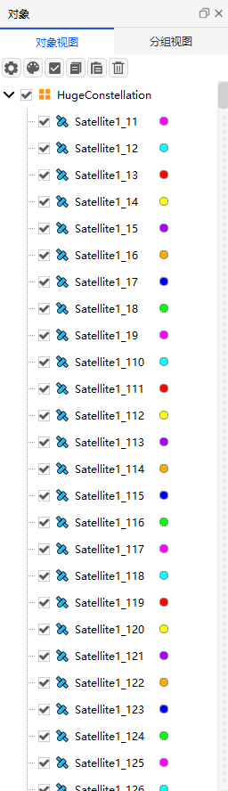

# 巨型星座设计案例

通过二次开发 Connect 模式，创建巨型星座案例，具体细节与 “案例三-9-巨型星座设计案例” 相同。期间必须保持 ATK 为打开状态，具体命令分类包括：

1. 与 ATK 进行连接。
2. 新建场景并进行属性设置。
3. 设计巨型星座。
4. 查看报告数据。
5. 保存场景后与 ATK 断开连接。

## 脚本展示

### 与 ATK 进行连接

```mixcode
{C:1, 与 ATK 进行连接}
conID = atkOpen()
```

### 新建场景并进行属性设置

```mixcode
{C:2, 创建任务场景}
atkConnect(conID, {S:New}, {S:/ Scenario HugeConstellation})
{C:设置仿真时间段}
atkConnect(conID, {S:SetAnalysisTimePeriod}, {S:* "2024-03-18 00:00:00.000" "2024-03-19 00:00:00.000"})
{C:初始化仿真}
atkConnect(conID, {S:Animate}, {S:* Reset})
```

### 设计巨型星座

```mixcode
{C:3, 创建参考卫星}
atkConnect(conID, {S:New}, {S:/ Satellite Satellite1})
{C:设置 WalkerDelta 星座}
atkConnect(conID, {S:WalkerDelta}, {S:*/Satellite/Satellite1 Semimajoraxis 6678137 Eccentricity 0 Inclination 65 RAAN 0 ArgumentOfPerigee 180 TrueAnomaly 180 NumPlanes 30 NumSatsPerPlane 10 InterPlanePhaseIncrement 1 RAANSpread 360 ColorByPlane Yes Yes})
```

### 运行仿真

```mixcode
{C:4, 运行仿真}
atkConnect(conID, {S:Animate}, {S:* Start})
atkConnect(conID, {S:Animate}, {S:* Reset})
```

### 保存场景后与 ATK 断开连接

```mixcode
{C:5, 保存文件并断开连接}
atkConnect(conID, {S:Save}, {S:/ *})
atkClose(conID)
```

## 报告数据结果

本案例运行结果为：生成巨型星座。具体如下图所示：



## 完整脚本

```mixcode
{C:1, 与 ATK 进行连接}
conID = atkOpen()

{C:2, 创建任务场景}
atkConnect(conID, {S:New}, {S:/ Scenario HugeConstellation})
{C:设置仿真时间段}
atkConnect(conID, {S:SetAnalysisTimePeriod}, {S:* "2024-03-18 00:00:00.000" "2024-03-19 00:00:00.000"})
{C:初始化仿真}
atkConnect(conID, {S:Animate}, {S:* Reset})

{C:3, 创建参考卫星}
atkConnect(conID, {S:New}, {S:/ Satellite Satellite1})
{C:设置 WalkerDelta 星座}
atkConnect(conID, {S:WalkerDelta}, {S:*/Satellite/Satellite1 Semimajoraxis 6678137 Eccentricity 0 Inclination 65 RAAN 0 ArgumentOfPerigee 180 TrueAnomaly 180 NumPlanes 30 NumSatsPerPlane 10 InterPlanePhaseIncrement 1 RAANSpread 360 ColorByPlane Yes Yes})

{C:4, 运行场景}
atkConnect(conID, {S:Animate}, {S:* Start})
atkConnect(conID, {S:Animate}, {S:* Reset})

{C:5, 保存场景}
atkConnect(conID, {S:Save}, {S:/ *})
{C:断开与 ATK 的连接}
atkClose(conID)
```