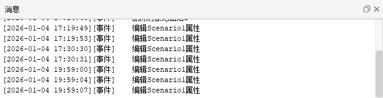
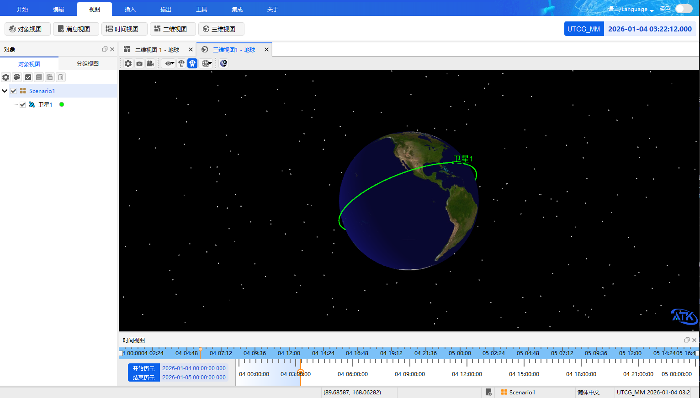

# 视图

**【视图】** 菜单选项包括五个子菜单：[对象视图](#对象视图)、[消息视图](#消息视图)、[时间视图](#时间视图)、[二维视图](#二维视图)、[三维视图](#三维视图)。

## 对象视图

对象视图用于直观展示当前想定场景中的对象情况。

**展开与隐藏对象窗口** 
单击  图标，即可在视图左侧显示对象窗口，展示场景内所有对象。再次单击该图标，则隐藏对象窗口。

**分组管理对象** 
在对象窗口中，可使用 **分组视图** 功能对对象进行分组管理。

## 消息视图

消息视图用于显示软件的操作反馈信息。在进行编辑操作时，相关提示信息会显示在 **消息** 窗口中。

**展开与隐藏消息窗口** 
单击  图标，即可在视图右下侧显示消息窗口，查看操作提示等信息。再次单击该图标，则隐藏消息窗口。

## 时间视图

时间视图用于展示想定场景的起止时间。

**调整时间进度** 
鼠标按住黄色滑块并拖动，可调整时间进度，松开鼠标后即设置为当前进度。

**展开与隐藏时间视图** 
单击  图标，可隐藏时间视图。再次单击该图标，则重新显示。

## 二维视图

二维视图用于直观展示仿真过程中各对象在地球投影面上的二维运动状态信息。

**打开与新增窗口** 
单击  图标，即可查看场景内各对象的二维位置信息。再次单击该图标，则会新增一个二维视图窗口。

**默认状态** 
新建想定文件后，二维视图默认处于打开状态。

## 三维视图

三维视图用于直观展示仿真过程中各对象的三维运动状态信息。

**打开与新增窗口** 
单击  图标，即可查看地球及其他对象的三维显示状态。再次单击该图标，则会新增一个三维视图窗口。

**默认状态** 
新建想定文件后，三维视图默认处于打开状态。

