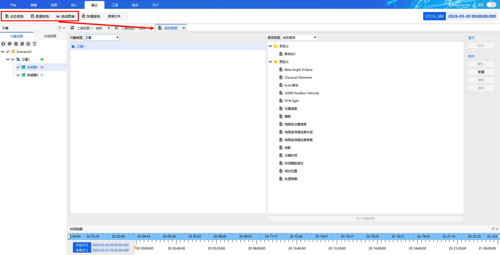

# 输出

**输出**菜单是数据查看与导出的核心入口，包含五个子菜单：[动态报告](#动态报告)、[数据报告](#数据报告)、[曲线图表](#曲线图表)、[快捷报告](#快捷报告)、[数据文件](#数据文件)。

本文结构如下：
- 首先介绍 **[报告管理](#报告管理)**，这是 [动态报告](#动态报告)、[数据报告](#数据报告)、[曲线图表](#曲线图表) 共用的配置入口，涵盖对象选择、样式管理、属性编辑等通用操作
- 然后分别说明五个子菜单的功能特点与使用方式：
  - [动态报告](#动态报告)：实时动态展示
  - [数据报告](#数据报告)：静态数据汇总
  - [曲线图表](#曲线图表)：曲线可视化分析
  - [快捷报告](#快捷报告)：快速访问常用报告
  - [数据文件](#数据文件)：星历数据导出

## 报告管理

点击输出菜单下的  三个按钮，即可打开 **【报告管理】** 窗口。该窗口用于配置和生成 [动态报告](#动态报告)、[数据报告](#数据报告)、[曲线图表](#曲线图表) 的输出样式。

## 动态报告

动态报告用于在**场景运行过程中**，实时动态展示选定对象的状态信息。

### 进入方式

- 点击输出菜单下的 **【动态报告】** 子菜单
- 或通过 [报告管理](#报告管理) 窗口，将【报告类型】选为【动态报告】，选择对象和样式后点击生成

### 特点

- 随仿真进度实时刷新
- 适合观察对象的连续变化趋势

---

## 数据报告

数据报告用于生成选定对象在**指定时间段内**的数据静态汇总，以表格形式呈现完整数据记录。

### 进入方式

- 点击输出菜单下的 **【数据报告】** 子菜单
- 或通过 [报告管理](#报告管理) 窗口，将【报告类型】选为【数据报告】，选择对象和样式后点击生成

### 快捷入口

仿真运行完成后，也可在对象栏中右键点击对象，选择【数据报告】快速打开 [报告管理](#报告管理) 窗口。

---

## 曲线图表

曲线图表将选定对象在仿真期间的数据以曲线形式直观呈现，便于对比和分析数据变化趋势。

### 进入方式

- 点击输出菜单下的 **【曲线图表】** 子菜单
- 或通过 [报告管理](#报告管理) 窗口，将【报告类型】选为【曲线图表】，选择对象和样式后点击生成

### 快捷入口

仿真运行完成后，也可在对象栏中右键点击对象，选择【曲线图表】快速打开 [报告管理](#报告管理) 窗口。

### 图表类型

在 [报告管理](#报告管理) 窗口右侧可选择【二维曲线】或【三维曲线】。

---

## 快捷报告

快捷报告用于快速显示已配置好的文字报告，方便常用报告的快捷访问。

### 首次配置

1. 点击输出菜单下的 **【[数据报告](#数据报告)】** 子菜单，打开 [报告管理](#报告管理) 窗口
2. 在左侧选择对象类型和具体对象
3. 在右侧【报告类型】下拉框中选择【数据报告】，并选中具体的报告样式
4. 点击窗口底部的 <kbd>加入快捷报告</kbd> 按钮，完成配置

### 使用

配置完成后，直接点击输出工具栏中的  图标，即可快速查看已配置的报告内容。

> [!NOTE]
> 若未配置快捷报告直接点击该按钮，将显示为空。

---

## 数据文件

数据文件用于输出对象在仿真过程中的星历数据，支持对星历类型、坐标系、时间范围、步长及输出格式进行自定义设置。

### 操作步骤

1. **进入设置** 
   点击输出工具栏中的 <kbd>数据文件</kbd> 图标，弹出 **【生成数据文件】** 对话框

2. **选择对象** 
   点击 <kbd>选择对象...</kbd> 按钮，在弹出的窗口中选择对象，点击 <kbd>确定</kbd>

3. **设置文件类型**  
   - **【外部文件类型】** 选择 **【星历】**
   - **【星历类型】** 选择 **【STK星历】**

4. **设置坐标系** 
   点击 **【详情】** → **【坐标系】** 下拉框，可选择：
   - 地固系
   - J2000
   - ICRF

5. **设置时间范围**  
   - 勾选 **【使用场景区间】**：使用场景的起止时间
   - 不勾选：需手动设置 **【开始历元】** 和 **【结束历元】**

6. **设置步长** 
   **【步长】** 可选择 **【使用星历步长】** 或使用自定义步长

7. **导出文件** 
   点击 <kbd>输出文件</kbd> → <kbd>导出...</kbd> 按钮，设置文件名、保存类型和保存位置，完成导出