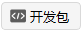
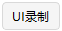

# 集成

“集成”是二次开发工具包，有开发包、客户端、控制台和UI录制四个子项。

1. 开发包

点击【开发包】按钮，会弹出 ATK 的 connect 文件夹路径，可以根据相应的需求选择进行二次开发的内容。

2. 客户端

点击【客户端】按钮，会弹出ATK客户端的对话框，可以根据相应的需求选择进行参数配置和二次开发的内容。

3. 控制台

点击【控制台】按钮，会弹出ATK的Console界面，可以使用二次开发命令实现对ATK软件的操作。

4. UI录制

点击【UI录制】按钮，会弹出ATK的Ui Recoder界面，点击【Strat Recode】按钮，即可对接下来在ATK软件中的操作过程进行录制，点击【Stop Recode】按钮完成录制，录制结束后，可以对录制好的操作过程进行回放、保存、加载、清理等操作。
