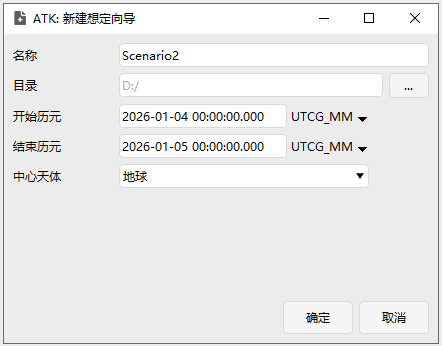

# 开始
点击 **【开始】** 菜单，可展开功能工具集，各功能分类与说明如下表：

| 功能分类 | 图标 | 功能项 | 跳转链接 |
| ---- | ---- | ---- | ---- |
| **文件操作** | | 新建 | [新建](#新建) |
| | | 打开 | [打开](#打开) |
| | | 关闭 | [关闭](#关闭) |
| | | 保存 | [保存](#保存) |
| | | 另存为 | [另存为](#另存为) |
| **对象插入** | | 插入 | [插入](#插入) |
| | | 插入默认 | [插入默认](#插入默认) |
| **视图** | | 二维视图 | [二维视图](#二维视图) |
| | | 三维视图 | [三维视图](#三维视图) |
| **仿真控制** | | 重置 | [重置](/03-基础使用指南/04-仿真控制/仿真控件说明.md#重置) |
| | | 减速 | [减速](/03-基础使用指南/04-仿真控制/仿真控件说明.md#减速) |
| | | 倒放 | [倒放](/03-基础使用指南/04-仿真控制/仿真控件说明.md#倒放) |
| | | 暂停 | [暂停](/03-基础使用指南/04-仿真控制/仿真控件说明.md#暂停) |
| | | 开始 | [开始](/03-基础使用指南/04-仿真控制/仿真控件说明.md#开始) |
| | | 加速 | [加速](/03-基础使用指南/04-仿真控制/仿真控件说明.md#加速) |
| | | 速度输入框 | [仿真步长/速度输入框](/03-基础使用指南/04-仿真控制/仿真控件说明.md#仿真步长/速度输入框) |
| | | 仿真模式下拉框 | [仿真模式](/03-基础使用指南/04-仿真控制/仿真控件说明.md#仿真模式) |
| | | 步长键 | [步长键](/03-基础使用指南/04-仿真控制/仿真控件说明.md#仿真模式) |

## 文件操作

### 新建

点击，弹出 **【ATK: 新建场景向导】** 对话框。

按向导提示，选择场景的中心天体，即可快速完成新场景的创建。

> 创建新场景参考：[开始-新建](/03-基础使用指南/02-场景管理/02-创建新场景.md)

### 打开

点击，弹出默认的场景文件目录。场景文件默认以 `.atk` 格式保存。选中需要打开的想定文件，即可恢复之前的场景设定。

### 关闭

点击，关闭当前正在编辑的想定。

### 保存

点击保存当前想定的修改。

> 保存场景详情请见：[保存场景](/03-基础使用指南/02-场景管理/04-保存场景.md#保存)

### 另存为

点击，弹出保存目录对话框。可输入文件名并选择保存格式（支持 `.atk`、`.xml`、`.txt`)，默认保存为 `.atk` 格式。将当前场景另存为新文件。

> 保存场景详情请见：[另存为场景](/03-基础使用指南/02-场景管理/04-保存场景.md#另存为)

## 对象插入

### 插入

> 详情请见： [插入](/03-基础使用指南/01-界面总览/01-主菜单栏/04-插入.md#插入)

### 插入默认

> 详情请见： [插入默认](/03-基础使用指南/01-界面总览/01-主菜单栏/04-插入.md#插入默认)

## 视图

### 二维视图

点击，可新建二维视图窗口。

> 具体功能说明请参考 [二维可视化](/03-基础使用指南/可视化/坐标系向量.md)。

### 三维视图

点击，可新建三维视图窗口。

> 具体功能说明请参考 [三维可视化](/03-基础使用指南/可视化/客户端绘图.md)。

## 仿真步长/速度输入框仿真控制

仿真控制模块提供仿真过程的运行控制功能，包括开始、暂停、重置、播放速度调节、步长模式切换等。

> 详细说明请参见 [执行仿真](/03-基础使用指南/04-仿真控制/仿真控件说明.md)。
