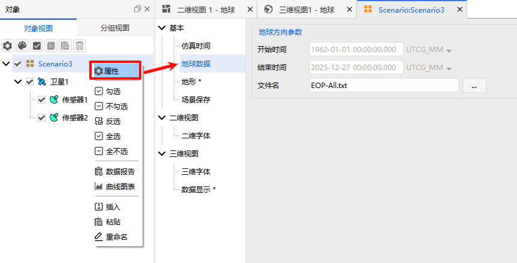

# 地球数据
地球数据是ATK场景属性的关键配置项，用于设置**地球方向参数（Earth Orientation Parameters，EOP）**。该参数精准描述了地球自转轴相对空间固定参考系的变化规律，是实现高精度轨道计算、地面目标精准定位的核心基础，直接影响航天任务仿真的计算精度。

## 地球数据核心设置项说明
| 设置项       | 详细说明                                                                 |
| :----------- | :----------------------------------------------------------------------- |
| **开始时间** | 地球方向参数数据的起始历元，**必须与场景[仿真时间](./01-仿真时间.md)的时间范围相匹配**，为仿真提供对应时段的地球方向基础数据 |
| **结束时间** | 地球方向参数数据的结束历元，**需与场景[仿真时间](./01-仿真时间.md)的时间范围保持一致**，保证仿真全时段的EOP参数连续性 |
| **数据文件** | 选择本地的地球方向参数数据文件，仅支持`.dat`格式，文件需包含完整、有效的EOP参数数据集，为计算提供数据支撑 |

> [!IMPORTANT]
> 地球数据配置的时间范围需与[仿真时间](./01-仿真时间.md)完全匹配，若出现时间范围偏差，将直接降低轨道计算、地面目标定位的精度，甚至导致仿真结果失真。
>