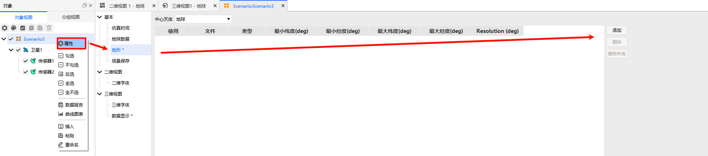

# 地形
## 功能概述
地形是ATK场景属性的重要配置模块，用于统一管理不同中心天体的地形数据，支持对地形数据的**添加**、**删除**操作。配置的地形数据文件将为航天任务仿真的**地形遮挡分析**、**天体表面环境可视化**提供真实的地理数据支撑，大幅提升仿真的真实性与精准度。

例如可针对**地球、月球及太阳系传统行星**自定义指定本地地形数据，适配不同航天任务仿真需求：
- 为月球添加高分辨率地形数据，精准模拟着陆器月表下降过程中的地形遮挡关系；
- 为地球添加地形数据，分析低轨卫星与地面接收站间的可视时段受山脉、高地等地形的影响程度。

## 基础操作说明
在【地形】配置界面中，先从**中心天体**下拉列表中选择需要配置的天体，界面将自动显示该天体当前已绑定的所有地形数据文件，随后即可对文件进行添加、删除等管理操作。

## 地形文件信息展示
选中目标中心天体后，界面将以列表形式展示其所有地形文件的核心信息，便于快速查看数据属性，各信息项说明如下：
- **使用状态**：标识该地形源是否在当前场景中启用；
- **文件**：显示地形数据文件的本地存储路径，便于定位文件；
- **类型**：标注地形数据的文件格式类型；
- **经纬度范围**：以`最小纬度、最小经度、最大纬度、最大经度`的格式，展示地形数据覆盖的地理范围；
- **分辨率**：标注地形数据的空间分辨率，分辨率越高，地形仿真与分析精度越高。

## 地形文件管理操作
针对选中中心天体的地形数据文件，支持单文件、批量文件的管理操作，操作按钮及功能说明如下：
- **添加**：点击<kbd>添加</kbd>按钮，在弹出的【文件选择】对话框中，可导入**一个或多个**地形数据文件至当前天体；
- **删除**：先在列表中选中需要移除的地形文件，再点击<kbd>删除</kbd>按钮，即可删除所选文件；
- **全部删除**：点击<kbd>全部删除</kbd>按钮，可一键清空当前中心天体绑定的**所有**地形数据文件。

> [!TIP]
> 地形数据的**分辨率**与**经纬度覆盖范围**，将直接影响场景的可视化精度与地形分析结果的准确性，建议根据仿真任务的精度要求、分析范围，选择匹配的地形文件。
>