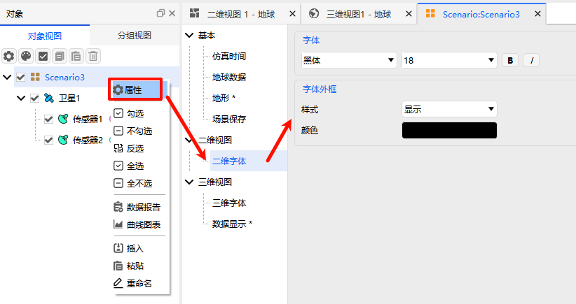

# 二维视图
二维视图属性页是ATK场景可视化配置的重要模块，专门用于自定义设置二维图形窗口中的**字体显示效果**，通过调整字体、外框相关参数，优化二维场景下文本标注的可读性，适配不同的地图背景与显示需求。

## 字体配置
可对二维视图中的文本字体进行全方位自定义，包含以下配置项：
- **字体**：支持从本地系统字体库中自由选择所需字体，适配不同的显示风格；
- **大小**：设置字体显示尺寸，单位为**磅**，可根据视图窗口大小灵活调整；
- **样式**：支持单独选择**加粗**、**斜体**，或同时勾选实现**加粗+斜体**的组合样式。

## 字体外框配置
为解决不同地图背景下文本易被遮挡、辨识度低的问题，支持对字体外框进行个性化设置，包含以下配置项：
- **样式**：提供两种选择，「无」为取消字体轮廓，「显示」为开启字体轮廓，开启后可大幅提升文本在复杂背景下的可读性；
- **颜色**：点击界面中的颜色选择器，可自定义设置字体外框的显示颜色，建议选择与地图背景对比鲜明的颜色。

> [!TIP]
> 二维视图的字体显示效果与场景背景匹配度直接相关，可根据当前地图的色彩、纹理灵活调整字体样式与外框配置，实现文本标注清晰易读。
>