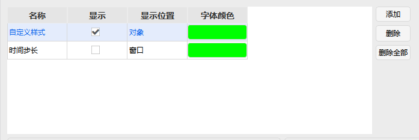

# 数据显示
数据显示是ATK三维视图的核心可视化配置模块，用于管理并自定义在三维视图中实时呈现的文字类监控信息（如航天器轨道参数、任务运行状态、历元时间等），支持灵活的布局与样式配置，实现航天仿真过程中关键数据的实时可视化监控。

## 添加显示数据
若需在三维视图中新增关键数据监控项，可按以下步骤完成配置，支持系统预定义与用户自定义两种数据样式：
1. 点击配置界面中的<kbd>添加</kbd>按钮，系统将弹出【添加显示数据】对话框；
2. 在对话框中选择数据样式来源，二选一即可：
   - **预定义样式**：系统自带的标准数据显示模板，适配常规仿真监控需求；
   - **自定义样式**：用户在【报告管理】中预先创建的个性化数据展示样式，适配定制化监控需求；
3. 样式的创建、编辑与详细配置，可参阅 [报告管理指南](/4.基础使用指南/0-ATK工作区介绍/02-窗口介绍/报告管理.md)；
4. 确认样式选择后，该数据监控项将自动同步至数据显示列表，完成添加。

## 列表管理
数据显示列表为当前三维视图中所有已激活的数据监控项的总览面板，清晰展示各监控项的基本信息与状态，同时支持单条/批量删除操作，具体说明如下：
- **名称**：该数据监控项的唯一标识名称，便于快速识别数据类型；
- **显示**：通过勾选框控制该监控项在三维视图中的显示/隐藏状态，无需删除即可临时关闭；
- **显示位置**：标注数据的绑定层级，分为「窗口」和「特定对象」两类；
- **字体颜色**：该监控项文字显示颜色的实时预览色块，直观查看色彩配置；
- **删除操作**：
  - **单条删除**：在列表中选中需移除的某一条数据监控项，点击<kbd>删除</kbd>按钮即可移除；
  - **批量删除**：点击<kbd>删除全部</kbd>按钮，可一键清空当前数据显示列表中的所有监控项。

## 数据样式配置
在数据显示列表中选中任意一项数据监控项后，可在界面下方的配置面板中对其视觉效果、显示位置进行精细化调整，分为**文字配置**和**装饰配置**两大模块，调整效果可实时在三维视图中预览。

### 文字配置
先勾选该监控项的「显示」选项，再对以下参数进行自定义配置，精准调整文字的显示与位置：
- **颜色**：点击颜色选择器，设置文字的显示色彩，建议选择与三维场景对比鲜明的颜色；
- **位置模式**：定义文字的绑定与显示规则，二选一：
  - **窗口**：文字固定在三维视图窗口的特定像素坐标，不随视角缩放、场景旋转而移动；
  - **对象**：文字与指定的航天器、地面站等仿真对象绑定，随对象同步移动、缩放；
- **对齐方式**：设置文字相对于原点的对齐规则，分X、Y轴独立配置：
  - **X轴原点**：可选「左」「右」「中心」三种对齐方式；
  - **Y轴原点**：可选「上」「下」「中心」三种对齐方式；
- **偏移量**：通过调整`X`、`Y`轴的数值，精确设定文字相对于对齐原点的坐标偏移，实现精细化位置校准。

### 装饰配置
为提升复杂三维场景下文字信息的辨识度，支持为文字添加背景与边框装饰，配置项如下：
- **背景**：勾选后可自定义文字底盒的**颜色**，通过纯色底盒遮挡背景干扰，提升文字可读性；
- **边框**：勾选后可配置文字底盒的**边框颜色**，为背景底盒添加视觉轮廓，进一步突出文字区域。

> [!TIP]
> 数据显示的所有配置效果均可实时在三维视图中预览，建议根据仿真场景的复杂度、背景色彩及观测需求，灵活调整文字样式、位置与装饰效果，确保关键数据清晰易读；同时可根据仿真阶段，通过「显示」勾选框灵活开关不同监控项。
>