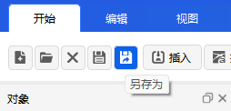

# 保存场景
本文档介绍ATK软件中场景的**保存**与**另存为**两种操作方式，包含操作步骤、保存内容及相关配置参考，确保场景的所有配置与对象信息可完整留存。

## 保存
1. 点击软件顶部【开始】菜单，在功能区选择<kbd>保存</kbd>按钮，即可快速保存当前场景的所有信息。

2. 保存规则说明：
   - 执行保存操作时，**场景本身**及其包含的**所有对象信息**会被同步保存；
   - 场景文件的默认后缀为`.atk`；
   - 若为已保存过的场景，将直接覆盖原有文件；若为新建未保存场景，将弹出【保存】对话框提示选择保存路径。

## 另存为
1. 点击软件顶部【开始】菜单，在功能区选择<kbd>另存为</kbd>按钮，即可对当前场景进行另存操作。

2. 另存为规则说明：
   - 执行另存为操作时，将弹出【另存为】对话框，可**自定义选择保存目录**与文件名称；
   - 保存内容包含**场景本身**及其包含的**所有对象信息**，文件后缀仍为`.atk`；
   - 另存为操作不会覆盖原有场景文件，将生成一个全新的场景文件，原文件保持不变。

> 场景保存相关详细配置可参考：[场景保存配置](/03-基础使用指南/02-场景管理/03-场景属性配置/02-基本/04-场景保存配置.md)