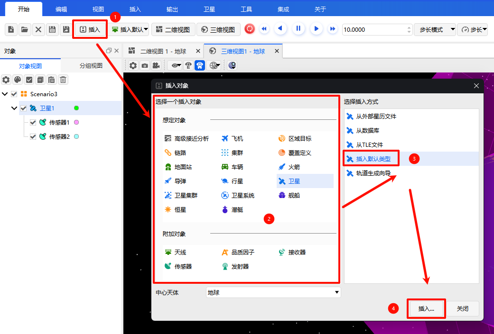

# 插入默认（快捷插入）
**插入默认**是ATK中最常用的对象快捷创建方式，支持预先自定义默认对象，也可在插入窗口直接使用系统默认参数，实现常用仿真对象一键快速插入。

## 方式一：设置默认对象一键插入
1. 单击  图标，弹出【默认插入对象设置】对话框；
2. 在对话框中勾选需要设为默认的对象类型，如高级接近分析、卫星、地面站、舰船等；
3. 设置完成后，直接单击  图标，即可**一键插入已选定的默认对象**，无需重复选择类型。

## 方式二：插入对象窗口选择默认方式
1. 打开【插入对象】窗口，在列表中选定需要创建的目标对象类型；
2. 在插入方式列表中选择 **「插入默认类型」**；
3. 直接点击 <kbd>插入...</kbd> 按钮，系统将使用内置默认参数快速完成对象添加。

