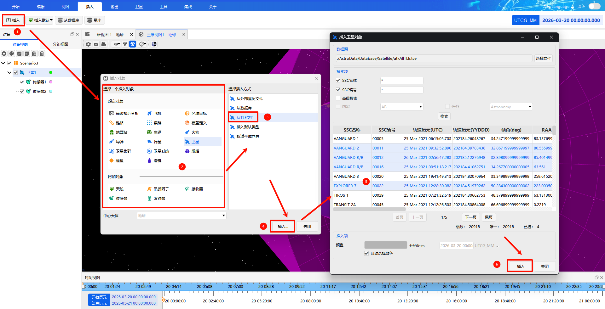

# 从TLE文件
**从TLE文件**是卫星对象专用的插入方式，支持通过外部TLE（两行根数）星历文件快速导入卫星轨道数据，适用于批量加载真实卫星轨道参数。

1. 在【插入对象】窗口中选择**卫星**，插入方式选择 **「从TLE文件」**；
2. 在弹出的对话框中选择本地TLE数据源文件；
3. 可通过**SSC 名称、SSC 编号、国家、任务**等字段对卫星进行筛选搜索；
4. 搜索完成后在列表中选择目标卫星：
   - 单击选择单个对象
   - 按住 <kbd>Ctrl</kbd> 进行多选
   - 按住 <kbd>Shift</kbd> 进行连续选择
5. 设置卫星显示颜色：需先取消勾选**自动选择颜色**，再自定义颜色；
6. 确认参数后完成卫星对象导入。

