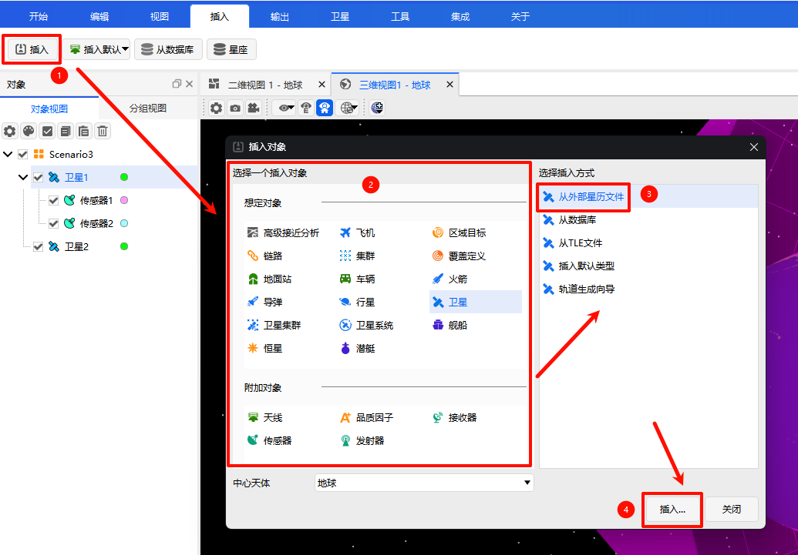

# 从外部星历文件
**从外部星历文件**是卫星专用的导入方式，支持通过外部`.e`格式星历文件直接导入高精度轨道数据，适用于使用自定义星历或第三方轨道数据的场景。

1. 在【插入对象】窗口中选择**卫星**，插入方式选择 **「从外部星历文件」**，点击 <kbd>插入...</kbd> 按钮；
2. 在弹出的文件对话框中，选择本地`*.e`格式星历文件；
3. 系统自动解析星历内容，并在界面中预览轨道信息；
4. 确认信息无误后，完成卫星对象导入。

