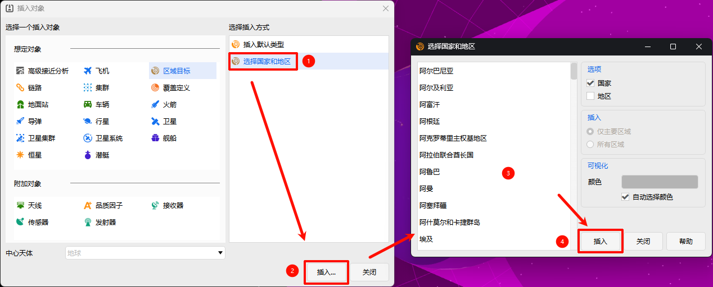

# 选择国家和地区
**选择国家和地区**是区域目标（AreaTarget）专用的快速创建方式，可直接基于行政区划生成面状目标，适合国土覆盖、区域观测等场景快速建模。

1. 在【插入对象】窗口中选择**区域目标**，插入方式选择 **「选择国家和地区」**；
2. 在界面左侧列表中选择目标**国家或地区**；
3. 在右侧面板配置：
   - 插入选项
   - 插入区域范围
   - 可视化显示颜色
4. 确认后即可生成对应区域目标。

