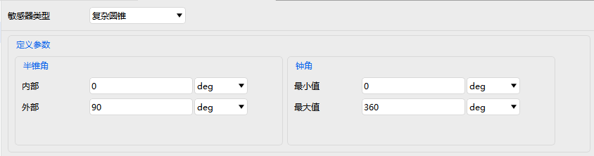
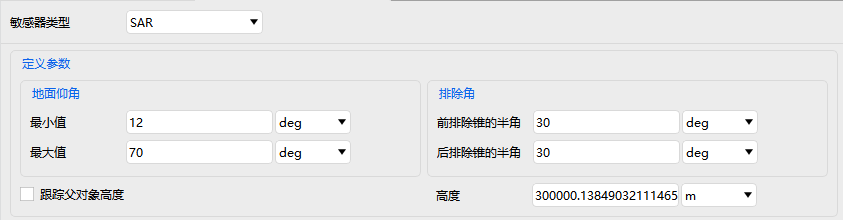

# 传感器

传感器属性用于配置搭载在各类平台上的探测设备，包含 **基本属性、二维视图、三维视图、约束** 四大配置模块。

---

## 基本属性

用于定义传感器类型、几何/物理参数、相对位置及指向方式。

### 传感器类型及对应参数

| 传感器类型 | 关键定义参数                               |
| ---------- | ------------------------------------------ |
| 简单圆锥   | 半锥角                                     |
| 矩形       | 垂直半角、水平半角                         |
| 复杂圆锥   | 半锥角、钟角                               |
| 半功率     | 频率、直径                                 |
| SAR        | 地面仰角、排除角、是否跟踪父对象高度、高度 |

指向设置中包括指向类型以及类型对应参数的设置。

::: details 指向类型：固定指向
| 偏置姿态形式 | 参数                             | 说明                                                         |
| :----------- | :------------------------------- | :----------------------------------------------------------- |
| **Az-EI**    | 方位角、高度角                   | 方位角（Azimuth）指水平方向角，高度角（Elevation）指俯仰角，单位为度。 |
| **四元数**   | qx, qy, qz, qs                   | 四元数表示姿态，qs 为标量部分。                              |
| **欧拉角**   | Euler1, Euler2, Euler3, 转序序列 | 三个欧拉角（度）及旋转顺序（如 ZYX、XYZ 等）。               |
| **YPR 角**   | 偏航角、俯仰角、滚转角, 转序序列 | 按三个角度及转序（如YPR、YRP）。                             |
| **转换矩阵** | 3×3 矩阵                         | 直接输入 3×3 旋转矩阵的 9 个元素。                           |
:::

::: details 指向类型：旋转
| 定义         | 说明                                                         |
| :----------- | :----------------------------------------------------------- |
| **扫描模式** | - **连续**：匀速旋转，需设置旋转速度、初始偏差角。 - **单向**：从开始角到结束角单向扫描，需设置开始角、结束角、旋转速度、初始偏差角。 - **双向**：来回扫描，参数同单向。 |
| **旋转轴**   | 可选：方位角、高度角、圆锥角。                               |
:::

::: details 指向类型：目标定向
| 参数           | 说明                                                         |
| :------------- | :----------------------------------------------------------- |
| **瞄准类型**   | - **追踪（接收/发射/转发）**：实时追踪目标，并根据信号类型（接收、发射、转发）调整指向。 - **固定指向**：采用与“固定指向”相同的偏置姿态形式（如 Az-EI、四元数等），对目标施加固定偏移。 |
| **选项过滤器** | 用于筛选可选目标，可从场景对象或库目标中选择。               |
:::

::: details 指向类型：入射高度
| 参数             | 说明                              |
| :--------------- | :-------------------------------- |
| **方位角偏移量** | 相对参考方向的水平偏移角。        |
| **入射高度**     | 目标点的高度值（单位通常为 km）。 |
:::

::: details 指向类型：外部
| 参数         | 说明                                                       |
| :----------- | :--------------------------------------------------------- |
| **外部文件** | 选择包含指向数据的文件（格式由软件支持，.pattern文件等）。 |
:::

## 二维视图

控制传感器在二维场景中的显示样式：

| 选项         | 说明                       |
| ------------ | -------------------------- |
| 显示         | 是否在二维视图中显示传感器 |
| 填充         | 是否对探测范围进行颜色填充 |
| 颜色         | 填充与轮廓颜色             |
| 显示相交类型 | 可选：无、中心天体、地形   |
| 线宽         | 轮廓线条宽度               |

---

## 三维视图

用于设置三维场景中传感器的空间表现形式，包含 **空间投影、脉冲、向量、数据显示**。

### 空间投影

- 空间投影距离（单位：km）
- 是否使用距离约束

### 脉冲

- 显示：是否显示探测脉冲动画
- 振幅、脉冲长度、频率值
- 反向：是否反向显示脉冲
- <kbd>重置为缺省值</kbd>：一键恢复默认参数

### 向量与数据显示

详情参见 [飞机的属性设置](./飞机.md) 对应章节。

---

## 约束

约束配置规则与 [飞机的属性设置](./飞机.md) 中约束部分一致，此处不再重复说明。