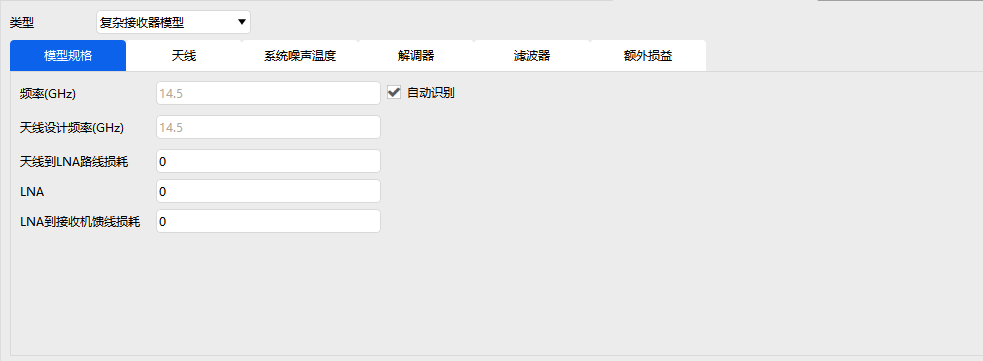

# 接收器

接收器属性用于配置卫星、地面站等平台上的信号接收设备，包含 **基本属性、约束、RF** 三大模块。

---

## 基本属性

可选择不同精度的接收机模型，并配置对应参数：

- 简单接收机模型

- 中等接收机模型

- 复杂接收机模型

> - 简单/中等/复杂模型均支持：**模型规格、调制器、滤波器、额外损益**
> - 中等模型**新增**：**系统噪声温度**设置
> - 复杂模型**新增**：**天线参数 + 系统噪声温度**设置

---

## 约束

- 基本约束、时间约束：同 [飞机的属性设置](./飞机.md)

- **通信约束**：支持频率、接收各向同性功率、通量密度、EIRP、多普勒频移、C/No、接收机输入功率、C/N、误码率、链路裕量、Eb/No、极化相对角、G/T 等指标，所有约束均支持**反向选择**

---

## RF

RF 环境设置同 [飞机的属性设置](./飞机.md) 对应部分，不再重复说明。