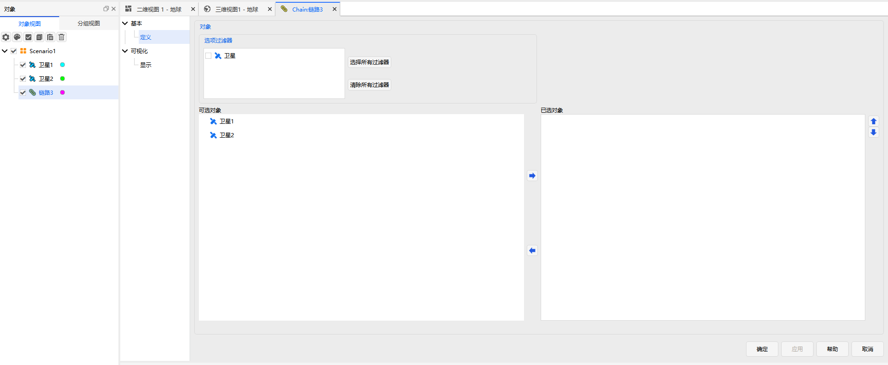

# 链路

链路属性用于配置两个或多个对象之间的通信/视线连接，包含 **基本属性** 和 **可视化** 两部分。

---

## 基本属性

用于定义链路组成：

- 对象选项过滤器
- 可选对象列表
- 已选对象（构成链路的平台/载荷）

---

## 可视化

支持静态 + 动态双模式显示：

- 总显示开关
- **静态可视化**：显示开关、颜色、线型、线宽
- **动态可视化**：亮度、线显示、颜色、线型线宽、方向显示

