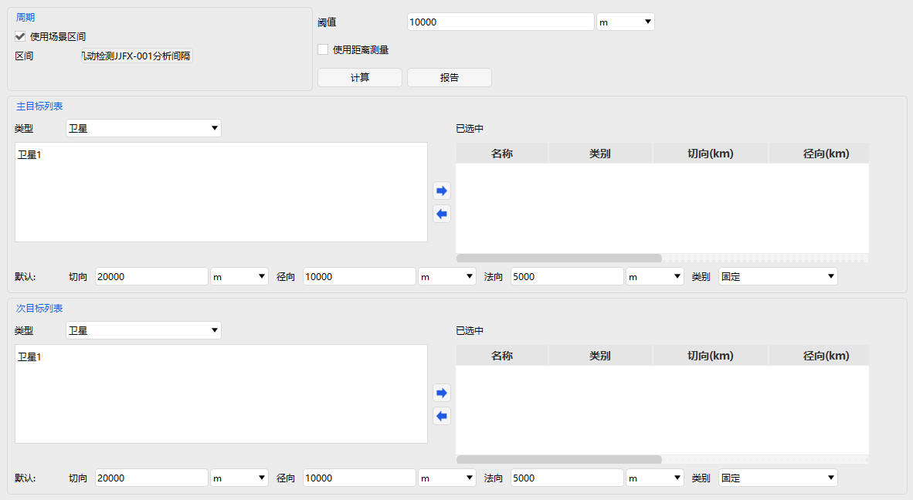
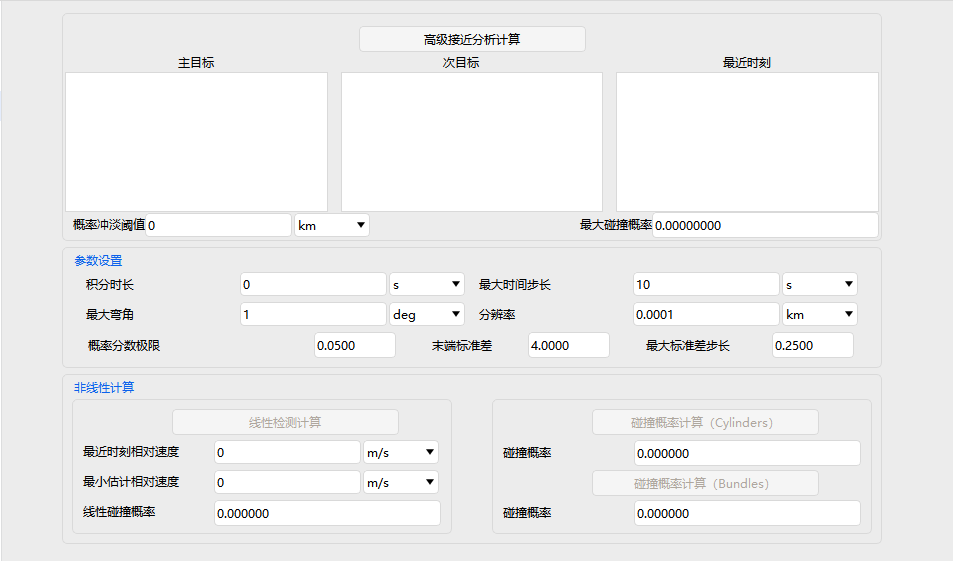

# 高级接近分析

高级接近分析用于对多目标之间的近距离交会、碰撞风险、相对位置进行精细化评估，属性设置包含 **基本属性** 和 **可视化** 两部分。

---

## 基本属性

包含 **主配置、高级、非线性计算** 三个配置页。

### 主配置

- 分析周期设置
- 主目标列表、次目标列表
- 距离/接近阈值设置
- 可选是否使用距离测量
- 内置 <kbd>计算</kbd>、<kbd>报告</kbd> 功能按钮

### 高级

- 预滤波器设置
- 高级椭球属性
- SSC 目标半径文件
- 最大/最小采样步长
- 碰撞类型设置

### 非线性计算

#### 参数设置

- 积分时长
- 最大时间步长、最大弯角
- 分辨率、概率分数极限
- 末端标准差、最大标准差步长

#### 计算类型

- 线性检测计算
- 碰撞概率计算（Cylinders）
- 碰撞概率计算（Bundles）

---

## 可视化

控制三维场景中的风险椭球显示：

- 整体显示开关
- 是否显示主椭球
- 是否显示次椭球
- 次椭球显示模式：所有 / 仅带碰撞

