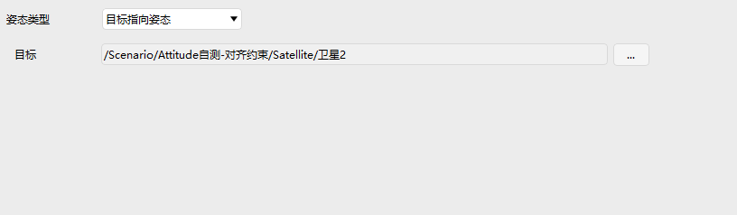
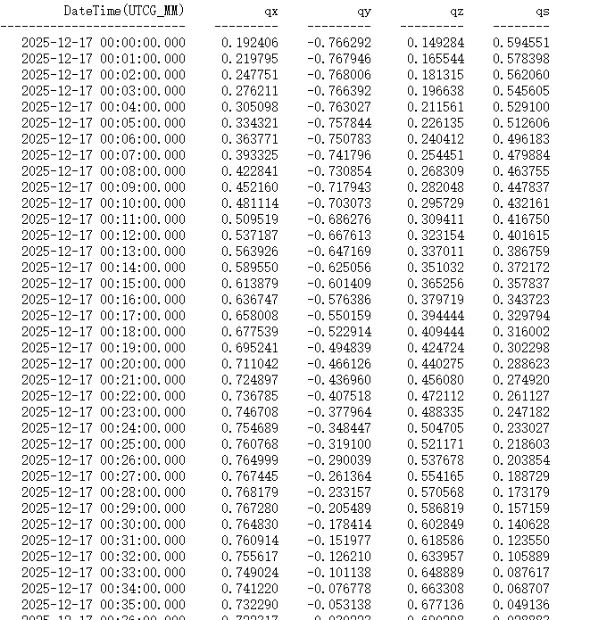
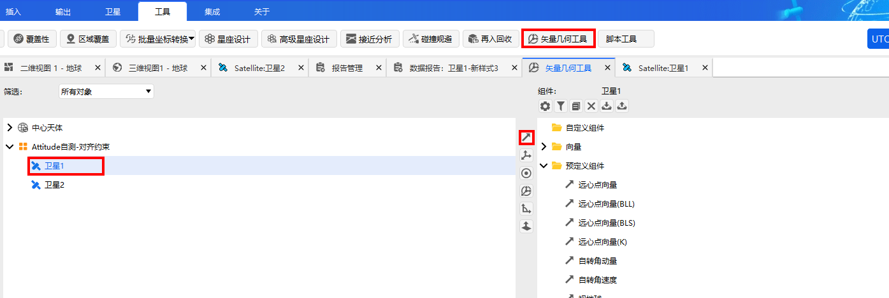
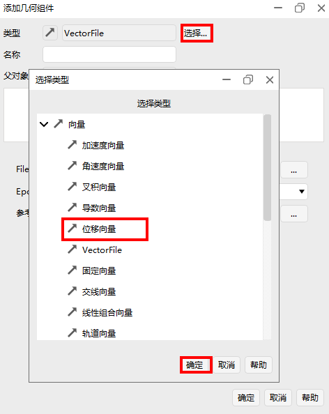
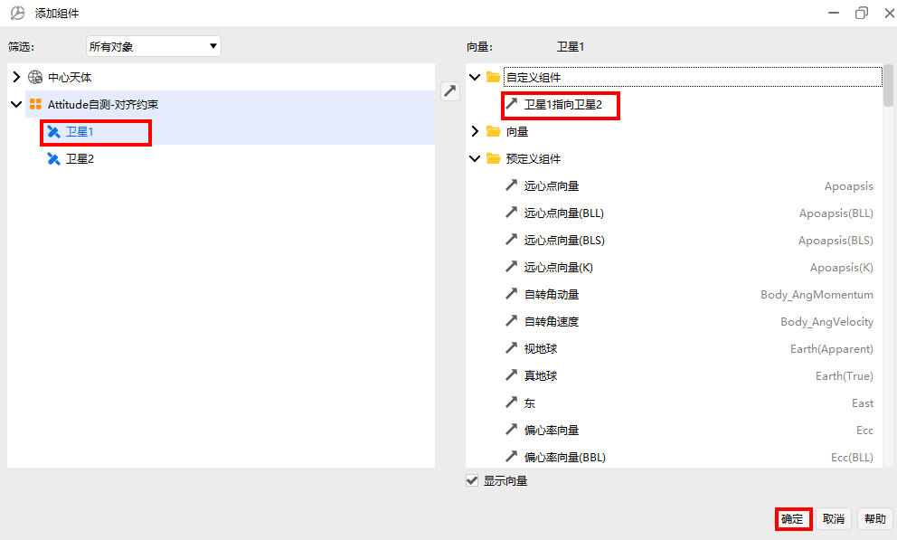
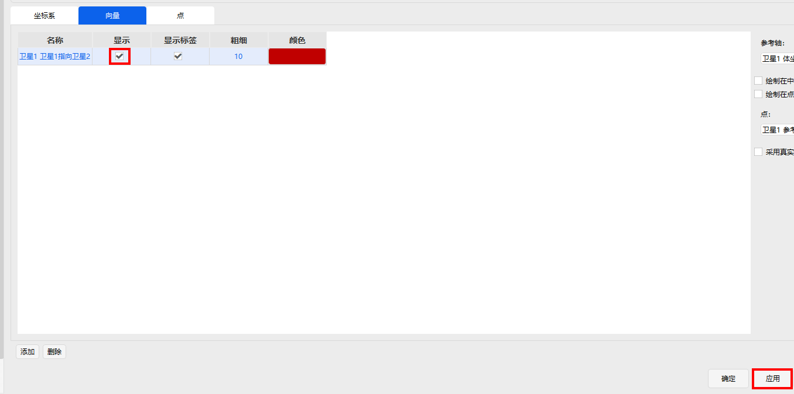
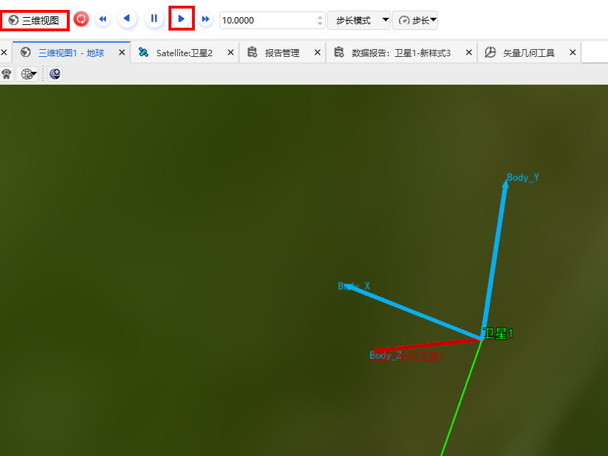

# 目标指向姿态

## 定义

姿态指向目标点

## 介绍

姿态指向指定目标

## 使用方法

###  选择姿态操作

点击卫星【属性】，选择【姿态】，选择姿态类型为【目标指向】

### 配置参数

目标：被指向的目标点

以指向卫星2为例。插入卫星2，设置卫星2的位置不同于卫星1，设置指向卫星2

## 姿态报告

1. 打开数据报告

右键【卫星1】，点击【数据报告】，选中【卫星1】

2. 新建报告

点击【新建】，选中新建好的【新样式1】，点击【属性】进行配置

3. 配置属性

找到【Attitude Quaternions in Select Axes】, 选中 qs, qx, qy, qz, 点击【→】

4. 点击生成

选择配置好的数据报告样式【新样式1】，点击【生成】

5. 选择参考系

以配置地球天体惯性系为例，选择中心天体为【地球】，选择【国际天体惯性系】，点击【确定】

6. 显示报告

生成姿态报告

## 可视化

1. 添加矢量几何向量

点击主菜单栏的【矢量几何工具】，选择【卫星1】，点击【↗】，添加向量

2. 添加位移向量

点击【选择】，选择【位移向量】，点击【确定】

3. 配置位移向量

编辑【名称】，选择起始点为卫星1的参考点，终点为卫星2的参考点，点击【确定】

4. 添加坐标系

点击【卫星1】，选择【向量】，点击【添加】，给卫星1添加坐标系

5. 选择坐标系

在添加的组件中，选中【卫星1】对象，选中【体坐标系】，点击【确定】

6. 坐标系配置

勾选【显示】，点击【应用】

7. 添加向量

选择【向量】，点击【添加】

8. 选择向量

选择【卫星1】，点击自定义组件中的【卫星1指向卫星2】，【确定】进行添加

9. 向量配置

勾选【显示】，点击【应用】或【确定】

10. 三维可视化

在主菜单栏中点击【三维视图】，选中【局部视点】，选择【卫星1】视角，点击【▶】播放动画，卫星1指向卫星2向量在体坐标系中保持不变，默认z轴为对齐轴

