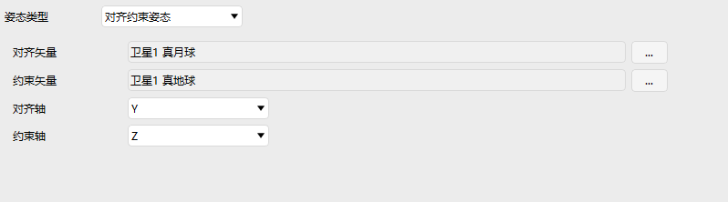
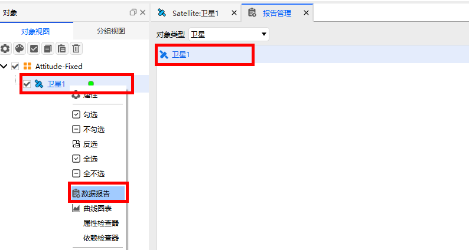
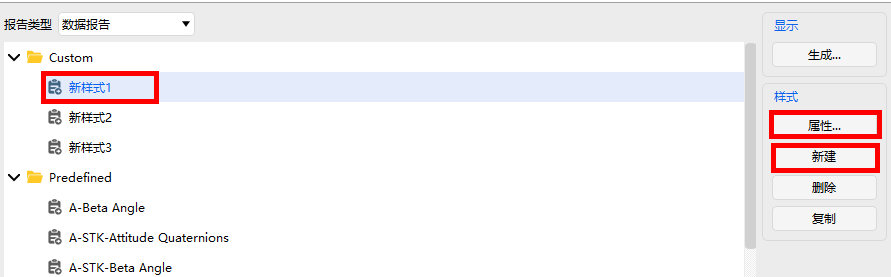
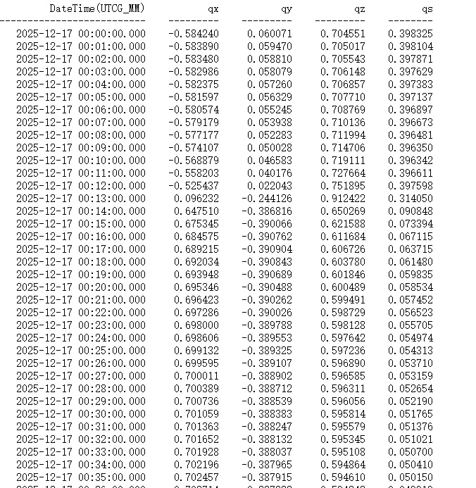
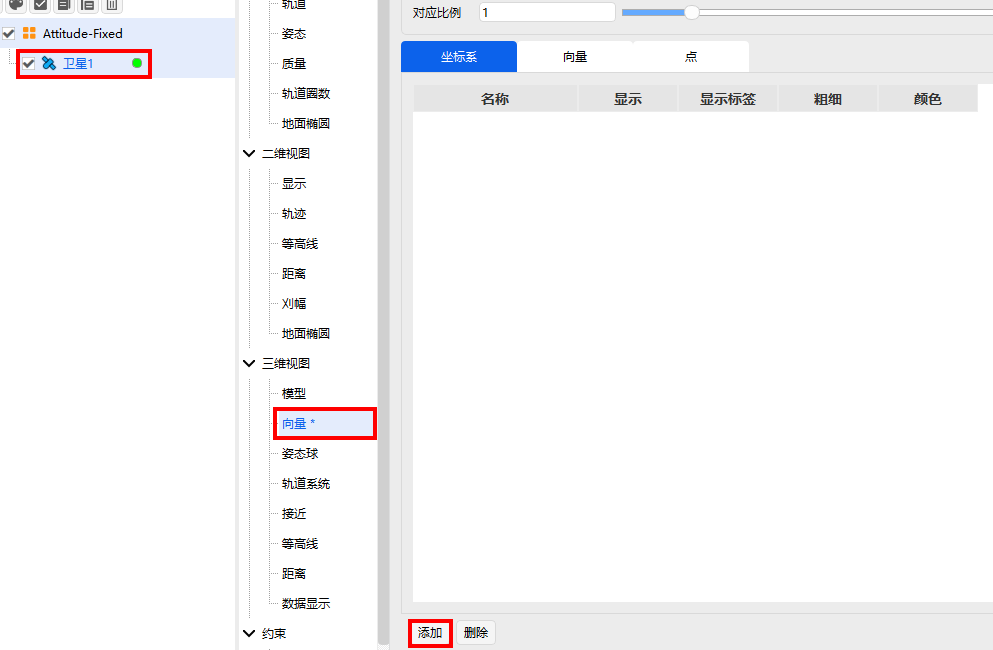
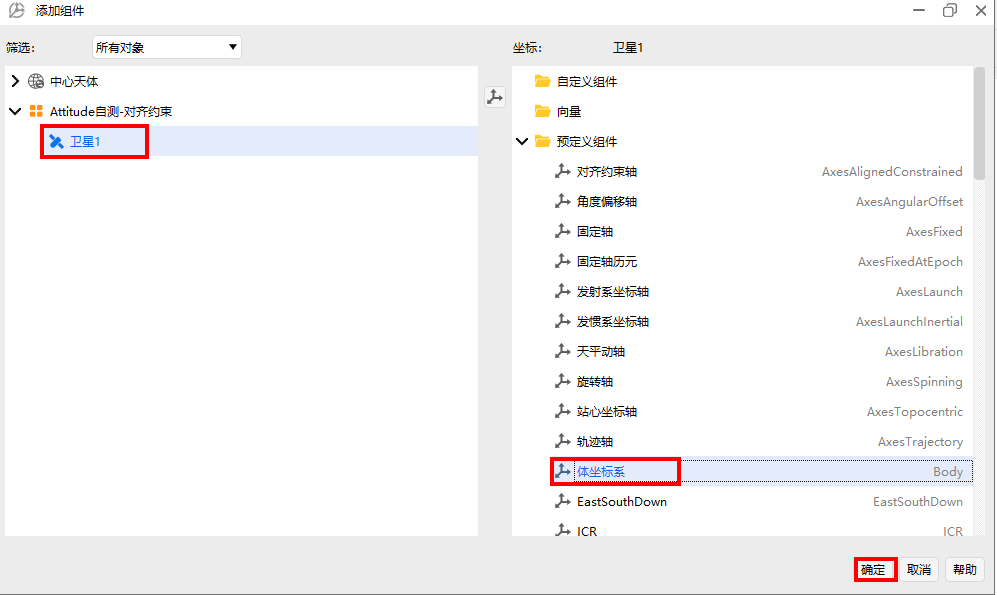
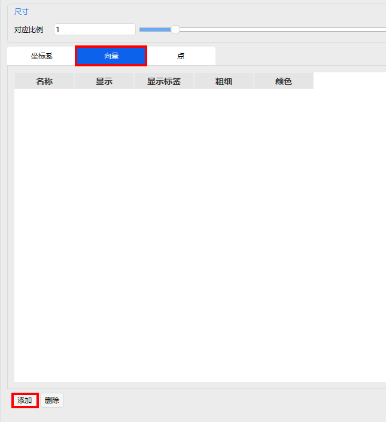
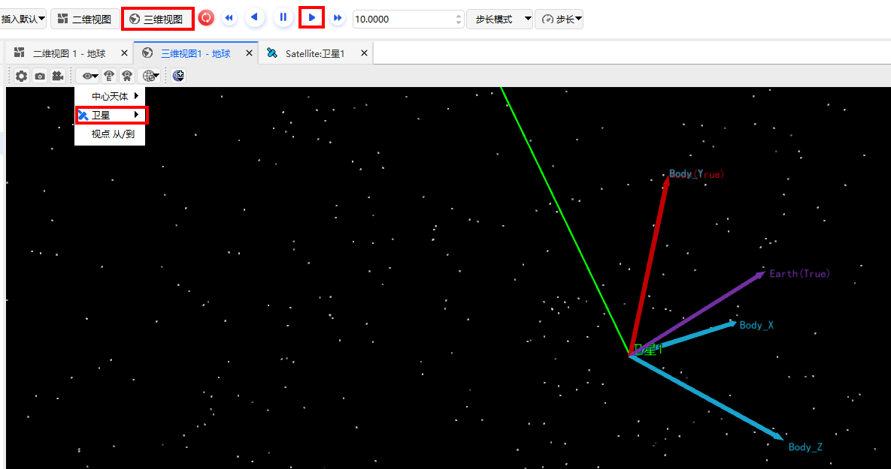

# 对齐约束姿态

## 定义
对齐约束下的姿态

## 介绍
用于定义一种“主轴对齐+辅助轴约束”的姿态控制，允许用户指定一个机体轴对齐到目标向量（如对齐到真月球向量），并指定第二个机体轴的约束方向（如尽量对齐到真地球向量），ATK会自动计算第三个轴，确保右手坐标系一致。

## 使用教程

###  选择姿态操作

点击卫星【属性】，选择【姿态】，选择姿态类型为【对齐约束姿态】

### 配置参数

1. 对齐矢量：姿态对齐的轴

2. 约束矢量：姿态约束的轴

3. 对齐轴：选择X,Y,Z,-X,-Y,-Z某一轴进行对齐

4. 约束轴：选择X,Y,Z,-X,-Y,-Z某一轴进行约束

以卫星1的Y轴对齐到真月球，Z轴约束到真地球为例，配置如下参数

## 姿态报告

1. 打开数据报告

右键【卫星1】，点击【数据报告】，选中【卫星1】

2. 新建报告

点击【新建】，选中新建好的【新样式1】，点击【属性】进行配置

3. 配置属性

找到【Attitude Quaternions in Select Axes】, 选中 qs, qx, qy, qz, 点击【→】

4. 点击生成

选择配置好的数据报告样式【新样式1】，点击【生成】

5. 选择参考系

以配置地球天体惯性系为例，选择中心天体为【地球】，选择【国际天体惯性系】，点击【确定】

6. 显示报告

生成姿态报告

## 可视化

1. 添加坐标系

点击【卫星1】，选择【向量】，点击【添加】，给卫星1添加坐标系

2. 选择坐标系

在添加的组件中，选中【卫星1】对象，选中【体坐标系】，点击【确定】

3. 坐标系配置

勾选【显示】，点击【应用】

4. 添加向量

选择【向量】，点击【添加】

5. 选择向量

选择【卫星1】，分别点击【真地球】【真月球】，【确定】进行添加

6. 向量配置

勾选【显示】，点击【应用】或【确定】

7. 三维可视化

在主菜单栏中点击【三维视图】，选中【局部视点】，选择【卫星1】视角，点击【▶】播放动画，卫星的Y轴将指向真月球，约束向量（真地球）将在对齐约束轴面（YZ平面）

