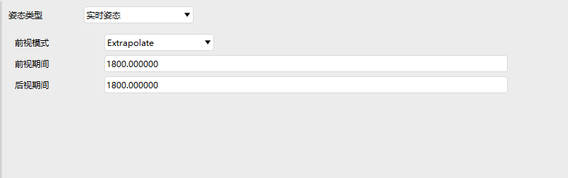

# 实时姿态

## 定义
实时姿态预报器

## 介绍

通过Connect命令接收实时数据，根据实时数据进行预报。

## 使用方法

###  选择姿态操作

点击卫星【属性】，选择【姿态】，选择姿态类型为【实时姿态】

### 配置参数

1. 前视模式：规定预测方式（线性、外推等）

2. 前视时间：允许在当前时刻预测未来姿态

3. 后视时间：允许用过去的数据平滑姿态

### Connect命令

通过Connect命令进行参数配置，以及实时数据的写入

### 可视化

选择【实时模式】，点击【▶】，点击【三维视图】，此时将场景时间变为当前实际时间，并播放动画

