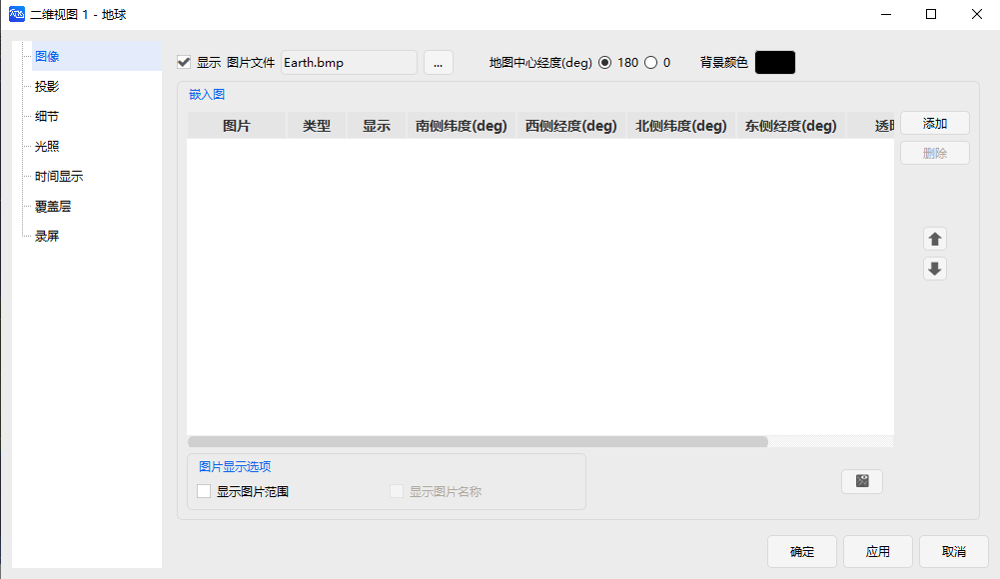

# 配置入口

点击 <kbd>属性</kbd> 按钮后弹出的【二维属性视图】对话框，是二维视图配置的核心入口，界面展示如下：

可配置核心参数分类如下：

- **图像配置**：调整视图亮度、对比度、饱和度等显示效果；
- **投影设置**：选择合适的投影方式（如墨卡托投影、方位投影等）；
- **细节控制**：设置对象显示精度、轨迹平滑度等细节参数；
- **光照调节**：配置视图光照强度、方向，优化视觉体验。