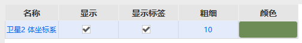
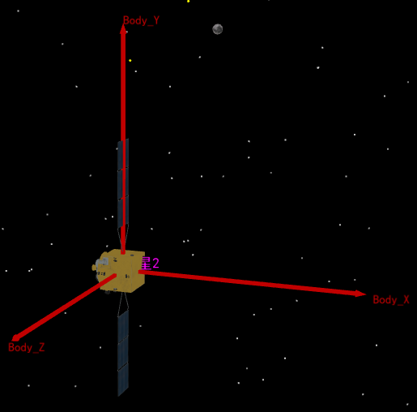

# 坐标系向量

## 功能介绍

- 控制三维图形窗口中，与地球等中心天体相关的矢量及几何元素（如坐标轴、角度）的显示。
- 控制与所选对象（如卫星）相关的矢量及几何元素的显示。

## 使用方法

1. **打开对象属性**
   选中目标对象（例如“卫星1”），通过以下任一方式打开其属性设置页面：
   - 右键单击对象，在快捷菜单中选择“属性”。
   - 左键双击对象。
2. **进入向量设置界面**
   在属性设置页面的左侧导航树中，依次展开 **三维视图** > **向量**，进入向量显示设置界面。
3. **添加向量组件**
   点击 **添加** 按钮，弹出“添加组件”窗口。
4. **选择预定义组件**
   在“预定义组件”列表中，选择 **体坐标系**。
5. **确认创建**
   点击 **确定**，完成体坐标系向量的添加。

6. **配置显示属性**
   添加完成后，在向量列表中可进行如下配置：
   - **显示/隐藏向量**：勾选或取消勾选“显示”列的选择框，控制向量在视图中的可见性。
   
   - **显示/隐藏文字标签**：勾选或取消勾选“显示标签”列的选择框，控制坐标轴标签的显示。
   
   - **调整粗细**：双击“粗细”列的数值，输入坐标轴线条的像素大小。
   
   - **调整颜色**：点击“颜色”列的颜色块，在弹出的颜色选择器中自定义坐标轴颜色。

7. **完成与应用**

  所有配置完成后，点击 **确定** 使设置生效并关闭窗口。如需继续编辑其他属性，可点击 **应用** 保存当前设置但不关闭窗口。此后，您也可以随时返回此界面修改已添加的向量配置。

