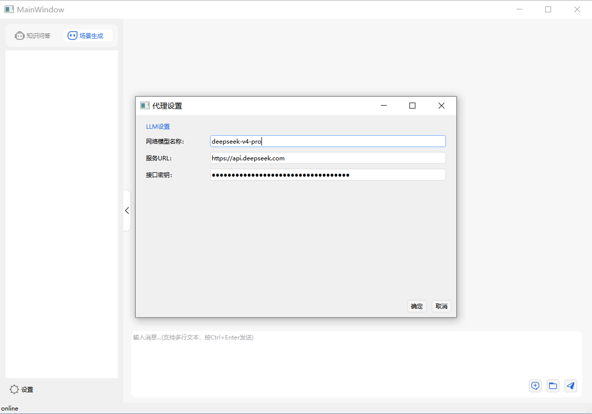

# 使用说明

ATK 场景生成智能体是基于大语言模型（LLM）的**自然语言驱动型辅助工具**，旨在降低航天仿真系统的操作门槛。该智能体作为 ATK 软件的前端交互层，能够将用户的中文自然语言指令实时解析为底层 Connect 二次开发命令，并自动执行，实现对仿真场景的无代码化构建与操控。

用户仅需表述任务目标（如轨道类型、载荷参数、仿真时段），智能体即可自动完成对象创建、参数赋值、仿真推演及数据后处理等完整工作流。

## 模型接入与配置

使用前需在【代理设置】面板中完成大模型API配置，系统支持所有兼容 OpenAI API 标准的模型服务。

| 配置项 | 说明 |
|--------|------|
| 网络模型名称 | 指定调用的模型名称（如 DeepSeek-R1、Qwen-Max、GLM-4 等） |
| 服务URL | 模型服务端点地址 |
| 接口密钥 | 接口认证密钥 |



## 当前适用范围

该智能体支持多类场景对象的创建与管理，并提供轨道设置、载荷配置、仿真控制与专业分析等全流程能力。

**场景对象管理**

- 支持创建卫星、地面站、飞机、导弹、天体、卫星星座等对象
- 可为卫星配置传感器、通信收发设备等子对象
- 支持对象改名、删除及场景时段设置等基础管理

**轨道与航迹设置**

- 卫星轨道支持五种设置方式：轨道向导、经典轨道根数、位置速度、星历文件导入、机动变轨规划，适配各类轨道类型与高精度仿真需求
- 可快速生成导弹弹道、规划飞机/船只航线、批量创建恒星与星座构型

**载荷与链路配置**

- 精细化配置多类传感器指向模式、地面站参数及完整通信链路参数
- 支持自动工程单位换算

**仿真控制与数据分析**

- 具备全套仿真控制能力与三维可视化显示调节功能
- 可完成覆盖分析、可见性分析等专业仿真计算

## 注意事项

- **自然表达即可**：
  无需记忆任何命令格式，用日常语言描述需求即可。

  ::: tip 示例
  “创建 10 个卫星”、”设置仿真时间从 2026 年 1 月 1 日 到 2026 年 1 月 7 日”
  :::

- **暂不支持中文对象名**：
  智能体基于 Connect 二次开发命令实现，当前不支持中文编码格式。

  ::: warning 注意
  请勿创建中文命名的对象，亦不要在有中文命名对象的场景中执行操作。
  :::

- **创建后需重置仿真状态**：
  对象创建完成后，须向智能体发送以下命令，新建内容才能在二维、三维视图中正确显示：

  ```text
  重置场景仿真状态
  ```

- **功能持续完善中**：
  当前智能体支持的指令尚不完全，部分操作可能暂不生效。后续将随版本迭代及 Connect 命令库的扩充逐步增强。
