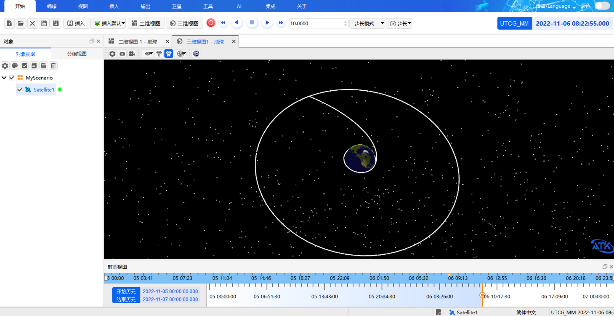

# 输入示例

以下示例展示了如何用自然语言操控 ATK 航天仿真软件，涵盖场景与对象管理、机动规划、可见性分析等典型用例。

## 场景与对象基本操作

包括场景和对象的新建、删除、重命名和查询。

::: details open **批量创建对象**
```
帮我创建 20 个卫星、10 个火箭、5 个导弹。
```
:::

::: details open **按类型删除**
```
帮我删除所有导弹。
```
:::

::: details open **批量重命名**
```
帮我将 sat1-5 重命名为 satellite1-5。
```
:::

::: details open **查询当前场景状态**
```
帮我总结当前场景信息。
```
:::

## 机动规划 · 快速转移案例

> 创建场景，仿真时间为 2022 年 11 月 5 日至 2022 年 11 月 7 日。插入卫星，设置轨道预报器为机动规划，设置初始段坐标系为地球、坐标系为 J2000，坐标类型轨道根数（半长轴 6700000m，偏心率 0，轨道倾角 0°，升交点赤经 0°，近拱点角距 0°，真近点角 0°），插入预报段，设置引力模和太阳，停止条件设置为 duration，触发值 7200 秒。插入瞄型为 JGM3，勾选大气阻力摄动、太阳光压，三体引力勾选月球准序列段，在该瞄准序列段下插入机动段，给机动段设置约束配置为远拱点半径，推理坐标轴为 VNC，设置速度增量 Vx 为设计变量，设置瞄准序列段的微分修正，勾选 Vx 和远拱点半径，远拱点半径触发值为 84328394m。
>
> 在瞄准序列后继续插入预报段，和之前预报段设置一样。设置停止条件为与中心天体距离，触发值为 42164197m。再插入瞄准序列段，在该序列段下创建机动段，设置约束配置为偏心率，推力坐标轴为 VNC，勾选 Vx 和 Vz 为设计变量，设置瞄准序列段的微分修正，勾选控制变量 Vx 和 Vz，最大步长均改为 300，勾选约束偏心率，收敛误差为 0.001。最后在这个瞄准序列段后插入预报段，和之前预报段设置一样，停止条件 duration 触发值为 172800。最后帮我运行机动规划。



## 可见性场景生成案例

> 新建场景，设置仿真时间 2024-07-08 00:00:00.000 至 2024-07-10 00:00:00.000。插入台北地面站（纬度 25.05，经度 121.5），插入台海地区覆盖定义（经度范围 117.5-122，纬度 22-26.5），插入马六甲地区（95-104.5，1.3-5.5）和五大湖区域（-92 至 -76，41-49）覆盖定义。创建一个卫星，用轨道向导设置为回归轨道，大致高度 412400m，倾角 45 度，回归圈数 15.537，首个升交点经度为 0，在该卫星下创建一个角度为 63 的圆锥传感器。以该卫星为种子卫星创建星座，轨道面 5 个，每个面 11 颗卫星，面间相位增量为 4。重置场景仿真状态。


