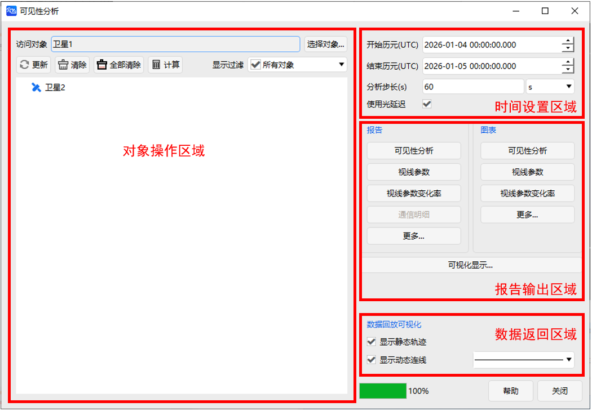

# 可见性工具

## 功能概述

ATK 可见性工具用于判定**空间两点间是否存在无遮挡的直接可视路径**，并求解**特定时间段内满足多约束条件的连续可见时段列表及对应报告、图表**。

在卫星通信、目标观测、指令发送等任务中，"可见"不仅指物理视线通视，还可代表特定的几何构型、服务效能或时间条件。工具支持卫星、无人机、舰船、导弹、车辆、雷达、地面站、飞机等多类型对象，能够纳入方位角、视线约束、视场约束、光照约束、通信约束等多种条件，适配陆、海、空、天、电多域场景下的分析需求。

::: tip
可见性分析是卫星通信、导航、遥感等任务的基础核心技术，用于明确"能否看见"的空间关系，解决任务"能否执行"、"何时执行"的核心问题。
:::

## 功能入口

### 1. 对象窗口调用

在场景中任意对象上右键单击，选择可见性工具。

### 2. 工具栏调用

点击工具栏中的可见性按钮，打开分析界面。

## 界面区域说明

主界面分为四大核心区域：

### 1. 对象操作区域

用于设置可见性分析的访问对象（发起方）与关联对象。支持同时选择多个访问对象和关联对象，减少多对象"可见"关系的重复操作。**分析结果仍以单个对象为单位存储和展示。**

| 元素 | 说明 | 操作 |
|------|------|------|
| **访问对象** | 可见性发起方 | 点击「选择对象...」从当前想定对象列表中选取 |
| **更新** | 同步场景配置变更，将时间设置重置为场景默认信息，更新可视化视图 | 场景属性修改后点击； 希望可见性分析时段重置为场景默认时间时使用； 对象属性修改保存后自动更新，无需点击 |
| **清除** | 移除选中的单个关联对象，清除其可视化显示效果 | 选中对象后点击 |
| **全部清除** | 清空当前访问对象下所有关联对象的可视化结果 | 直接点击，仅清除当前访问对象的分析结果及显示（不影响其他访问对象） |
| **计算** | 执行可见性计算，生成可见时段数据并在二三维视图中展示 | 配置完成后点击，完成后对象名前显示 `*` |
| **显示过滤** | 按类型筛选对象列表 | 下拉选择（默认：所有对象） |
| **对象列表** | 显示可添加的关联对象 | 按住 `Ctrl` 可多选 |

::: warning
未清除的结果会占用内存，建议用完及时清理。
:::

### 2. 时间设置区域

设定可见性分析的时间区间、计算步长及光延迟选项。

| 元素 | 说明 | 操作 |
|------|------|------|
| 开始历元 (UTC) | 分析起始时间 | 格式：`YYYY-MM-DD HH:MM:SS.000` |
| 结束历元 (UTC) | 分析结束时间 | 格式：`YYYY-MM-DD HH:MM:SS.000` |
| 分析步长 | 报告时间间隔 | 可切换单位（默认：秒） |
| 使用光延迟 | 考虑光线传播时间延迟，修正对象间相对位置 | 近地轨道常规分析可不勾选； 地月通信、深空探测等远距离场景建议勾选 |

::: warning
分析时间范围必须在平台仿真时间段内，否则将因无法获取对应状态数据导致分析失败。
:::

::: tip 光延迟说明
勾选"使用光延迟"时，默认分析对象为**接收信号的一方**，计算会修正信号传播期间对象的位置变化。该效应在卫星通信、深空测控等任务中需重点考虑。
:::

### 3. 报告输出区域

支持**数据报告**和**图表报告**，操作逻辑一致：

1. 点击「更多...」查看所有模板
2. 选择模板后点击「创建」
3. 支持自定义模板：更多... → 自定义 → 勾选参数 → 确定

#### 数据报告

::: details 展开查看全部 13 种数据报告模板

| 模板名称 | 含义 |
|---------|------|
| 可见性报告 | 可见时段开始时间、结束时间、可见时长及统计信息（UTCG） |
| 可见性报告（相对时间） | 同上，时间以仿真场景开始历元为计时零点，单位为 s |
| 视线参数报告 | 每个可见时段内方位角、俯仰角、视线距及统计信息 |
| 视线参数变化率报告 | 每个可见时段内视线角速率、视线方位角速率、视线俯仰角速率、视线距变化率及统计信息 |
| 不可见报告 | 不可见时段开始时间、结束时间、不可见时长及统计信息（UTCG） |
| 不可见报告（相对时间） | 同上，时间以相对秒为单位 |
| 不可见视线参数报告 | 每个不可见时段内方位角、俯仰角、视线距及统计信息 |
| 可见性统计报告 | 最小/最大/平均/总可见时长统计（UTCG） |
| 可见性统计报告（相对时间） | 同上，时间以相对秒为单位 |
| 视线参数统计报告 | 最小/最大/平均俯仰角，最小/最大/平均距离统计 |
| 不可见统计报告 | 最小/最大/平均/总不可见时长统计（UTCG） |
| 不可见统计报告（相对时间） | 同上，时间以相对秒为单位 |
| 距离变化率报告 | 每个可见时段内最大/最小/平均距离变化率及对应时间 |
| > | 可见时段内通信对象、链路状态、传输速率等明细信息 |

:::

#### 图表报告

::: details 展开查看全部 14 种图表报告模板

| 模板名称 | 含义 |
|---------|------|
| 可见性曲线 | 可见时段时间区间（UTCG） |
| 可见性曲线（相对时间） | 可见时段时间区间（相对秒） |
| 视线参数曲线 | 可见时段内方位角、俯仰角、距离随时间变化曲线 |
| 视线参数变化率曲线 | 可见时段内视线角速率、视线方位角速率、视线俯仰角速率、视线距变化率随时间变化曲线 |
| 不可见时段曲线 | 不可见时段时间区间（UTCG） |
| 不可见时段曲线（相对时间） | 不可见时段时间区间（相对秒） |
| 不可见视线参数曲线 | 不可见时段内方位角、俯仰角、距离随时间变化曲线 |
| 可见俯仰角曲线 | 可见时段内俯仰角随时间变化曲线 |
| 可见方位角曲线 | 可见时段内方位角随时间变化曲线 |
| 可见视线距曲线 | 可见时段内视线距随时间变化曲线 |
| 可见角度变化率曲线 | 可见时段内视线角速率随时间变化曲线 |
| 可见俯仰角方位角极坐标曲线 | 可见时段内方位角、俯仰角的极坐标曲线 |
| 可见时段百分比饼图 | 各可见时段占总可见时长的百分比饼图 |
| 全任务周期可见百分比饼图 | 总可见时长占计算时间段的百分比饼图 |

:::

#### 自定义报告可选参数

方位角、俯仰角、方位角变化率、俯仰角变化率、距离、距离变化率、视线角变化率、高度、太阳高度角、月球高度角、太阳视线规避角、月球视线规避角、视线约束、当地时、当地太阳时。

#### 视图动态显示

1. 点击「可视化显示...」按钮
2. 左侧勾选需显示的数据，右侧设置文字颜色、位置、背景及边框
3. 点击「确定」，数据将在二维/三维视图中动态显示

::: tip
二维视图中，字体显示效果与场景背景相关，可灵活调整字体样式与外框配置以保证清晰可读。
:::

> 完整报告模板定义及覆盖报告说明，参见 [覆盖图形与报告](06-覆盖图形与报告.md)。

### 4. 数据返回区域

配置可见性分析结果在视图中的可视化效果。

| 元素 | 说明 |
|------|------|
| 显示静态轨迹 | 二维视图中，访问对象与关联对象之间的全部可见弧段以**静态加粗线条**持续显示，不随时间推进而变化 |
| 显示动态连线 | 时间视图运行到可见时段时，动态绘制**访问对象与关联对象之间的连线**，离开时连线消失；仅反映当前时刻的可见状态 |

::: tip
- **静态轨迹**适合快速浏览全时段覆盖情况，一眼看出哪些时段可见
- **动态连线**适合时序推演场景，逐帧观察可见关系的建立与中断
- 两者可同时勾选，互不冲突
:::

## 完整操作流程

**步骤 1：选择访问对象**

在对象操作区域，点击「选择对象...」，从当前想定对象列表中选取可见性分析的**发起方**。支持同时选择多个访问对象。

**步骤 2：添加关联对象**

在对象列表中勾选需分析的关联对象（按住 `Ctrl` 可多选），点击「计算」。支持同时添加多个关联对象，分析结果以**单个对象对**为单位分别存储。

**步骤 3：配置分析时段**

在时间设置区域设定开始历元、结束历元及分析步长。分析时段必须在场景仿真时间范围内；若对象为车、船、导弹等生命周期短于仿真时间的对象，实际分析时段取对象生命周期与设置时段的**交集**。

**步骤 4：设置约束条件（可选）**

如需限制可见条件（如仰角范围、视线遮挡、光照约束等），双击对象进入「属性」→「约束」选项卡进行配置。详见 [约束配置](05-约束配置.md)。

**步骤 5：执行计算**

点击「计算」，完成后关联对象名前显示 `*` 标识。  
对象属性修改保存后，可见性结果将**自动更新**，无需重复点击计算。

**步骤 6：查看结果**

- **数据报告**：点击报告区域相应按钮，或「更多...」选择模板后「创建」
- **图表报告**：点击图表区域相应按钮，或「更多...」选择模板后「创建」
- **自定义报告**：点击「更多...」→「自定义」→勾选参数→「确定」

**步骤 7：配置可视化显示（可选）**

在报告输出区域点击「可视化显示...」，勾选需动态显示的数据项并设置文字样式，即可在二三维视图中实时展示。

**步骤 8：清除结果**

分析完成后，点击「清除」移除单个关联对象的结果，或点击「全部清除」清空当前访问对象下的所有结果。未清除的结果将持续占用内存。

::: tip
多对象批量分析时，不同访问对象的分析结果相互独立，「全部清除」仅影响当前选中的访问对象。
:::

## 相关案例

- [可见性工具案例](../3.案例教程/2-可见性工具案例.md)