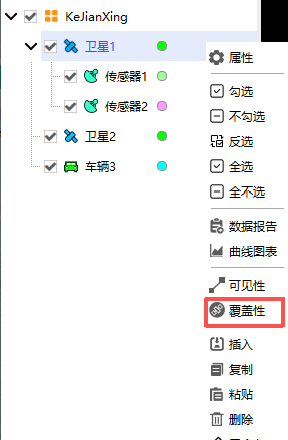

# 覆盖性工具  

## 功能概述

覆盖工具用于计算在当前属性和参数约束的条件下，两对象之间是否存在覆盖关系，可用于卫星对地覆盖等任务的分析。该工具可在不同的评估标准下对覆盖效果进行评价。

该工具可执行单个对象对单个/多个对象的覆盖分析，同时可以根据不同覆盖关系下的计算结果输出数据报告及图像报告，例如：输出覆盖时段数据信息，以及所定义的覆盖品质因子下的覆盖品质数据。绘制可视化图像报告，也可将计算结果在二维窗口进行可视化呈现。

## 功能入口

### 对象窗口调用

在对象窗口选择任意对象，点击鼠标右键，即可找到覆盖性工具。

### 工具栏调用

点击 <kbd>工具</kbd> — <kbd>覆盖性</kbd> ，即可调出【覆盖性工具】窗口。

## 界面区域说明

包括对象操作区域、时间设置区域、覆盖品质区域、报告输出区域以及数据返回区域。

### 对象操作区域

用于选择分析对象，生成覆盖分析数据以及覆盖分析数据更新与清除。用于设置覆盖性分析的访问对象（发起方）与关联对象。支持同时选择多个访问对象和关联对象，减少多对象"覆盖"关系的重复操作。**分析结果仍以单个对象为单位存储和展示。**

::: tip 默认覆盖范围说明
关联对象为附属 **传感器** 以外的对象时，默认计算该对象在 45° 半锥角的圆锥范围内的覆盖情况
:::

|     元素     |                                   说明                                   |                                                      操作                                                      |
|:------------:|:------------------------------------------------------------------------:|:--------------------------------------------------------------------------------------------------------------:|
| **访问对象** |                               覆盖性发起方                               |                              点击 <kbd>选择对象...</kbd> 从当前想定对象列表中选取                              |
|   **更新**   | 同步场景配置变更，将时间设置与分析步长重置为场景默认信息，更新可视化视图 | 场景属性修改后点击； 希望覆盖性分析时段重置为场景默认时间时使用； 对象属性修改保存后自动更新，无需点击 |
|   **清除**   |                移除选中的单个关联对象，清除其覆盖分析数据                |                                                 选中对象后点击                                                 |
| **全部清除** |               清空当前访问对象下所有关联对象的覆盖分析数据               |                       直接点击，仅清除当前访问对象的分析结果及显示（不影响其他访问对象）                       |
|   **计算**   |           执行覆盖性计算，生成覆盖时段数据并在二三维视图中展示           |                                     配置完成后点击，完成后对象名前显示 `*`                                     |
| **显示过滤** |                            按类型筛选对象列表                            |                                           下拉选择（默认：所有对象）                                           |
| **对象列表** |                           显示可添加的关联对象                           |                                               按住 `Ctrl` 可多选                                               |

::: warning 及时清理结果释放内存
未清除的结果会占用内存，建议用完及时清理。
:::

### 时间设置区域

用于覆盖性设定分析时间区间、计算步长。

|      元素      |     说明     |               操作              |
|:--------------:|:------------:|:-------------------------------:|
| 开始历元 (UTCG_MM) | 分析起始时间 | 格式：`YYYY-MM-DD HH:MM:SS.000` |
| 结束历元 (UTCG_MM) | 分析结束时间 | 格式：`YYYY-MM-DD HH:MM:SS.000` |
|    分析步长    | 报告时间间隔 |      可切换单位（默认：秒）     |

::: warning 分析时间范围限制
分析时间范围必须在平台仿真时间段内，否则将因无法获取对应状态数据导致分析失败。
:::

### 覆盖品质区域

#### 覆盖品质参数

点击 <kbd>定义…</kbd>，进入【品质参数】设置页面。在该页面下可以对覆盖品质参数的 **类型**、**计算** 方式（不同类型的品质参数有不同的设置方式）、**有效条件**、**无效数据指标** 以及 **有效值限制** 属性进行配置。

覆盖分析工具支持 16 类覆盖品质参数，类型定义及统计值说明详见 [品质因子](04-品质因子.md)。

此外，勾选 **显示热力图** 复选框可在视图中以热力图形式展示覆盖品质参数的数值分布。点击 <kbd>热力图...</kbd> 按钮进入设置页面，可配置热力图的显示选项、颜色分级以及线条样式。点击 **分级属性** 区域的 <kbd>图例...</kbd> 按钮，可设置热力图在视图中的显示位置、显示背景、显示文字以及颜色范围。

::: info 热力图支持的品质参数类型
**显示热力图** 复选框仅对于以下 **类型** 的覆盖品质参数可用：

- 访问时长
- 多重覆盖
- 访问次数
- 响应时间
- 重访时间
- 数据时龄
- 系统响应时间
- 系统数据时龄
- 精度衰减因子
- 导航精度
- 可见性约束
:::

#### 视图动态显示

1. 点击 <kbd>可视化显示...</kbd> 按钮
2. 左侧勾选需显示的数据，右侧设置文字颜色、位置、背景及边框
3. 点击 <kbd>确定</kbd>，数据将在二维/三维视图中动态显示

::: tip 二维视图字体显示调整
二维视图中，字体显示效果与场景背景相关，可灵活调整字体样式与外框配置以保证清晰可读。
:::

### 报告输出区域

支持**数据报告**和**图表报告**，操作逻辑一致：

1. 点击 <kbd>更多...</kbd> 查看所有模板
2. 选择模板后点击 <kbd>创建</kbd>

#### 数据报告

::: details 展开查看全部 10 种数据报告模板

|           模板名称           |                                     含义                                     |
|:----------------------------:|:----------------------------------------------------------------------------:|
|         覆盖时段报告         |            覆盖时段开始时间、结束时间、覆盖时长及统计信息（UTCG_MM）            |
|   覆盖时段报告（相对时间）   |               同上，时间以仿真场景开始历元为计时零点，单位为 s               |
|         覆盖间隔报告         |           未覆盖时段开始时间、结束时间、持续时长及统计信息（UTCG_MM）           |
|   覆盖间隔报告（相对时间）   |                           同上，时间以相对秒为单位                           |
|         每日覆盖报告         |                   以自然日为间隔，统计每天覆盖时长所占比例                   |
|         覆盖概率报告         |                       计算对象对分析对象实现覆盖的概率                       |
|        品质因子值报告        |                       覆盖品质参数在每个时间步长的取值                       |
|       有效覆盖时段报告       | 各覆盖时段开始时间、结束时间、覆盖时长、占总仿真时间的比例及统计信息（UTCG_MM） |
| 有效覆盖时段报告（相对时间） |                           同上，时间以相对秒为单位                           |
|      品质因子静态值报告      |                             覆盖品质参数的静态值                             |

:::

#### 图表报告

::: details 展开查看全部 8 种图表报告模板

|           模板名称           |                     含义                     |
|:----------------------------:|:--------------------------------------------:|
|         覆盖时段曲线         |           覆盖时段时间区间（UTCG_MM）           |
|    覆盖时段曲线 (相对时间)   |          覆盖时段时间区间（相对秒）          |
|         覆盖间隔曲线         |          未覆盖时段时间区间（UTCG_MM）          |
|    覆盖间隔曲线 (相对时间)   |         未覆盖时段时间区间（相对秒）         |
|         覆盖概率曲线         | 计算对象对分析对象的覆盖概率随时间的变化曲线 |
|        品质因子值曲线        |         覆盖品质参数随时间的变化曲线         |
|       有效覆盖时段曲线       |         有效覆盖时段时间区间（UTCG_MM）         |
| 有效覆盖时段曲线（相对时间） |        有效覆盖时段时间区间（相对秒）        |

:::

### 数据返回区域

配置覆盖性分析结果在视图中的可视化效果。

|     元素     |                                                          说明                                                          |
|:------------:|:----------------------------------------------------------------------------------------------------------------------:|
| 显示静态轨迹 |             二维视图中，访问对象与关联对象之间的全部覆盖弧段以**静态加粗线条**持续显示，不随时间推进而变化             |
| 显示动态连线 | 二维、三维视图中，当进入覆盖时段时，动态绘制**访问对象与关联对象之间的连线**，离开时连线消失；仅反映当前时刻的覆盖状态 |

::: tip 静态轨迹与动态连线区别
- **静态轨迹**适合快速浏览全时段覆盖情况，一眼看出哪些时段存在覆盖关系
- **动态连线**适合时序推演场景，逐帧观察覆盖关系的建立与中断
- 两者可同时勾选，互不冲突
:::

## 完整操作流程

### 设置约束条件

根据实际任务需要，设置覆盖性分析过程的约束条件。具体操作为：双击分析对象，进入【属性】设置页面，然后在 **约束** - **基本**、**约束** - **太阳**、**约束** - **时间** 三个选项卡中对约束条件进行设置。

### 选择访问对象

在对象操作区域，点击 <kbd>选择对象...</kbd>，从当前想定对象列表中选取覆盖性分析的**发起方**。支持同时选择多个访问对象。

### 添加关联对象

在对象列表中勾选需分析的关联对象（按住 `Ctrl` 或按住鼠标左键并滑动可多选），点击 <kbd>计算</kbd>。支持同时添加多个关联对象，分析结果以**单个对象**为单位分别存储。

### 配置分析时段

在时间设置区域设定开始历元、结束历元及分析步长。分析时段必须在场景仿真时间范围内；若对象为车、船、导弹等生命周期短于仿真时间的对象，实际分析时段取对象生命周期与设置时段的**交集**。

### 设置品质参数

在 **品质参数** 区域，点击 <kbd>定义…</kbd>，定义品质参数的类型及相关参数设置。对于部分类型的品质参数，可勾选 **显示热力图** 复选框，在视图中以热力图形式展示覆盖品质参数的数值分布。

### 执行计算

点击 <kbd>计算</kbd>，完成后关联对象名前显示 `*` 标识。  
对象属性修改保存后，覆盖性结果将**自动更新**，无需重复点击计算。

### 查看结果

- **数据报告**：点击报告区域相应按钮，或 <kbd>更多...</kbd> 选择模板后 <kbd>创建</kbd>
- **图表报告**：点击图表区域相应按钮，或 <kbd>更多...</kbd> 选择模板后 <kbd>创建</kbd>

### 在视图中动态显示数据

覆盖性分析的 **品质因子值** 数据可在 **二维视图** 或 **三维视图** 中动态显示。

具体操作为：点击 <kbd>可视化显示...</kbd> 按钮，进入【可视化数据显示】页面。页面左侧列出了 **品质因子值** 数据复选框，用户可根据实际需求进行勾选。页面右侧可对显示的文字颜色、文字位置、背景、边框进行设置。完成所有设置后，点击 <kbd>确定</kbd> 按钮，即可在视图中动态显示 **品质因子值** 数据结果。

### 清除结果

分析完成后，点击 <kbd>清除</kbd> 移除单个关联对象的结果，或点击 <kbd>全部清除</kbd> 清空当前访问对象下的所有结果。未清除的结果将持续占用内存。

::: tip 多对象分析结果隔离
多对象批量分析时，不同访问对象的分析结果相互独立，<kbd>全部清除</kbd> 仅影响当前选中的访问对象。
:::

## 相关案例

- [覆盖工具案例](../../02-案例教程/3-覆盖工具案例.md)
