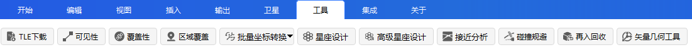
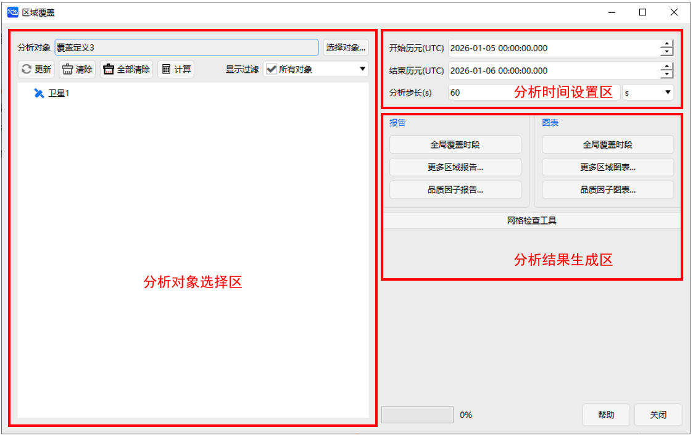
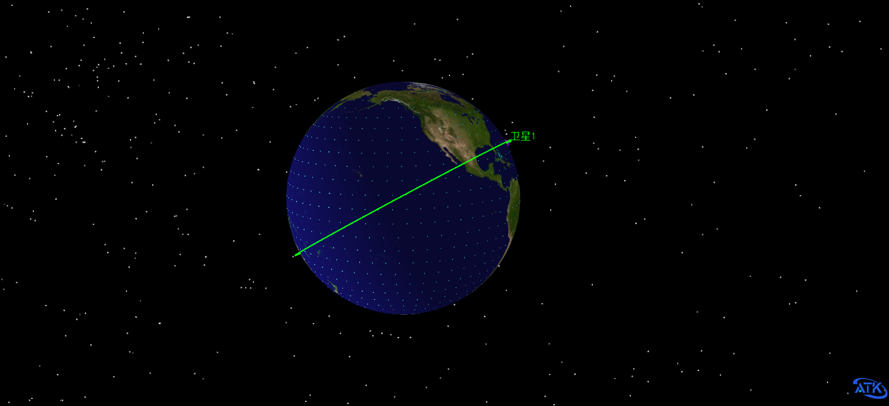
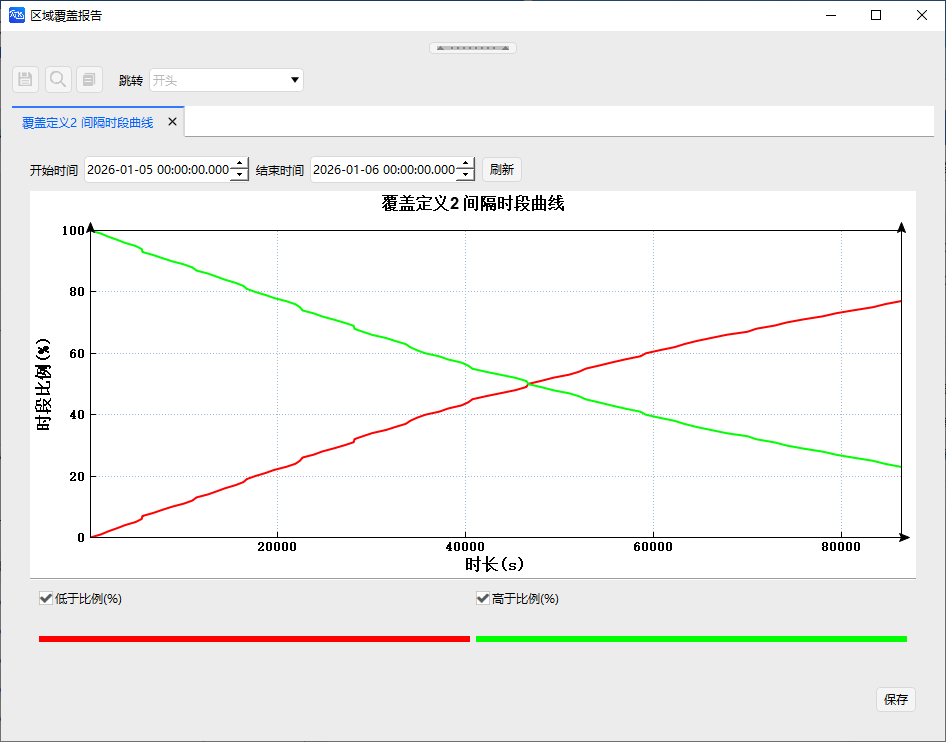

# 区域覆盖工具

## 功能概述

区域覆盖工具用于评估一个或多个覆盖资源（如卫星、传感器等）对全球或指定区域的覆盖能力。分析过程中可综合考虑对象可见性约束，从而获得更准确的覆盖效果评估。

## 功能入口

在 ATK 工具栏中点击区域覆盖图标即可打开该工具，具体位置如下图所示：

## 界面说明

工具界面分为三个区域：**分析对象选择区**、**分析时间设置区**和**分析结果生成区**。整体布局如下图所示：

### 分析对象选择区

本区域用于指定待分析的覆盖定义对象，并选择参与覆盖计算的资源对象。

| 参数 | 说明 |
|------|------|
| 分析对象 | 需要评估覆盖能力的区域对象，通常包含区域范围、网格定义和覆盖约束条件等。 |
| 覆盖资源列表 | 参与覆盖计算的资源对象，如卫星、传感器或其他具备覆盖能力的对象。 |

**操作按钮说明**

| 按钮 | 功能描述 |
|------|----------|
| 更新 | 同步场景配置变更，将时间设置重置为场景默认信息，更新可视化视图 |
| 清除 | 删除当前选中的分析对象及其对应覆盖资源的覆盖窗口计算结果。 |
| 全部清除 | 删除所选分析对象的所有覆盖窗口计算结果（包括与该对象关联的所有覆盖资源）。 |
| 计算 | 开始分析所选资源对象对分析对象的覆盖窗口。计算完成后，可通过对象名称前的 `*` 标记查看计算状态。 |

::: tip 计算状态
计算状态符号 `*` 会出现在对象名称前方，用于快速识别是否已完成覆盖计算。
:::

### 分析时间设置区

分析时间设置区用于定义覆盖计算所采用的时间范围。覆盖分析结果与时间设置密切相关：时间范围越长、分析步长越细，计算量通常也越大。

常用配置如下：

| 参数 | 说明 |
| ---- | ---- |
| 开始历元 | 覆盖计算的起始时间。 |
| 结束历元 | 覆盖计算的终止时间。 |
| 分析步长 | 影响覆盖时段、间隔时段、重访时间等指标的计算精度。步长越小，结果越精确，但计算耗时相应增加。 |

::: tip 步长设置建议
在保证分析精度的前提下，可适当增大步长以提升计算效率。
:::

### 分析结果生成区

结果生成区用于执行覆盖计算，并生成对应的报告或图表。完成覆盖窗口计算后，可通过本区域输出定量分析结果。

常用功能说明如下：

| 功能 | 说明 |
| ---- | ---- |
| 报告 | 生成区域覆盖报告或品质因子报告。 |
| 图表 | 生成区域覆盖曲线或品质因子曲线，直观展示覆盖能力的变化趋势。 |
| 网格检查工具 | 根据当前覆盖计算，得到网格点信息和覆盖情况。 |

::: warning 
提示使用“网格检查工具”前，请确保已对所需分析对象完成覆盖计算（即对象名称前出现 `*` 标记）。该工具支持查看特定网格点的详细覆盖信息，有助于定位覆盖薄弱区域。
:::

## 操作流程

### 创建场景

1. 在【开始】菜单中点击 <kbd>新建</kbd> ，创建一个新场景。

### 场景中添加各类对象

1. 添加卫星  
   在【开始】栏点击 <kbd>插入</kbd>，选择“卫星 - 插入默认类型”。

2. 修改卫星轨道  
   插入卫星后，在其属性中找到 <kbd>坐标类型</kbd>，更改为“轨道根数”，然后将轨道倾角修改为 <kbd>65°</kbd>，其余参数保持默认。

3. 添加传感器  
   点击 <kbd>插入</kbd>，选择“传感器 - 插入默认类型”。在弹出的窗口中选择上一步插入的“卫星1”，点击<kbd>确定</kbd>。

4. 添加覆盖定义  
   点击 <kbd>插入</kbd>，选择“覆盖定义 - 插入默认类型”。

5. 添加品质因子  
   点击 <kbd>插入</kbd>，选择“品质因子 - 插入默认类型”。在弹出的窗口中选择“覆盖定义2”，点击<kbd>确定</kbd>。

场景搭建完成后的效果如下图所示：

### 区域覆盖计算

1. 打开 <kbd>区域覆盖</kbd> 工具。
2. 在分析对象选择区中，选择“覆盖定义2”。
3. 在覆盖资源列表中，勾选该卫星下挂的所有传感器。
4. 点击 <kbd>计算</kbd> 按钮。计算时长取决于场景复杂度和时间步长设置。
5. 计算完成后，即可在“报告”/“图表”功能区生成各类覆盖分析报告和曲线。

### 结果输出

区域覆盖分析完成后，可在“报告”和“图表”功能区查看分析结果。其中，“报告”用于生成覆盖相关的数据表格或文字报告，“图表”用于生成覆盖结果的可视化曲线。通过“更多区域报告…”或“更多区域图表…”功能，可选择生成不同类型的区域覆盖统计结果。

区域覆盖工具的结果输出主要分为两类：

- **区域覆盖结果**：描述覆盖时段、间隔时段、区域覆盖率、全局覆盖状态和网格点覆盖情况。
- **品质因子结果**：描述覆盖质量指标的统计结果，例如 FOM 最大值、最小值、平均值、有效区域百分比等。

#### 区域覆盖结果

区域覆盖结果主要用于描述覆盖资源对分析区域内各网格点的覆盖情况，包括覆盖时段、覆盖间隔、部分覆盖、全局覆盖、区域覆盖率和纬度覆盖统计等。

| 名称 | 含义 | 报告 | 图表 |
| :--: | ---- | :--: | :--: |
| 覆盖时段 | 对区域内每个网格点的覆盖时段进行统计，用于分析各网格点在分析时段内被覆盖的持续时间情况。 | √ | √ |
| 间隔时段 | 对区域内每个网格点的覆盖间隙进行统计，用于分析相邻覆盖时段之间的未覆盖时间长度。 | √ | √ |
| 部分覆盖时段 | 所有网格点覆盖时段的并集，表示分析区域中至少有一个网格点被覆盖的时间段。 | √ | √ |
| 部分覆盖时段（相对时间） | 以相对时间形式表示部分覆盖时段，便于从分析起始时刻开始观察覆盖变化。 | √ | √ |
| 全局覆盖时段 | 所有网格点覆盖时段的交集，表示分析区域内所有网格点同时被覆盖的时间段。 | √ | √ |
| 全局覆盖时段（相对时间） | 以相对时间形式表示全局覆盖时段，便于分析整体区域同时覆盖的持续情况。 | √ | √ |
| 全局覆盖间隔 | 表示分析区域未能实现全局覆盖的时间段，即至少有一个网格点未被覆盖的时段。 | √ | √ |
| 全局覆盖间隔（相对时间） | 以相对时间形式表示全局覆盖间隔，便于分析全局覆盖中断情况。 | √ | √ |
| 网格点信息 | 给出每个网格区域的基础信息，包括网格中心点经纬度、网格点高度、网格面积以及网格区域经纬度范围等。 | √ |  |
| 网格点可见对象 | 给出分析时段内与每个网格点存在覆盖关系的资源对象名称。 | √ |  |
| 区域覆盖率 | 统计每个时刻分析区域的覆盖率和累计覆盖率。覆盖率通常表示被覆盖网格区域面积占总区域面积的比例。 | √ | √ |
| 单个对象资源覆盖率统计 | 统计单个覆盖资源对象对分析区域的覆盖能力，包括最小覆盖率、最大覆盖率、平均覆盖率和累计覆盖情况等。 | √ |  |
| 纬度覆盖 | 按纬度方向统计网格点覆盖情况，可用于分析不同纬度区域的平均覆盖时段占比和平均覆盖总时长。 | √ | √ |

#### 品质因子结果

品质因子结果依托于区域覆盖分析结果生成，用于进一步评价覆盖质量。品质因子可以从时间、空间和统计特征等角度描述覆盖效果，例如各时刻网格 FOM 统计值、有效区域百分比、各纬度或各经度 FOM 值等。

| 名称 | 含义 | 报告 | 图表 |
| :--: | ---- | :--: | :--: |
| 各时刻网格 FOM 统计值 | 在每个时刻，对区域内所有网格点的瞬时品质因子值进行统计，通常包括最大值、最小值和平均值。 | √ | √ |
| 网格 FOM 统计值 | 对区域内所有网格点的品质因子静态统计值进行统计，通常包括最大值、最小值和平均值。 | √ |  |
| 有效区域百分比 | 统计品质因子静态统计值满足有效条件的网格区域面积占总区域面积的比例。 | √ |  |
| 各时刻有效区域 | 在每个时刻，统计品质因子值满足有效条件的网格区域面积占总区域面积的比例。 | √ | √ |
| 指定时刻网格点 FOM 值 | 在指定 UTC 时刻下，输出每个网格点的瞬时品质因子值。 | √ |  |
| 网格点 FOM 值 | 输出每个网格点的品质因子静态统计值，用于分析品质因子在空间网格上的分布情况。 | √ |  |
| 各纬度 FOM 值 | 按纬度方向对网格点品质因子进行统计，得到对应纬度上品质因子静态值的最大值、最小值和平均值。 | √ | √ |
| 各经度 FOM 值 | 按经度方向对网格点品质因子进行统计，得到对应经度上品质因子静态值的最大值、最小值和平均值。 | √ | √ |

#### 输出说明

覆盖时段、间隔时段、部分覆盖时段和全局覆盖时段主要用于分析覆盖结果在时间维度上的分布情况；区域覆盖率和纬度覆盖结果主要用于分析覆盖结果在空间维度上的分布情况；品质因子结果则用于进一步评价覆盖质量。

在生成品质因子报告或图表前，应确保覆盖定义对象下已配置相应的品质因子，并且区域覆盖计算已经完成。若未配置品质因子，或覆盖分析结果为空，则相关品质因子报告和图表可能无法生成有效数据。

下图展示了间隔时段曲线示例：

### 网格检查工具

为了获取特定网格点的覆盖分析数据，ATK 区域覆盖分析工具提供了 <kbd>网格检查工具</kbd>。

- 在“区域覆盖”界面中，找到并点击 <kbd>网格检查工具</kbd>，进入工具界面。首先确认所分析的覆盖定义对象名称，可通过选择对象来切换不同的覆盖定义。
- 打开二维视图，在视图中点击所需的网格点，即可抓取该点的覆盖信息。成功选择后，工具“消息”栏中会显示当前选中的网格点的位置、大小，以及覆盖时段占比等信息。

同时，该工具也提供了对应的报告和图表功能。点击相应按钮，即可生成针对该网格点的覆盖分析报告，报告内容与单对象覆盖性分析报告一致，此处不再赘述。

## 相关案例

- [区域覆盖案例](../3.案例教程/11-区域覆盖案例.md)