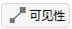

# 可见性工具

## 功能介绍

可见性工具用于计算在对象当前属性和参数约束的条件下，两对象之间是否能够建立联系（是否可见），可用于卫星的星间通信等任务的可视性分析。该工具能够计算两对象的可见时间、被视对象相对分析对象的方位角、俯仰角和两对象间的距离及其变化率等。

该工具可以执行单个对象对单个/多个对象的可见分析，同时可以根据每对计算对象在可见时段内、不可见时段内的计算结果输出数据报告及图像报告。

### 功能位置

（1）在对象窗口选择任意对象点击鼠标右键，即可找到可见性工具。

（2）在工具栏中找到可见性工具点击即可调出可见性工具窗。

### 界面介绍

包括对象操作区域、时间设置区域、报告输出区域和数据返回区域。

（1）对象操作区域。用于选择分析对象，进行可见性数据计算、数据清除及数据更新。

（2）时间设置区域。用于设定可见性分析时间区间。

（3）报告输出区域。用于生成可见性数据报告及可视化图像报告。

（4）数据返回区域。用于在二维视图内显示静态加粗的可见弧段。

## 使用方法

### 约束设置

根据实际任务需要，设置可见性分析过程的约束条件。具体操作为：双击分析对象，进入【属性】设置页面，然后在【约束 - 基本】、【约束 - 太阳】、【约束 - 时间】三个选项卡中对约束条件进行设置。

#### 约束参数说明

在卫星通信、目标观测、指令发送等任务中，会受到包括视线遮挡、载荷活动范围、载荷作用距离等多种约束，只有在满足特定约束的情况下，两个分析对象才能够被判定为"可见"。根据约束类型不同，可将其分为基础约束、光照约束、通信约束三大类。

##### 基础约束

基础约束涵盖了任务分析与设计中最常考虑的两对象间的几何关系条件，包含方位角、仰角、距离等空间几何参数，以及视线、视场约束。

**几何参数**

|     参数名称     | 含义                                                         |
| :--------------: | :----------------------------------------------------------- |
| 方位角 (Azimuth) | 关联对象相对于分析对象在水平面上的投影方向角，表征关联对象相对于分析对象的空间方位 |
| 仰角 (Elevation) | 关联对象相对于分析对象在垂直方向的角度，表征关联对象相对于分析对象的高度关系 |
|   距离 (Range)   | 分析对象与关联对象之间的直线距离                             |
|   方位角变化率   | 方位角随时间的变化率                                         |
|    仰角变化率    | 仰角随时间的变化率                                           |
|    距离变化率    | 距离随时间的变化率                                           |
|   视线角变化率   | 表征关联对象相对分析对象的旋转速度，可用于判断通信链路的稳定性 |
|       高度       | 分析对象与关联对象建立"可见"关系时相对地面的高度约束         |
|     传播延时     | 分析对象和关联对象之间传输信息所需的时间                     |

**视线约束**

视线约束主要用于分析中心天体（如地球）遮挡导致的对象间不可见的情况，表征中心天体对分析对象可视关系的遮挡程度。

- 对于固定对象（如地面站）：评估视线是否被中心天体遮挡
- 对于移动对象（如卫星、飞机）：考虑对象运动状态下的视线遮挡情况

**视场约束**

视场约束与其所属传感器对象一一对应，该约束由传感器的特征角度决定，用于判断目标是否在传感器的可视范围内。

##### 光照约束

光照约束包含太阳、月球与所属对象的几何位置相关指标。

|    参数名称    | 含义                                                         |
| :------------: | :----------------------------------------------------------- |
|   太阳高度角   | 太阳相对分析对象的视位置高度角                               |
|   月球高度角   | 月球相对分析对象的视位置高度角                               |
| 当地太阳高度角 | 定义在地面站等地面对象的当地坐标系下的太阳高度角             |
|   太阳规避角   | 视线或视轴方向与太阳方向的最小夹角，用于某些传感器需要躲避太阳光的场景 |
|   月球规避角   | 视线或视轴方向与月球方向的最小夹角                           |

**太阳/月球规避角含义**

|    名称    | 含义                                                         |
| :--------: | :----------------------------------------------------------- |
| 视线规避角 | 指向目标对象的视线矢量与太阳/月球矢量之间的最小夹角，小于该角则视为访问无效 |
| 视轴规避角 | 视轴矢量与太阳/月球矢量之间的最小夹角，小于该角则视为访问无效 |

### 可见性计算时段

在“时间设置区域”，设定可见性分析的开始和结束历元。该区域默认取值为场景的时间区间（自场景开始历元起，至场景结束历元止），可根据用户自身计算需求进行修改。但需要确保所分析的时间段位于场景仿真时间段内。

### 对象选择

在“对象操作区域”，点击【选择对象...】，选择【访问对象】，即可见性计算基准对象，可支持对 【卫星】、【飞机】、【导弹】和【舰船】等多类对象进行可见性分析。

在【访问对象】下方，可选择被视对象，支持同时选择多个对象进行计算。

### 分析可见关系

选中目标对象后，点击【计算 】，可计算相应目标的可见情况。当计算完成后，相应对象名称前将带有 * 标识。

### 生成可见性报告

在“报告输出区域”可查看可见性计算结果。提供数据报告和图表报告两类，分别对应于【报告】和【图表】两部分。点击【报告 - 更多...】和【图表 - 更多...】按钮可以查看不同输出模板，在选择相应模板后，点击【创建】按钮即可生成相应报告或图表。

数据报告输出的默认模板包括：

|          模板名称          |                             含义                             |
| :------------------------: | :----------------------------------------------------------: |
|         可见性报告         | 访问对象对目标对象的可见时段开始时间、结束时间、可见时长及统计信息。其中开始时间与结束时间以 UTCG 单位表示 |
|   可见性报告（相对时间）   | 访问对象对目标对象的可见时段开始时间、结束时间、可见时长及统计信息。仿真场景的开始历元将被视为计时零点，并且开始时间与结束时间以 s 单位表示 |
|        视线参数报告        | 访问对象对目标对象在每个可见时段内，方位角、俯仰角、视线距及统计信息 |
|     视线参数变化率报告     | 访问对象对目标对象在每个可见时段内，视线角速率、视线方位角速率、视线俯仰角速率、视线距变化率及统计信息 |
|         不可见报告         | 访问对象对目标对象的不可见时段开始时间、结束时间、可见时长及统计信息。其中开始时间与结束时间以 UTCG 单位表示 |
|   不可见报告（相对时间）   | 访问对象对目标对象的不可见时段开始时间、结束时间、可见时长及统计信息。仿真场景的开始历元将被视为计时零点，并且开始时间与结束时间以 s 单位表示 |
|     不可见视线参数报告     | 访问对象对目标对象在每个不可见时段内，方位角、俯仰角、视线距及统计信息 |
|       可见性统计报告       | 访问对象对目标对象的可见性统计信息，包括最小可见时长、最大可见时长、平均可见时长以及总可见时长。其中最小可见时长与最大可见时长对应的时间区间以 UTCG 单位表示 |
| 可见性统计报告（相对时间） | 访问对象对目标对象的可见性统计信息，包括最小可见时长、最大可见时长、平均可见时长以及总可见时长。其中最小可见时长与最大可见时长对应的时间区间以 s 单位表示 |
|      视线参数统计报告      | 访问对象对目标对象的视线参数统计信息，包括最小俯仰角、最大俯仰角、平均俯仰角、最小距离、最大距离、平均距离 |
|       不可见统计报告       | 访问对象对目标对象的不可见性统计信息，包括最小不可见时长、最大不可见时长、平均不可见时长以及总不可见时长。其中最小不可见时长与最大不可见时长对应的时间区间以 UTCG 单位表示 |
| 不可见统计报告（相对时间） | 访问对象对目标对象的不可见性统计信息，包括最小不可见时长、最大不可见时长、平均不可见时长以及总不可见时长。其中最小不可见时长与最大不可见时长对应的时间区间以 s 单位表示 |
|       距离变化率报告       | 访问对象对目标对象在每个可见时段内的最大、最小和平均距离变化率、相应的绝对时间和相对时间及统计信息 |

 

图表报告输出的默认模板包括：

|          模板名称          |                             含义                             |
| :------------------------: | :----------------------------------------------------------: |
|         可见性曲线         | 访问对象对选定目标对象的可见时段时间区间。其中时间以 UTCG 单位表示 |
|   可见性曲线（相对时间）   | 访问对象对选定目标对象的可见时段时间区间。仿真场景的开始历元将被视为计时零点，并且时间以 s 单位表示 |
|        视线参数曲线        | 访问对象对目标对象在可见时段内，方位角、俯仰角、距离随时间的变化曲线 |
|     视线参数变化率曲线     | 访问对象对目标对象在可见时段内，视线角速率、视线方位角速率、视线俯仰角速率、视线距变化率随时间的变化曲线 |
|       不可见时段曲线       | 访问对象对选定目标对象的不可见时段时间区间。其中时间以 UTCG 单位表示 |
| 不可见时段曲线（相对时间） | 访问对象对选定目标对象的不可见时段时间区间。仿真场景的开始历元将被视为计时零点，并且时间以 s 单位表示 |
|     不可见视线参数曲线     | 访问对象对目标对象在不可见时段内，方位角、俯仰角、距离随时间的变化曲线 |
|       可见俯仰角曲线       |    访问对象对目标对象在可见时段内，俯仰角随时间的变化曲线    |
|       可见方位角曲线       |    访问对象对目标对象在可见时段内，方位角随时间的变化曲线    |
|       可见视线距曲线       |    访问对象对目标对象在可见时段内，视线距随时间的变化曲线    |
|     可见角度变化率曲线     |  访问对象对目标对象在可见时段内，视线角速率随时间的变化曲线  |
| 可见俯仰角方位角极坐标曲线 |  访问对象对目标对象在可见时段内，方位角、俯仰角的极坐标曲线  |
|     可见时段百分比饼图     |    访问对象对目标对象的可见时间段占总可见时段的百分比饼图    |
|  全任务周期可见百分比饼图  |   访问对象对目标对象的总可见时间段占计算时间段的百分比饼图   |

数据报告和图表报告除了使用默认模板进行输出，还支持用户自定义模板进行输出。点击【报告 - 更多...】或【图表 - 更多...】按钮，在弹出的报告模板选择界面中，点击下方【自定义】按钮，即可查看自定义输出内容。自定义选项包括：

|   自定义选项   |
| :------------: |
|     方位角     |
|     俯仰角     |
|  方位角变化率  |
|  俯仰角变化率  |
|      距离      |
|   距离变化率   |
|  视线角变化率  |
|      高度      |
|   太阳高度角   |
|   月球高度角   |
| 太阳视线规避角 |
| 月球视线规避角 |
|    视线约束    |
|     当地时     |
|   当地太阳时   |

勾选好自定义选项后，点击右下角【确定】按钮，即可生成包含相应内容的报告或图表。

### 在视图中动态显示数据

可见性分析的计算数据可在【二维视图】或【三维视图】中动态显示。

具体操作为：点击【可视化显示...】按钮，进入【可视化数据显示】页面。页面左侧列出了一系列数据复选框，可选数据类型与“自定义选项”表格内容一致，用户可根据实际需求进行勾选。页面右侧可对显示的文字颜色、文字位置、背景、边框进行设置。完成所有设置后，点击【确定】按钮，即可在视图中动态显示相应数据结果。

### 可见弧段查看

系统默认勾选【显示静态轨迹】选项，在二维视图中全部可见轨迹弧段将显示为静态加粗线条。

取消勾选后，可见弧段不再以静态加粗线条显示，而是在时间视图运行到对应可见时刻后，以卫星间的连线展示可见弧段信息。

### 清除计算数据

在“对象操作区域”，点击【清除】，可清除当前选中对象的计算信息。点击【全部清除】可清除全部计算结果。

[可见性工具案例](../3.案例教程/2-可见性工具案例.md)