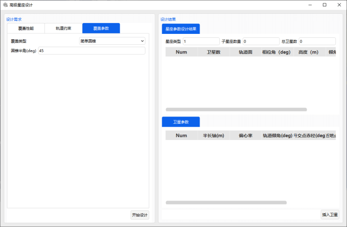
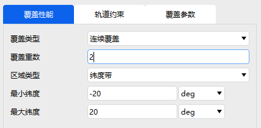
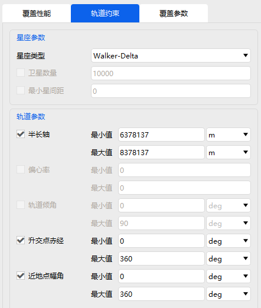
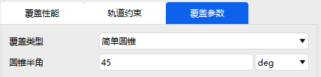
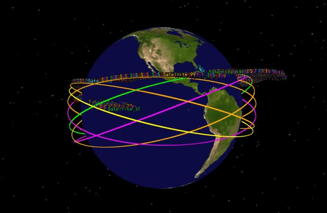

# 高级星座设计功能模块

## 功能介绍

高级星座设计功能模块用于根据用户设定的覆盖需求和轨道约束，自动设计满足指定区域覆盖要求的 Walker 星座。用户可设置覆盖区域、覆盖重数、传感器视场角以及部分轨道参数约束，系统根据这些输入条件生成推荐的星座构型参数，并可将生成的卫星直接插入当前场景中进行三维显示和后续分析。

该模块适用于以下任务：

- 区域连续覆盖星座设计；
- 指定纬度带覆盖星座设计；
- 局部区域或地面点覆盖星座设计；
- Walker 星座初步构型生成；
- 星座覆盖性能分析前的快速方案设计。

与手动设置轨道参数相比，高级星座设计模块能够根据覆盖需求自动推算卫星数量、轨道面数量、轨道高度、倾角和相位角等关键参数，提高星座方案设计效率。

### 功能位置

该功能位于 ATK 工具栏目中，具体打开位置如图所示。

### 界面介绍

本功能界面包括**约束条件设置**、**星座设计结果**、**卫星参数展示**三个区域，如图所示。

## 使用方法

### 创建场景

首先在【开始】中点击 <kbd>新建</kbd>，创建场景，如图所示。

### 设计星座

点击【工具】页面【高级星座设计】，弹出窗口如图所示。

设计需求分为：**覆盖性能**、**轨道约束**、**覆盖参数**

覆盖性能：覆盖类型为 **连续覆盖** ，覆盖重数由用户设置，区域类型有：全球、纬度带、局部区域以及地面点。

本应用例程中设置已覆盖重数为 2 ，区域类型为纬度带，纬度范围为 -20~20 度，如图所示。

轨道约束为设计星座卫星的部分参数，包括：半长轴范围、升交点赤经范围、近地点幅角范围。星座类型当前仅能选择 **Walker-Delta** 。本应用例程设置采用默认设置，如图所示。

覆盖参数包括三种类型：**简单圆锥**、**地面仰角**和**矩形**

| 覆盖参数类型 | 需要设置的参数 | 参数含义 |
|---|---|---|
| 简单圆锥 | 圆锥半角 | 描述卫星载荷覆盖锥的半角大小，用于近似表示单颗卫星的圆形覆盖范围 |
| 地面仰角 | 最小值 | 描述地面目标观测卫星时允许的最低仰角，低于该角度则认为不满足覆盖条件 |
| 矩形 | 水平半角、垂直半角 | 分别描述载荷视场在水平方向和垂直方向上的半角范围，用于表示矩形视场覆盖模型 |

本例程选择“简单圆锥”，“圆锥半角”为 45 度

点击<kbd>开始设计</kbd>，窗口右侧给出星座设计结果，包含：卫星数、轨道面数、相位角、轨道高度和倾角，再下面有每颗卫星具体的参数。

选择右侧下方所有生成的卫星，点击右下侧<kbd>插入卫星</kbd>，系统将把设计结果插入当前场景中。插入完成后，可在三维窗口和二维窗口中查看星座构型。

## 输出说明

插入卫星后，左侧对象树中应生成对应卫星对象。用户可在对象树中查看、编辑或删除这些卫星。用户应能够在视图窗口中看到：

- Walker 星座的三维空间分布；
- 多个轨道面的排列情况；
- 卫星在各轨道面内的相位分布；
- 二维地图中的星下点轨迹或覆盖分布；
- 星座对指定纬度带的覆盖关系。

三维视图主要用于检查星座轨道构型是否合理；二维视图主要用于观察星座对目标区域的地面覆盖效果。

[高级星座设计案例](../02-案例教程/14-高级星座设计案例.md)
