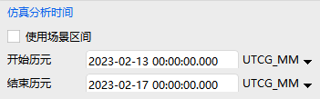
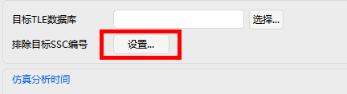

# 接近分析工具

## 功能介绍

接近分析工具可以实现分析和评估太空中的目标与其他物体接近的可能性，得到目标与其他物体的最接近时刻以及最接近时刻所对应的相对位置、速度等信息。目前，接近分析已成为任务分析中的重要内容。

### 功能位置

ATK 的接近分析工具能够分析航天器与目标之间的接近参数，该功能位于“ATK菜单” -【工具】栏目中，具体打开位置如图所示。

### 界面介绍

**（1）主界面**

主界面包含接近分析对象选择、目标数据库选择、排除目标 SSC 编号列表设置、仿真分析时间设置、接近约束设置、并提供高级设置按钮、计算按钮和结果展示按钮，界面如表所示。

|    主界面选项     |                             含义                             |
| :---------------: | :----------------------------------------------------------: |
|    选择主目标     | 主目标分别来自仿真场景对象与 TLE 数据库：       |
|  目标TLE 数据库   | 用户或 ATK 已有的 TLE 数据库文件，格式为：       |
| 排除目标 SSC 编号 |         用于排除上述TLE  目标数据库中的国际目标卫星          |
|   仿真分析时间    | 可选择使用场景区间，不勾选时分别设置开始历元与结束历元，默认 UTCG_MM 格式：  |
|     接近约束      |             目标航天器与跟踪航天器的相对距离约束             |
|     高级设置      |               包含过滤器约束与等效距离告警门限               |

**（2）选择主目标**

接近分析对象有多种方式选择，可通过主界面的接近分析对象区域下拉框进行切换，选择方式包括：

1）从场景对象选择卫星。支持卫星多选：

2）从场景对象选择导弹/火箭。支持目标多选：

3）输入目标国际编号。首先需要选择目标TLE数据库，然后在输入框中输入目标国际编号，并点击【添加】按钮即可加入。删除列表中某个对象时，单击选中，点击【删除】按钮。

4）数据库目标遍历计算。选择目标TLE数据库，计算时就会遍历所有目标进行分析。

**（3）排除目标 SSC 编号**

在主界面中点击【排除目标 SSC 编号】的【设置...】按钮，打开设置界面。

打开【排除目标】界面后，可进行添加、删除和查看操作。

**（4）高级设置界面**

在主界面中点击【高级设置】按钮，高级设置界面包含【过滤器】与【等效距离告警门限】。

过滤器的【方法】选项包含【解析法】与【数值法】，具体设置项如表所示。

|       设置项       |                             含义                             |
| :----------------: | :----------------------------------------------------------: |
|  轨道历元过期门限  | 表示物体飞行数据的可信时间段，物体与目标接近事件的发生时间超过该门限后，将认为不可信 |
|   远/近地点门限    |       对于接近目标的物体，其轨道远近点差不能超过该门限       |
| 轨道路径筛选器门限 |      对于接近目标的物体，两轨道的最短距离不能超过该门限      |
|   时间筛选器门限   | 对于接近目标的物体，其位置距离另一目标轨道面的距离不能超过该门限 |
|    仿真分析步长    |                    接近分析的仿真计算步长                    |

值得注意的是，由于火箭与导弹的轨道特性，【轨道路径筛选器门限】和【时间筛选器门限】设置并不适用。

等效距离告警门限设置，即当等效距离小于黄色告警门限时，结果标黄，当等效距离小于红色告警门限时，结果标红。其中**等效距离**指加权相对距离与径向距离的更大值，具体如下图所示。

**（5）结果界面**

点击【计算】按钮，输出计算结果。

| 输出参数 |           参数说明           |       单位        |
| :------: | :--------------------------: | :---------------: |
|  主目标  |          目标航天器          |                   |
|  次目标  |         接近空间目标         |        SSC        |
| 接近时刻 |      协调世界时（UTC）       | 年-月-日-时-分-秒 |
| 开始时刻 |      协调世界时（UTC）       | 年-月-日-时-分-秒 |
| 结束时刻 |      协调世界时（UTC）       | 年-月-日-时-分-秒 |
| 等效距离 |       加权后的接近距离       |        km         |
| 相对距离 |           相对距离           |        km         |
| 径向距离 |    LVLH 系下的x 轴向距离     |        km         |
| 横向距离 |    LVLH 系下的y 轴向距离     |        km         |
| 法向距离 |    LVLH 系下的z 轴向距离     |        km         |
| 接近夹角 | 接近时刻对应两目标速度的夹角 |        deg        |
| 相对速度 |     ICS 系下的相对速度差     |       km/s        |

在接近分析页面点击【结果...】按钮可重新打开计算结果界面。

[接近分析案例](../3.案例教程/6-接近分析案例.md)