# 碰撞规避工具

## 功能介绍

（1）在完成航天器与空间目标或其他目标库的碰撞规避数据设定之后，选择自然交会功能界面，计算主目标与次目标在交会分析门限约束下的所有数据结果。

（2）根据自然交会分析的所有数据结果和航天跟踪测控计划，进行避撞机动规划分析，本功能提供了遍历和优化两种分析算法。

（3）基于避撞机动规划分析的结果，利用机动复核功能检验数据结果的正确性，保证碰撞规避机动安全可靠。

## 功能位置

该功能位于【ATK 菜单】-【工具】栏目中，具体打开位置如图所示。

## 界面介绍

### 主界面

主界面包含各种基础设置（卫星、目标星历、目标数据库等）、高级设置、交会数据表格显示、自然交会模块、避撞机动规划模块、机动复核模块、偏差机动复核模块和计算结果区域，界面效果如图显示。

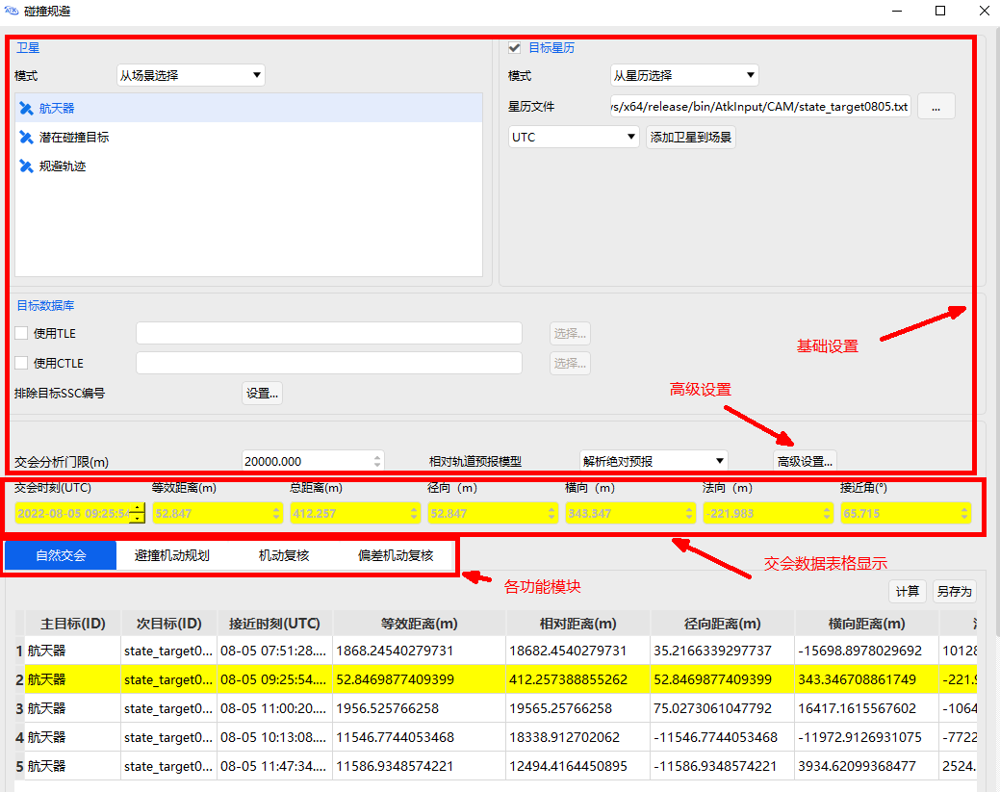

模块界面中表头的各参数及其定义如下：

**接近时刻：** 在【自然交会分析】界面计算出的且小于设定交会分析门限值的所有数据中，最小等效距离所对应的 UTC 时间。

**等效距离：** 由于轨道预报误差在切向较大，在径向较小，因此碰撞风险和规避效果评估需要综合考虑接近的最近距离 $d_k$ 和径向距离 $R_k$，定义等效距离指标如下式：

$$
s_{k}=\max \left(\frac{d_{k}}{10},\left|R_{k}\right|\right)
$$

其中 $s_k$ 越小，碰撞风险越高，$s_k$ 越大，规避效果越好。

**最小等效距离：** 分析历次接近的等效距离 $s_k$，确定最小等效距离 $s^*$，即：

$$
s^{*}=\min \left(s_{k}\right), \quad k=1,2,3, \ldots
$$

**相对距离：** 两个空间目标相对位置矢量的模。

**径向距离 $R$：** 指自然交会分析时，最小等效距离对应的航天器与空间目标的径向距离（对应 LVLH 坐标系 X 方向）。

**横向距离 $T$：** 指自然交会分析时，最小等效距离对应的航天器与空间目标的横向距离（对应 LVLH 坐标系 Y 方向）。

**法向距离 $N$：** 指自然交会分析时，最小等效距离对应的航天器与空间目标的法向距离（对应 LVLH 坐标系 Z 方向）。

**接近夹角：** 指自然交会分析时，最小等效距离对应的航天器与空间目标的接近夹角。

**相对速度：** 指自然交会分析时，最小等效距离对应的航天器与空间目标的接近速度。

### 自然交会模块界面

在【主界面】上完成各航天器和空间目标数据配置和规避条件筛选后，点击 <kbd>自然交会</kbd> 按钮，进入【自然交会】模块界面，再点击 <kbd>计算</kbd> 按钮，得出主目标与次目标的历次接近时刻对应的时间距离信息：

1）黄色标识行对应的数据是等效距离小于软件设置值 200 m 时，对应的接近时刻、等效距离、相对距离、径向距离、横向距离、法向距离、接近夹角、接近速度。

2）红色标识行对应的数据是等效距离小于软件设置值 50 m 时，对应的接近时刻、等效距离、相对距离、径向距离、横向距离、法向距离、接近夹角、接近速度。

3）在【交会分析门限(m)】中输入需要规避的交会分析门限值，则计算后结果仅显示小于此次输入值的数据。单击数据框内的列名称，可将数据依据此列大小顺序重新排序。

### 避撞机动规划模块界面

点击 <kbd>避撞机动规划</kbd> 按钮，进入【避撞机动规划】模块界面。

其中，“控制时刻门限”参数根据航天测控跟踪计划和最近等效距离时的自然交会分析时刻确定；“半长轴控制量门限”参数根据航天器平台机动能力限制和轨道维持约束确定：

### 机动复核模块界面

点击 <kbd>机动复核</kbd> 按钮，进入【机动复核】模块界面。

其使用方法为：在【避撞机动规划】模块界面中，将【遍历分析】或【优化分析】方法计算出的数值结果，通过 <kbd>载入到机动复核</kbd> 按钮直接载入到【机动复核】模块界面中，从而检验输入的控制时刻和半长轴控制量是否是可行的规避控制策略：

如果没有黄色标识或红色标识，则相应控制策略在多圈交会内满足碰撞规避机动要求，能有效提升机动规避效果。

### 偏差机动复核模块界面

点击 <kbd>偏差机动复核</kbd> 按钮，进入【偏差机动复核】模块界面。

在进行轨道预报时，初始偏差会随着轨道模型的外推而发散，其传播特性和趋势因轨道类型不同而有差异。本步骤利用非线性偏差方法，通过轨道均值和协方差的预报，可以得到相应的偏差管道。考虑偏差的机动复核，使得碰撞规避的范围更精细化，有效提升轨道安全性评估效果。

其使用方法为：在【避撞机动规划】模块界面中，将【遍历分析】或【优化分析】方法计算出的数值结果，通过 <kbd>载入到机动复核</kbd> 按钮直接载入到【偏差机动复核】模块界面中，从而检验输入的控制时刻、半长轴控制量和半长轴标准差是否是可行的规避控制策略：

如果没有黄色标识或红色标识，则相应控制策略在多圈交会内满足碰撞规避机动要求，能有效提升机动规避效果。

### 排除目标 SSC 编号界面

在【主界面】点击 <kbd>排除目标 SSC 编号</kbd>-<kbd>设置...</kbd> 按钮，可以打开相应设置界面。输入排除目标 SSC 编号后点击 <kbd>添加</kbd>，可以将目标编号加入列表中，点击 <kbd>确定</kbd> 保存。其中 SSC 编号为五位数的空间目标国际编号。当不再需要排除目标时，可以在列表中选中之前保存的 SSC 编号，点击 <kbd>删除</kbd> 按钮，然后点击 <kbd>确定</kbd> 保存。

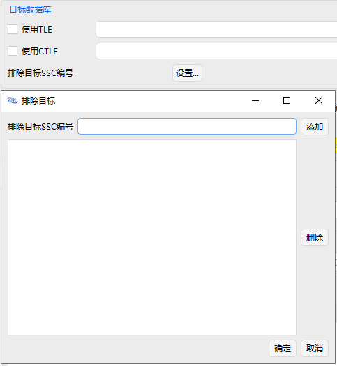

### 高级设置界面

点击 <kbd>高级设置...</kbd> 按钮进入【高级设置】界面。

1）轨道历元过期门限：

当软件仿真分析的自然交会分析时间和空间目标星历初始数据的差值，大于设定的轨道历元过期门限值时，软件判定没有继续计算的必要，系统停止分析，默认 2592000 sec，即 30 天。

2）远/近地点门限：

在自然交会分析之前需要进行筛选，从大量目标中快速排除与所关心航天器轨道不可能接近的目标，再进行进一步自然交会分析，远/近地点门限是筛选常用的方法，默认 50000 m。

3）仿真分析步长：

设定软件仿真分析的单位时间分析计算数据，默认值为 600 sec。

### 遍历分析结果界面

点击【遍历分析】区域中的 <kbd>结果</kbd> 按钮查看分析结果。

遍历分析是指沿着某条搜索路线，依次对树（或图）中每个节点均做一次访问。访问结点所做的操作依赖于具体的应用问题，具体的访问操作可能是检查节点的值、更新节点的值等。

可根据需求，设定【时间步长】和【半长轴控制步长】，点击 <kbd>计算</kbd> 按钮，软件将以单位时间步长或单位控制量步长为间隔进行遍历计算，选取规避机动的控制时间。

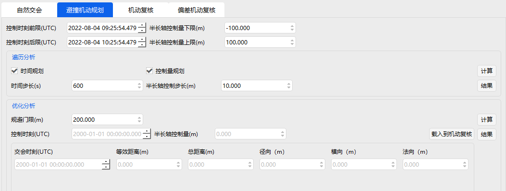

计算完毕后，单击 <kbd>结果</kbd> 按钮查看【遍历分析】结果：

1）表格最左侧列是以“控制时刻前后限”为区间，单位时间步长为间隔的时刻序列。

2）表格最上侧行是以“半长轴控制量上下限”为区间，单位控制量步长为间隔的半长轴控制量序列。

3）表格里的内容是每个时刻和半长轴控制量所对应的碰撞规避的距离。

计算完毕后，用户可选择合适的距离结果值对应的时刻和半长轴控制量，载入到【机动复核】模块，保证碰撞规避的安全性。

### 优化分析结果界面

点击【优化分析】区域中的 <kbd>结果</kbd> 按钮查看分析结果。

以控制时刻和半长轴控制量为优化变量，寻找能使航天器与潜在碰撞目标之间的距离大于给定【规避门限】的策略，采用序列二次规划算法求解。可根据用户需求，输入【规避门限】值，点击 <kbd>计算</kbd> 按钮，调用优化算法计算最优规避机动策略：

计算完毕后，单击 <kbd>结果</kbd> 按钮查看【优化分析】结果，表格按列依次为主目标 ID、次目标 ID、主目标和次目标优化分析后的接近时刻、对应时刻的等效距离、相对距离、径向距离、横向距离、法向距离、接近夹角、相对速度的数值。通过单击数据框内的列名称，可将数据依据此列大小顺序重新排序。

计算完毕后，用户可选择合适的距离结果值对应的时刻和半长轴控制量，载入到【机动复核】模块，保证碰撞规避的安全性。

### 控制偏差预报界面

点击【偏差机动复核】区域中的 <kbd>控制偏差预报</kbd> 按钮，打开对应设置页面。

【控制偏差预报】页面由三部分构成，分别为预报值、坐标图和表格：

**预报值：** 在此功能界面中，可设定【预报时间】和【预报步长】，默认为 86400s 和 60s。点击 <kbd>计算</kbd> 按钮，将生成相应的坐标图和表格。重新设定预报值即可重新生成坐标图和表格。

**坐标图：** 可根据需求，选择合适的横纵坐标轴查看控制偏差预报坐标图。横坐标可选择项分别为历元时刻、偏差均值 R、偏差均值 T、偏差均值 N、偏差标准差 R_3σ、偏差标准差 T_3σ、偏差标准差 N_3σ。纵坐标可选择项与横坐标基本一致，只是没有历元时刻一项可选。横坐标默认为历元时刻，范围从控制时刻前 40min 开始计算，到 16h 后结束。纵坐标默认为偏差均值 R。

**表格：** 自控制时刻开始，每隔一个【预报步长】，所对应的时刻、偏差均值 R、偏差均值 T、偏差均值 N、 sigma R、 sigma T、 sigma N、偏差标准差 R_3σ、偏差标准差 T_3σ、偏差标准差 N_3σ 数据。

### 半长轴偏差估算界面

点击【偏差机动复核】区域中的 <kbd>半长轴偏差估算</kbd> 按钮。

考虑偏差的机动复核，其半长轴偏差的估算并不直接。可通过半长轴控制偏差估算功能计算半长轴标准差。点击 <kbd>半长轴偏差估算</kbd> 按钮，根据具体航天器的性能，输入发动机推力、航天器质量、开机时长、推力方位角、推力俯仰角的均值和标准差，然后点击 <kbd>计算</kbd> 按钮，即可估算出半长轴偏差。

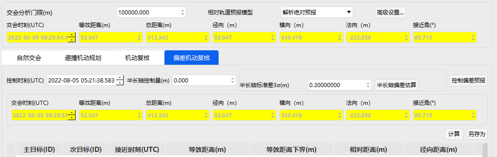

## 使用方法

### 选择卫星星历文件

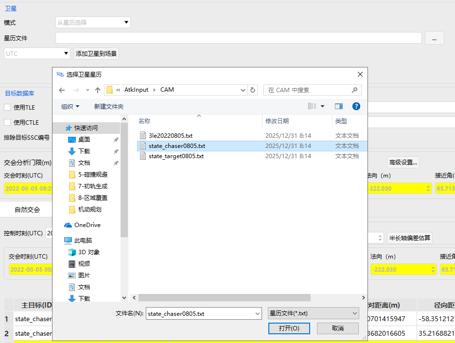

### 选择目标星历文件

### 设置排除目标

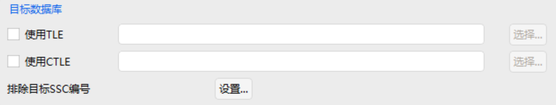

### 设置交会分析门限与相对轨道预报模型

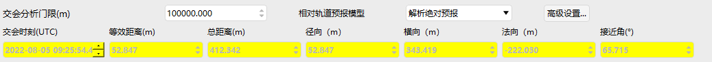

### 高级设置

按照程序默认值进行设置。

### 计算

进入【自然交会】模块界面，并点击 <kbd>计算</kbd> 按钮，查看计算结果。

### 遍历分析

进入【避撞机动规划】模块界面，进行【遍历分析】，点击 <kbd>计算</kbd> 按钮，查看分析结果。

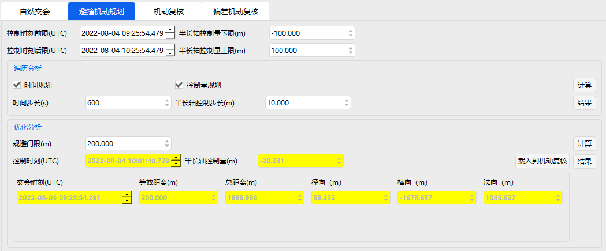

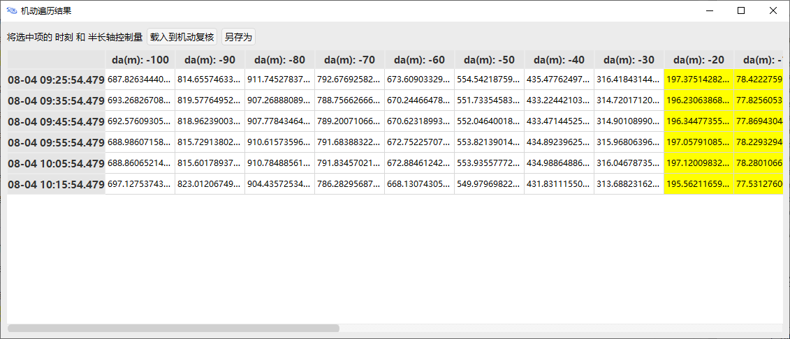

可以将选中结果对应的时刻和半长轴控制变量赋值到【机动复核】和【偏差机动复核】模块。

可以选中结果查看详情。

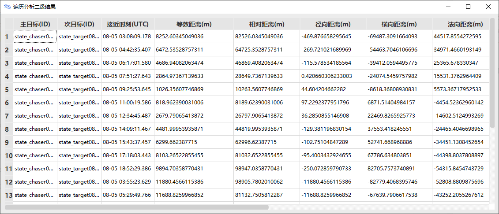

### 优化分析

进行【优化分析】，点击 <kbd>计算</kbd> 按钮，查看分析结果。

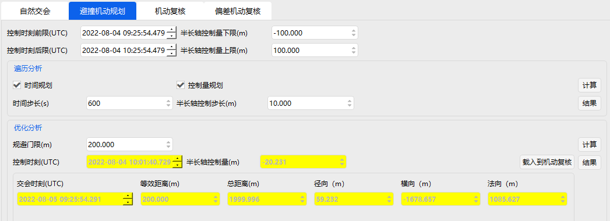

可以将结果对应的时刻和半长轴控制变量赋值到【机动复核】和【偏差机动复核】模块。

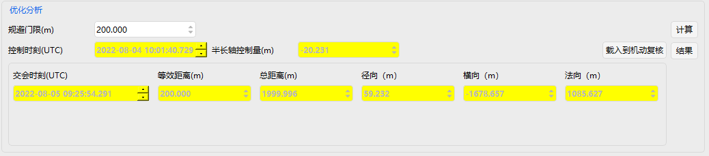

### 机动复核

进入【机动复核】模块界面，设置【控制时刻】和【半长轴控制量】，点击 <kbd>计算</kbd> 按钮，查看结果。

### 偏差机动复核

进入【偏差机动复核】模块界面，设置【控制时刻】、【半长轴控制量】、【半长轴标准差3σ】，并点击 <kbd>计算</kbd> 按钮，查看偏差机动复核计算结果。

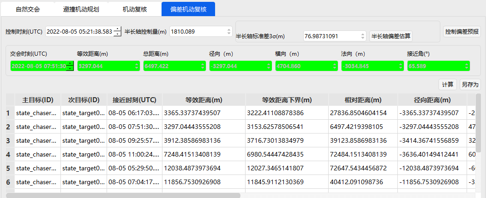

半长轴偏差可以手动输入或者调用估算方法获取。

### 控制偏差预报

点击 <kbd>控制偏差预报</kbd> 按钮，进行控制偏差预报操作。

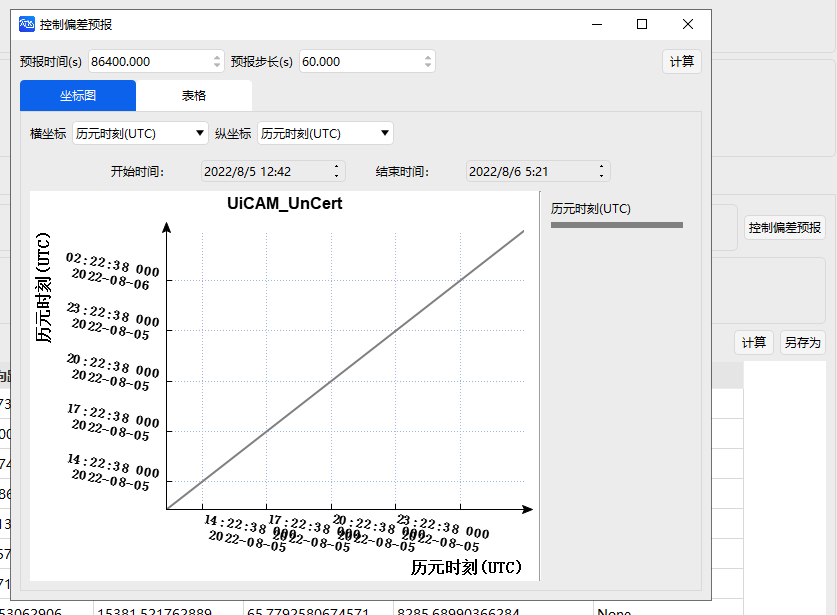

[碰撞规避案例](../02-案例教程/7-碰撞规避案例.md)
