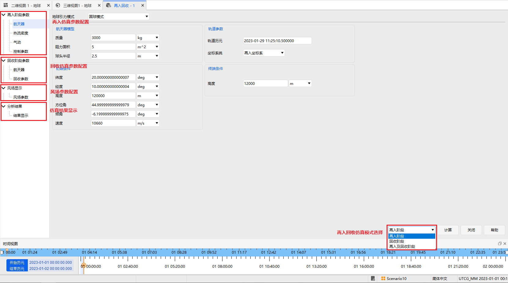
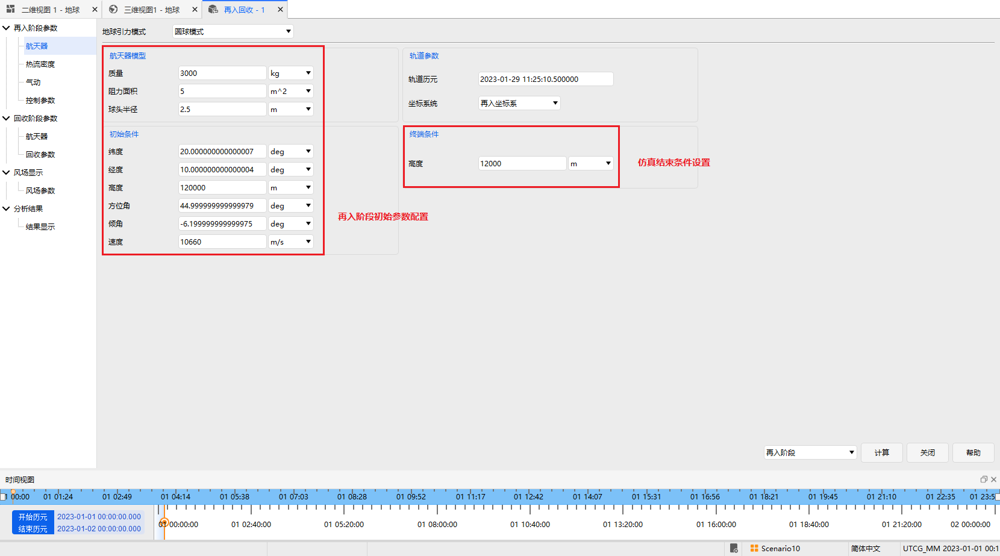
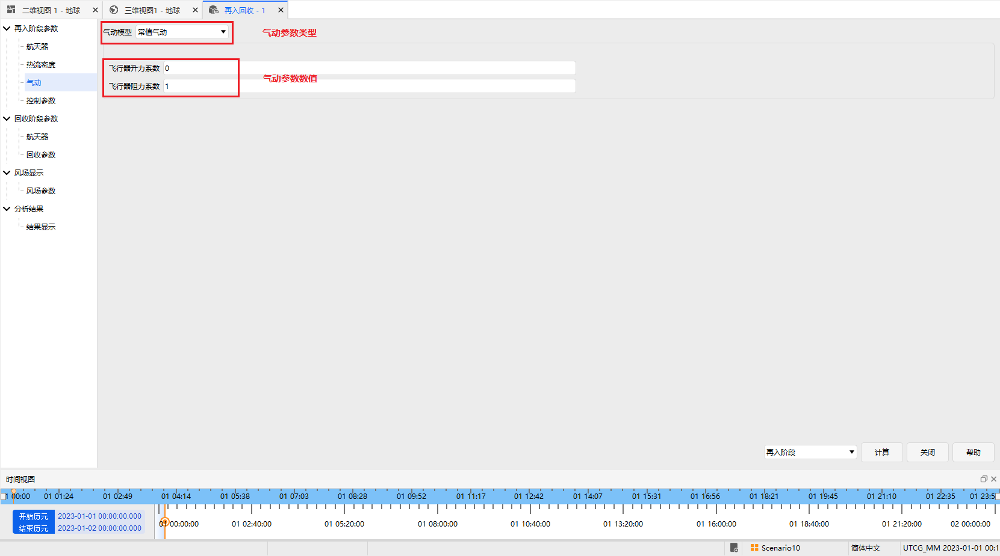
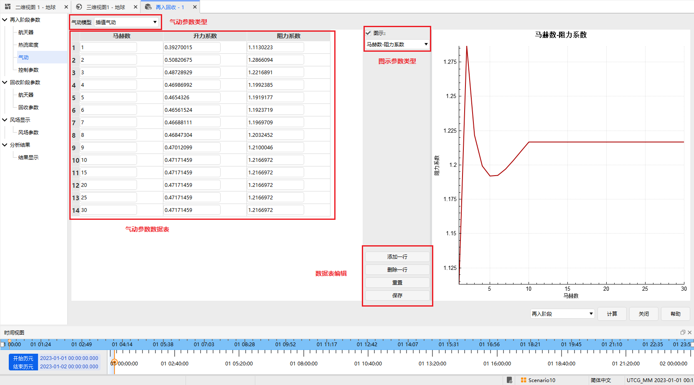
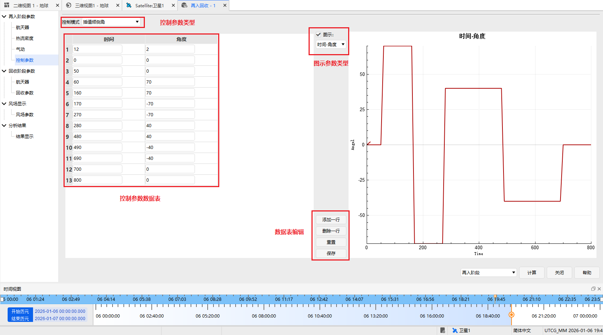
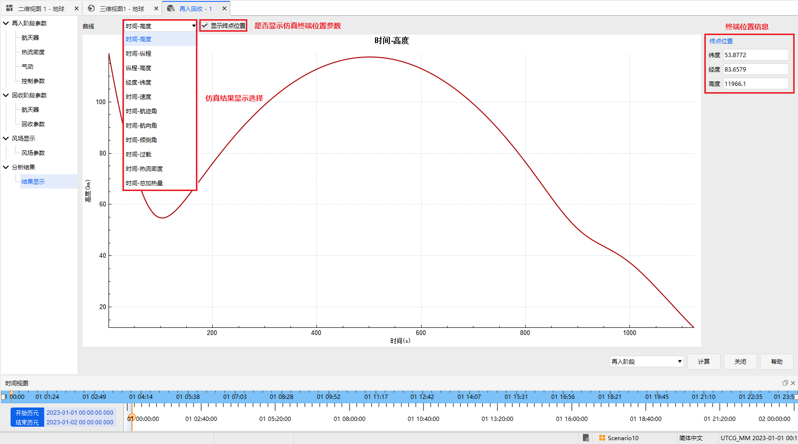
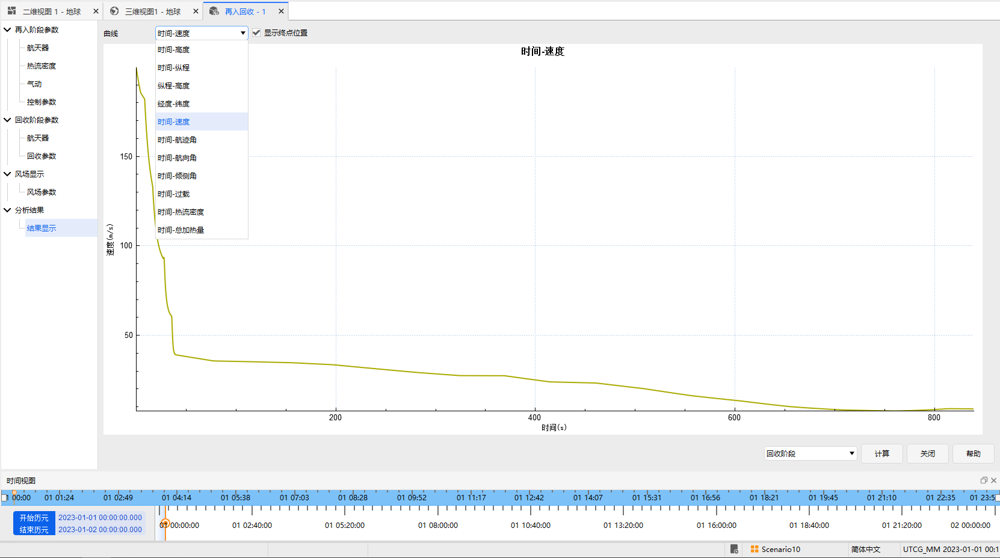
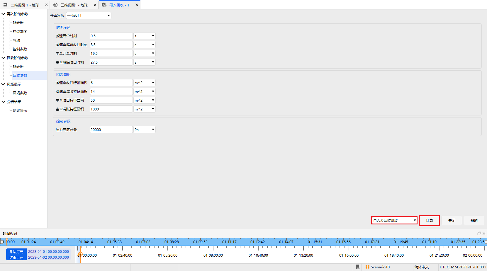
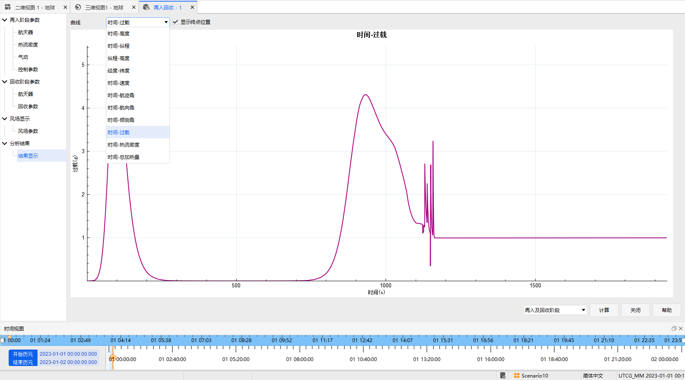

# 再入回收分析

## 功能介绍

本功能模块对返回式卫星、载人飞船等航天器的再入和伞降回收阶段进行飞行动力学仿真分析。

### 功能位置

该功能位于 ATK 工具栏目中，具体打开位置如图所示。

### 界面介绍

本模块分为三部分功能：再入阶段飞行仿真、伞降回收阶段飞行仿真、再入回收一体化飞行仿真。
仿真主界面如图所示。

## 使用方法

### 再入阶段飞行仿真

#### 初始参数设置

配置再入飞行仿真的初始参数，包括：航天器模型参数、再入初始条件、再入倾侧角设置、仿真结束高度设置等，如图所示。
地球引力模式也可选择圆球模式或更高精度的J2项模型

#### 热流参数设置

配置再入飞行仿真时的热流计算参数，包括：热流密度经验指数和经验系数，如图所示。

#### 气动参数设置

配置航天器的气动参数，包括常值气动和插值气动两种模式。常值气动配置时将再入飞行过程中航天器的阻力系数和升力系数设置为常值，如图所示。

插值气动配置时将再入飞行过程中航天器的阻力系数和升力系数配置为可插值的数据表，如下图所示，可通过界面对气动数据表进行添加和删除操作，以适应不同气动参数的航天器再入仿真。

#### 控制参数设置

配置航天器的控制参数，包括常值倾侧角和插值倾侧角两种模式。常值倾侧角配置时将再入飞行过程中航天器的倾侧角设置为常值，如图所示。

插值倾侧角配置时将再入飞行过程中航天器的倾侧角配置为可插值的数据表，如下图所示，可通过界面对倾侧角数据表进行添加和删除操作，以适应变化倾侧角参数的航天器再入仿真。

#### 风场参数设置

再入飞行仿真可考虑风场的影响，风场可以通过直接替换配置风场文件的形式添加，也可通过界面配置风场数据表，如图所示。

#### 再入仿真模式设置

再入阶段飞行仿真参数配置完毕后，选择界面右下角的再入阶段，点击【计算】按钮，如下图所示，即可完成再入飞行阶段的仿真。

#### 再入仿真结果显示

再入飞行计算结果可以通过选择下拉框显示不同参数，可选择显示仿真终点航天器的位置信息，如图所示。

### 回收阶段飞行仿真

#### 初始参数设置

配置回收飞行仿真的初始参数，包括：航天器模型参数、回收初始条件、仿真结束高度设置等，如图所示。

#### 回收参数设置

配置伞降回收阶段的降落伞开伞时序、降落伞阻力特征面积、开伞控制参数等，如图所示。
注意：可以根据需求选择相应的开伞次数：未收口、一次收口、二次收口，并设置相应的参数。

#### 风场参数设置

参考再入阶段飞行仿真风场参数配置。

#### 回收仿真模式设置

回收阶段飞行仿真参数配置完毕后，选择界面右下角的回收阶段，点击【计算】按钮，如下图所示，即可完成回收飞行阶段的仿真。

#### 回收仿真结果显示

如图所示，相关设置与再入阶段相同。

 

### 再入回收飞行仿真

#### 再入回收阶段初始参数设置

#### 再入回收阶段回收参数设置

回收阶段只需配置降落伞相关的回收参数，如图所示
**注意**：回收的初始条件是再入的终端条件。

 

#### 再入回收阶段风场参数设置

#### 再入回收仿真模式设置

 

#### 再入回收仿真结果显示

 