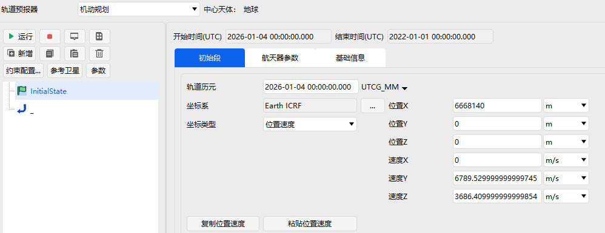

# 初始段

初始段全称为初始状态段，用于定义整个任务控制序列及其子序列的初始状态。除了时间信息之外，初始段的设置主要包括初始轨道要素或初始位置速度、航天器参数、基础信息三个部分，详细页面展示如图所示。

具体来说，初始段的主要功能是定义航天器的初始条件和航天器本身的特征参数。初始状态通常以初始轨道要素、初始历元、以及轨道坐标系等参数给出。航天器参数则包括净质量、推进剂质量、大气阻力系数、阻力面积、太阳光压系数、太阳光压面积等参数。基础信息主要是用来描述初始段基本参数，包括名称和用户定义的其他描述信息。
