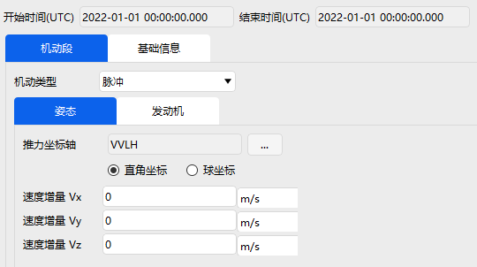

# 机动段

机动段主要功能是对航天器在轨道上的机动过程进行建模，当前软件提供了脉冲机动和有限推力机动两种工况模式。

**（1）脉冲机动模式**

脉冲机动模式通过对前一任务序列段的最终速度增加一个速度增量，然后更新飞行器的状态。脉冲机动的设置分为姿态和发动机两个部分。脉冲机动段参数设置界面如图所示。

脉冲机动类型模式下，推力坐标轴可选择 VVLH、J2000、VNC 等多类不同坐标系，施加方式可选直角坐标系（速度增量）、球坐标（方位角、仰角及大小）两类。以 VVLH  推力坐标轴模式下设置为例，在对应速度增量输入框内输入数据即可，其中正值代表沿着坐标轴的正方向，反之则为负方向。

发动机需要设置的参数有比冲、以及选择是否根据推进剂消耗更新质量。用户在使用时直接在相应输入框内输入变量大小即可。

**（2）有限推力机动模式**

有限推力机动模式是根据设定的推力加速度，利用定义的轨道预报器来预报状态参数。推力的量级取决于用户定义的发动机模型，推力的方向由姿态控制来决定。因此，该模式下，用户需要设置一下三个部分：

| 设置 | 说明 |
| :--- | :--- |
| 姿态 | 控制推力方向 |
| 发动机 | 定义推力大小 |
| 轨道预报 | 预报状态参数 |

界面分布情况如图所示。

姿态部分同脉冲模式下的姿态设置基本一致，不同的是有限推力的坐标设置不再是速度增量，而是不同方向的单位矢量或者角度，用户在使用时仅需输入对应方向即可。发动机部分的设置相比脉冲机动模式增加推力值（N）设置。轨道预报部分同预报段的设置一致，即新增停止条件，输入相应参数大小即可。