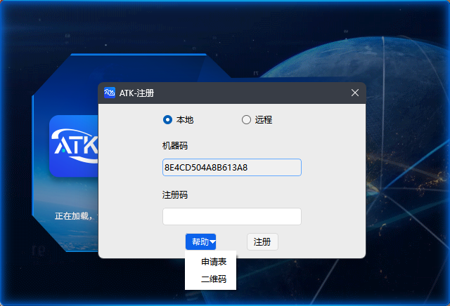

## ATK Registration

ATK is **free to use**, but **registration is required on first launch**; otherwise, features will not work properly.

1. Double-click `ATK.exe`. The **ATK License Agreement** dialog will appear automatically.

2. After reading the agreement carefully, check **I have read the agreement**, and click <kbd>Agree</kbd> to enter the **ATK Registration** window.

3. The **machine code** in the registration window is generated automatically and does not need to be modified.

4. Enter the obtained Register Id in the input field, and click <kbd>Register</kbd> to activate.

