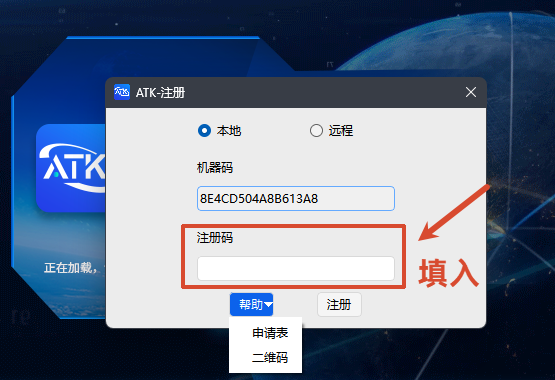
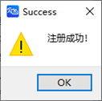

## Entering the Register Id

After obtaining the Register Id, return to the ATK registration window to complete activation.

### Steps

1. Enter the obtained Register Id in the input field (we recommend pasting it directly to avoid manual entry errors).

2. Click the <kbd>Register</kbd> button to submit.

### Registration Result

- **Registration successful**: The interface shows a success message, and you can use all ATK features normally.

  

- **Registration failed**: If "Registration failed" is shown, check the following:
  1. Whether the machine code matches the Register Id (the code only works on the device with the matching machine code)
  2. Whether the Register Id is entered correctly (note that it is case-sensitive; we recommend copying and pasting directly)
  3. If it still cannot be registered, contact us for a new Register Id
