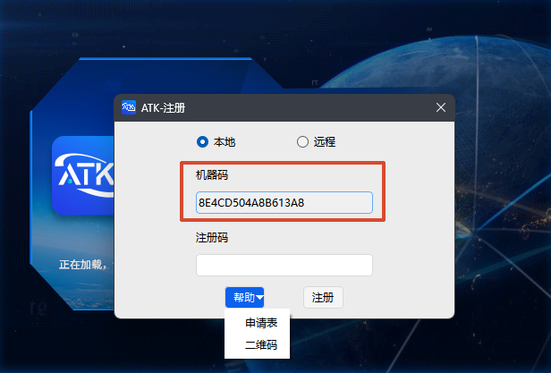

# Before You Begin

Make sure you have completed the software installation steps. When you launch ATK for the first time, the **ATK Registration** window appears automatically, as shown below:

## Machine Code

The **machine code** is a unique identifier automatically generated by the ATK registration window (a 16-character alphanumeric string, such as `30C48ACB13924C96`). It is used to bind the software to the current device.

**Be sure to note down the machine code shown in the window**, as you will need to provide it when applying for a Register Id.

::: warning Important
The machine code is tied to the device. **If you change computers or reinstall the operating system, the machine code will change**, and you will need to apply for a new Register Id.
:::

## Obtaining a Register Id

### Individual Users

After noting down the machine code, you can obtain a Register Id through the following methods:

- [WeChat Mini Program](./02-小程序申请.md)
- [Email](./03-邮件申请.md)
- [Contact Us](./05-直接联系我们.md)

### Enterprise / Team Users (Remote Service Deployment)

If you need to deploy the ATK remote service so that multiple clients can share a server-side license, refer to the [Remote Service Registration](./04-ATK远程服务注册操作指南.md).

Remote service registration also requires a Register Id. The server generates a machine code automatically after startup. Please contact us to obtain a Register Id.

After obtaining the Register Id, return to the registration window and enter it to complete activation.