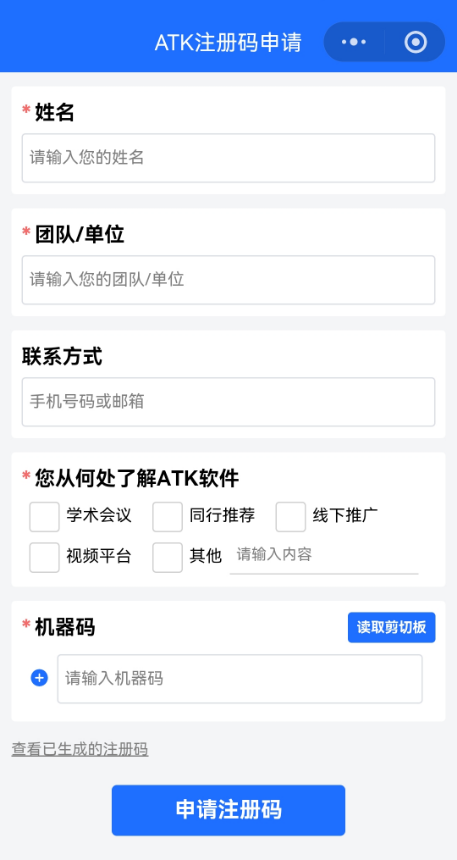
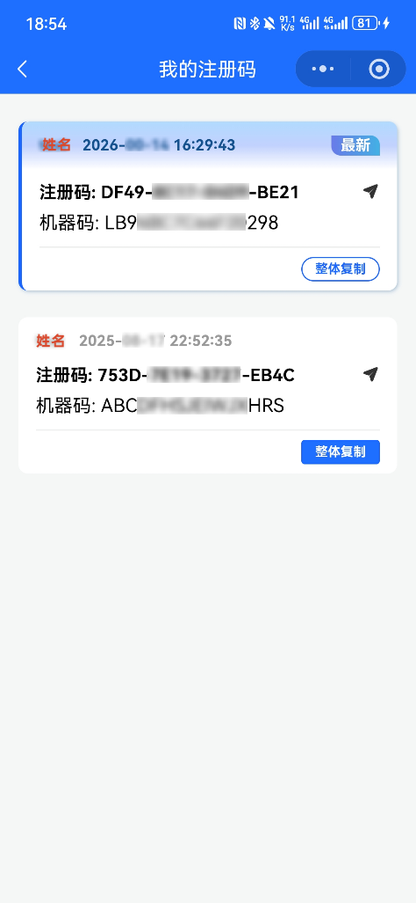

# WeChat Mini Program

## Application Process

### Scan the QR Code to Open the Mini Program

Open WeChat and scan the QR code below to access the ATK Register Id application Mini Program.

::: tip Alternative Method
If the QR code cannot be scanned, search for the Mini Program **“AerospaceToolKit”** in WeChat to access it directly.
:::

### Fill in the Application Form

After scanning the QR code and entering the form page, fill in the following information as required:

::: warning Important
Double-check the machine code carefully. **An incorrect entry will make the Register Id unusable.**
:::

### Get the Register Id

After confirming that the information is correct, click **Apply for Register Id**. Once the application is complete, you can view all Register Ids generated under this WeChat account on the page.

::: tip Tip
It is recommended to use the “copy all” button to copy the code directly and avoid manual entry errors. You can also view previously applied Register Ids through the Mini Program at any time.
:::

<!--@include:./.include/填入注册码.md-->